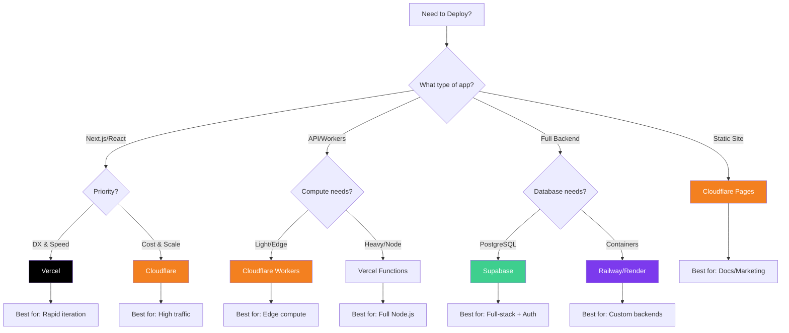
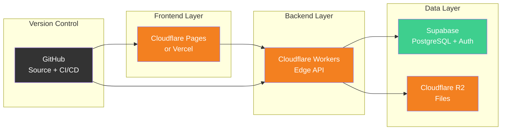
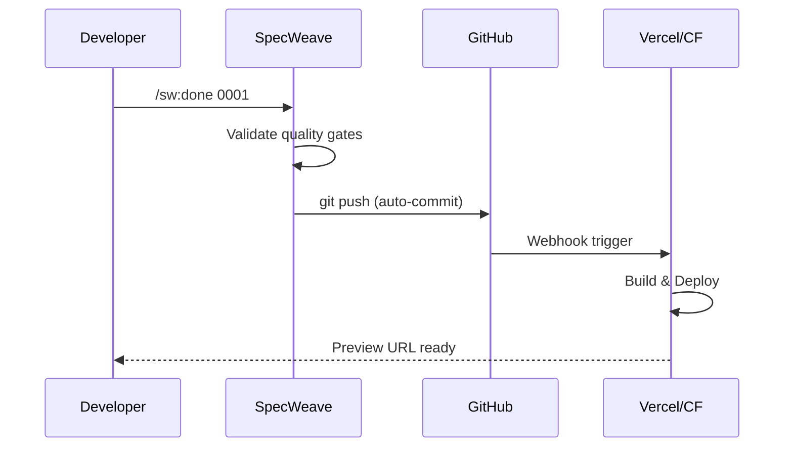
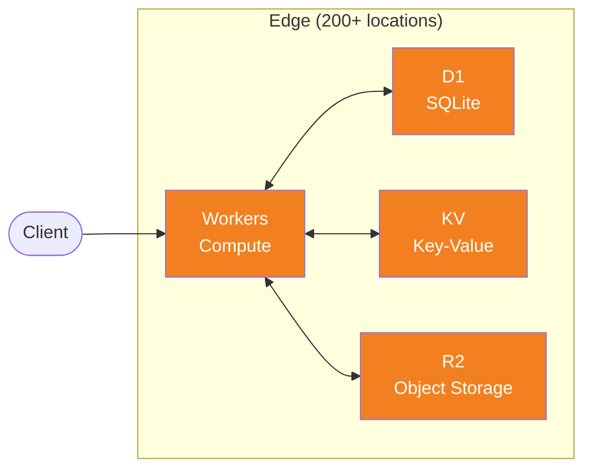
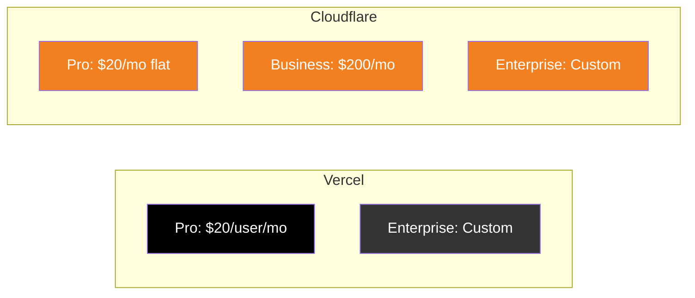
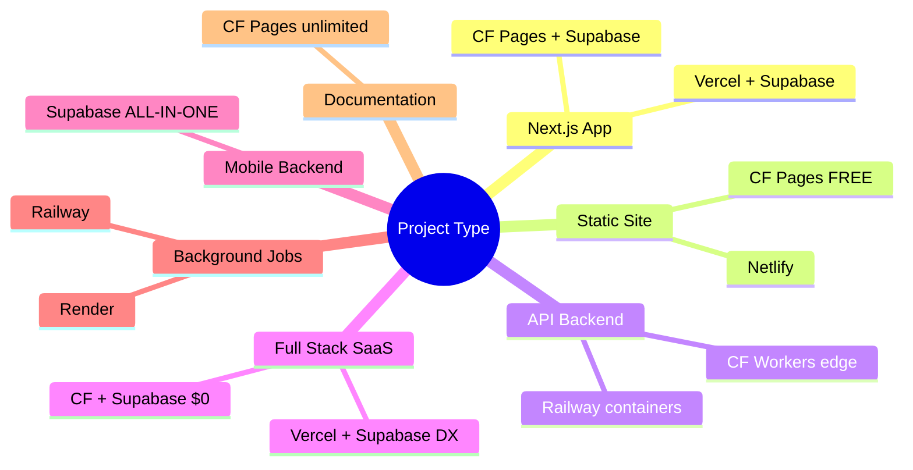

# The Modern Developer Stack: Deployment Platforms Guide

**Why Cloudflare, Vercel, Supabase, and friends are often better than AWS/Azure/GCP — and how to choose between them.**

---

## The $0 to Production Stack

You can ship a complete production application — frontend, backend, database, storage, auth — for **$0/month** using this stack:

| Layer | Tool | Free Tier |
|-------|------|-----------|
| **Frontend** | Cloudflare Pages or Vercel | Unlimited bandwidth (CF) / 100GB (Vercel) |
| **Backend/API** | Cloudflare Workers | 100K requests/day |
| **Database** | Supabase | 500 MB + 50K MAU |
| **Storage** | Cloudflare R2 | 10 GB + **$0 egress** |
| **Auth** | Supabase Auth | 50K MAU included |
| **Version Control** | GitHub | Unlimited repos |

**Total monthly cost: $0** — until you have real traction.

:::tip The Stack That Built SpecWeave
This exact stack powers multiple production applications. The YouTube tutorial demonstrates 5 apps built in one month using Cloudflare Workers + Supabase + Vercel/Pages.
:::

---

## Why NOT AWS/Azure/GCP?

Before diving into specific platforms, let's address the elephant in the room.

### The Complexity Tax

```
┌─────────────────────────────────────────────────────────────────┐
│              AWS/AZURE/GCP: THE COMPLEXITY TAX                   │
├─────────────────────────────────────────────────────────────────┤
│                                                                  │
│  ❌ 200+ services to learn                                      │
│  ❌ IAM policies, VPCs, security groups                         │
│  ❌ Surprise bills (forgot to turn off that Lambda?)            │
│  ❌ Cold starts in seconds                                       │
│  ❌ Per-user pricing explodes with teams                         │
│  ❌ Requires dedicated DevOps knowledge                          │
│                                                                  │
│  WHEN TO USE:                                                    │
│  • Enterprise with compliance requirements (FedRAMP, etc.)       │
│  • Existing infrastructure/vendor lock-in                        │
│  • Specialized services (SageMaker, BigQuery, etc.)              │
│  • When you have a DevOps team                                   │
│                                                                  │
└─────────────────────────────────────────────────────────────────┘
```

### The Modern Alternative

```
┌─────────────────────────────────────────────────────────────────┐
│         DEVELOPER-FIRST PLATFORMS: THE ALTERNATIVE               │
├─────────────────────────────────────────────────────────────────┤
│                                                                  │
│  ✅ Deploy in 30 seconds (git push → live)                      │
│  ✅ Zero infrastructure management                               │
│  ✅ Predictable pricing (often free until scale)                 │
│  ✅ Global by default (edge, CDN)                                │
│  ✅ Built-in CI/CD, preview deployments                          │
│  ✅ Works for solo devs AND teams                                │
│                                                                  │
│  THE PHILOSOPHY:                                                 │
│  "Use the simplest thing that works until it doesn't."          │
│                                                                  │
└─────────────────────────────────────────────────────────────────┘
```

**Real talk**: If your "DevOps team" is just you, don't pick a stack that expects deep knowledge of IAM policies, VPC peering, or container orchestration. Start with a platform that lets you stay in **dev mode**, not **ops mode**.

---

## Quick Decision



---

## Platform Deep Dives

### 1. Cloudflare (Workers, Pages, R2, D1, KV)

**The edge-first platform with the most generous free tier.**

| Resource | Free Tier | Paid ($5/mo) |
|----------|-----------|--------------|
| **Workers Requests** | 100,000/day | 10M/month included |
| **CPU Time** | 10ms/request | 30M ms/month |
| **Pages Bandwidth** | **Unlimited** | Unlimited |
| **R2 Storage** | 10 GB | $0.015/GB |
| **R2 Egress** | **$0 forever** | $0 forever |
| **D1 Database** | 5 GB | $0.75/GB |
| **KV Reads** | 100K/day | 10M/month |

**Why Cloudflare Wins:**
- **Zero cold starts** — V8 isolates, not containers
- **330+ edge locations** — code runs everywhere
- **R2 = S3 without egress fees** — save thousands on bandwidth
- **Commercial use on free tier** — launch your startup for $0

```typescript
// Full-stack Cloudflare Worker in 20 lines
export default {
  async fetch(request: Request, env: Env) {
    const url = new URL(request.url);

    // D1 for database
    if (url.pathname === '/api/users') {
      const users = await env.DB.prepare('SELECT * FROM users').all();
      return Response.json(users.results);
    }

    // R2 for file storage
    if (url.pathname.startsWith('/files/')) {
      const file = await env.BUCKET.get(url.pathname.slice(7));
      return new Response(file?.body);
    }

    return new Response('Hello from the edge!');
  }
};
```

**Best For**: APIs, edge compute, high-traffic sites, file storage, cost-conscious teams

---

### 2. Vercel

**The Next.js creators' platform with unmatched developer experience.**

| Resource | Hobby (Free) | Pro ($20/user/mo) |
|----------|--------------|-------------------|
| **Bandwidth** | 100 GB/month | 1 TB + $0.15/GB overage |
| **Function Invocations** | 100K/month | 1M included |
| **Function Duration** | 10s default (60s max) | 15s default (300s max) |
| **Build Minutes** | 6,000/month | 24,000/month |
| **Deployments/Day** | 100 | 6,000 |
| **Team Members** | 1 | Unlimited |
| **Commercial Use** | **No** | Yes |

:::warning Hobby Plan Restrictions
Vercel Hobby is for **personal, non-commercial use only**. If you're building a product, you need Pro ($20/user/month).
:::

**Why Vercel Wins:**
- **Zero-config for Next.js** — they created it
- **Preview deployments** — every PR gets a URL
- **Edge + Serverless** — both available
- **Built-in analytics** — Web Vitals, speed insights
- **Best DX in the industry** — just `git push`

**Best For**: Next.js apps, rapid prototyping, teams who value DX over cost

---

### 3. Supabase

**The open-source Firebase alternative with real PostgreSQL.**

| Resource | Free | Pro ($25/mo) |
|----------|------|--------------|
| **Database** | 500 MB | 8 GB included |
| **Storage** | 1 GB | 100 GB included |
| **Bandwidth/Egress** | 5 GB | 250 GB included |
| **Auth MAU** | 50,000 | 100,000 included |
| **Edge Functions** | 500K invocations | 2M included |
| **Realtime** | 200 connections | 500 connections |
| **Projects** | 2 | Unlimited |

**Why Supabase Wins:**
- **Real PostgreSQL** — not a proprietary database
- **Auth built-in** — social logins, magic links, SSO
- **Row-Level Security** — database-level permissions
- **Realtime subscriptions** — live data sync
- **Edge Functions** — Deno runtime
- **Self-hostable** — avoid vendor lock-in

```typescript
// Full-stack app with Supabase in minutes
import { createClient } from '@supabase/supabase-js';

const supabase = createClient(SUPABASE_URL, SUPABASE_KEY);

// Auth
const { data: { user } } = await supabase.auth.signInWithOAuth({
  provider: 'google'
});

// Database
const { data: posts } = await supabase
  .from('posts')
  .select('*, author:users(name)')
  .order('created_at', { ascending: false });

// Realtime
supabase.channel('posts')
  .on('postgres_changes', { event: 'INSERT', schema: 'public' }, (payload) => {
    console.log('New post:', payload.new);
  })
  .subscribe();

// Storage
const { data } = await supabase.storage
  .from('avatars')
  .upload('user-123.png', file);
```

**Best For**: Full-stack apps, auth-heavy apps, real-time features, mobile backends

---

### 4. Railway

**The Heroku successor for containers and backends.**

| Resource | Trial | Hobby ($5/mo) | Pro ($20/mo) |
|----------|-------|---------------|--------------|
| **Credits** | $5 one-time | $5 included | $20 included |
| **CPU** | 8 vCPU | 8 vCPU | 32 vCPU |
| **Memory** | 8 GB | 8 GB | 32 GB |
| **Databases** | PostgreSQL, MySQL, Redis, MongoDB | Same | Same |
| **Deployments** | Unlimited | Unlimited | Unlimited |

**Pricing Model**: Pay for actual compute usage (CPU-seconds, memory-GB-hours). $5/mo covers most hobby projects.

**Why Railway Wins:**
- **Heroku-like simplicity** — `railway up` and done
- **Real containers** — not just functions
- **Multi-service support** — frontend + backend + DB in one project
- **Usage-based** — only pay for what you use
- **Database options** — Postgres, MySQL, Redis, MongoDB

**Best For**: Custom backends, background jobs, microservices, long-running processes

---

### 5. Render

**The straightforward alternative for web services and databases.**

| Resource | Free | Starter ($7/mo) | Standard ($25/mo) |
|----------|------|-----------------|-------------------|
| **Web Service** | 750 hrs/month | 512 MB / 0.5 CPU | 2 GB / 1 CPU |
| **PostgreSQL** | 1 GB (expires 30 days) | Persistent | Persistent |
| **Bandwidth** | 100 GB | Included | Included |
| **Static Sites** | Unlimited | Unlimited | Unlimited |

:::warning Free PostgreSQL Expiration
Render's free PostgreSQL databases **expire after 30 days**. Plan accordingly.
:::

**Why Render Wins:**
- **Transparent pricing** — no hidden fees
- **Background workers** — not just web services
- **Cron jobs** — built-in scheduling
- **Private services** — internal microservices
- **Preview environments** — per-PR deployments

**Best For**: Traditional web apps, Python/Ruby backends, scheduled jobs

---

### 6. Netlify

**The JAMstack pioneer with a new credit-based pricing model.**

| Resource | Free | Pro ($19/mo) |
|----------|------|--------------|
| **Bandwidth** | 100 GB | 1 TB |
| **Build Minutes** | 300/month | 25,000/month |
| **Serverless** | 125K invocations/site | Included |
| **Edge Functions** | 1M requests | 2M requests |
| **Forms** | 100/month | Included |
| **Team Members** | 1 | Unlimited |

:::info September 2025 Pricing Change
Netlify switched to credit-based pricing. New accounts use the new model; legacy plans are grandfathered.
:::

**Why Netlify Wins:**
- **Form handling** — built-in without backend
- **Identity** — auth without Supabase
- **Large media** — Git LFS alternative
- **Split testing** — A/B tests at the edge

**Best For**: JAMstack sites, forms-heavy sites, static sites with light interactivity

---

## Master Comparison Table

| Feature | Cloudflare | Vercel | Supabase | Railway | Render | Netlify |
|---------|------------|--------|----------|---------|--------|---------|
| **Free Bandwidth** | **Unlimited** | 100 GB | 5 GB | Usage-based | 100 GB | 100 GB |
| **Commercial Free** | **Yes** | No | Yes | Yes | Yes | No |
| **Edge Compute** | **330+ PoPs** | Yes | Via Functions | No | No | Yes |
| **Database** | D1 (SQLite) | No | **PostgreSQL** | Multi | PostgreSQL | No |
| **Auth** | No | No | **Built-in** | No | No | Identity |
| **File Storage** | **R2 ($0 egress)** | Blob | Built-in | No | No | LFS |
| **Cold Starts** | **0ms** | ~250ms | ~500ms | Varies | Varies | ~50ms |
| **Containers** | No | No | No | **Yes** | **Yes** | No |
| **Entry Paid** | $5/mo | $20/user | $25/mo | $5/mo | $7/mo | $19/mo |

---

## Decision Matrix by Use Case

| Use Case | Recommended Stack | Why |
|----------|-------------------|-----|
| **Next.js SaaS** | Vercel + Supabase | Native Next.js + real PostgreSQL |
| **High-traffic marketing** | Cloudflare Pages | Unlimited bandwidth, free |
| **API-heavy product** | Cloudflare Workers + Supabase | Edge compute + managed DB |
| **Mobile app backend** | Supabase | Auth, realtime, storage all-in-one |
| **Startup MVP** | Cloudflare + Supabase | $0 until traction |
| **Custom Python backend** | Railway or Render | Container support |
| **Scheduled jobs/cron** | Railway or Render | Background workers |
| **Static docs site** | Cloudflare Pages | Unlimited, free |
| **E-commerce** | Vercel + Supabase | DX + transactions |

---

## The SpecWeave-Recommended Stack

For most SpecWeave projects, we recommend this combination:



**Cost at Scale:**
- 0-10K users: ~$0-25/month
- 10K-100K users: ~$50-150/month
- 100K+ users: Still cheaper than AWS

---

## SpecWeave Deployment Integration

### Auto-Deploy on Increment Completion

Both platforms integrate with SpecWeave's workflow:



### Configuration Examples

**Vercel (`vercel.json`)**:
```json
{
  "buildCommand": "npm run build",
  "outputDirectory": "dist",
  "framework": "nextjs",
  "regions": ["iad1", "sfo1"]
}
```

**Cloudflare (`wrangler.toml`)**:
```toml
name = "my-specweave-app"
main = "src/index.ts"
compatibility_date = "2024-01-01"

[site]
bucket = "./dist"

[[r2_buckets]]
binding = "ASSETS"
bucket_name = "my-assets"
```

---

## Cloudflare Serverless Ecosystem

Cloudflare offers a complete serverless stack that runs at the edge — no cold starts, global by default.



### Workers (Compute)

**What**: JavaScript/TypeScript functions that run at the edge
**Why**: Sub-millisecond cold starts, runs in 200+ locations

```typescript
// src/index.ts - A simple Worker
export default {
  async fetch(request: Request, env: Env): Promise<Response> {
    const url = new URL(request.url);

    if (url.pathname === '/api/users') {
      // Query D1 database
      const users = await env.DB.prepare('SELECT * FROM users').all();
      return Response.json(users.results);
    }

    return new Response('Hello from the edge!');
  }
};
```

### D1 (SQLite at the Edge)

**What**: Serverless SQLite database, globally distributed
**Why**: SQL without infrastructure, automatic replication

```typescript
// Query D1 from a Worker
const result = await env.DB.prepare(
  'INSERT INTO posts (title, content) VALUES (?, ?)'
)
  .bind('Hello World', 'My first post')
  .run();

// Read with automatic read replicas
const posts = await env.DB.prepare(
  'SELECT * FROM posts ORDER BY created_at DESC LIMIT 10'
).all();
```

**Free tier**: 5 GB storage, 5M rows read/day, 100K rows written/day

### KV (Key-Value Store)

**What**: Global, low-latency key-value storage
**Why**: Session data, feature flags, cached API responses

```typescript
// Store data (eventually consistent, ~60s global propagation)
await env.KV.put('user:123:session', JSON.stringify(sessionData), {
  expirationTtl: 86400 // 24 hours
});

// Read data (instant from nearest edge)
const session = await env.KV.get('user:123:session', 'json');
```

**Free tier**: 100K reads/day, 1K writes/day, 1 GB storage

### R2 (Object Storage)

**What**: S3-compatible storage with **zero egress fees**
**Why**: Store files, images, backups without bandwidth costs

```typescript
// Upload file to R2
await env.BUCKET.put('uploads/image.png', imageBuffer, {
  httpMetadata: { contentType: 'image/png' }
});

// Generate signed URL for downloads
const object = await env.BUCKET.get('uploads/image.png');
return new Response(object.body, {
  headers: { 'Content-Type': 'image/png' }
});
```

**Free tier**: 10 GB storage, 10M reads/month, 1M writes/month, **$0 egress**

### When to Use Each

| Service | Use Case | Example |
|---------|----------|---------|
| **Workers** | API endpoints, auth, routing | REST API, auth middleware |
| **D1** | Relational data, transactions | User profiles, orders |
| **KV** | Fast reads, config, sessions | Feature flags, JWT sessions |
| **R2** | Files, images, large objects | User uploads, static assets |

### Full Stack Example

```toml
# wrangler.toml - Complete serverless app
name = "my-saas-app"
main = "src/index.ts"

[[d1_databases]]
binding = "DB"
database_name = "my-app-db"
database_id = "xxx-xxx-xxx"

[[kv_namespaces]]
binding = "KV"
id = "xxx-xxx-xxx"

[[r2_buckets]]
binding = "BUCKET"
bucket_name = "my-uploads"
```

```typescript
// Full stack Worker with all services
export default {
  async fetch(request: Request, env: Env) {
    const url = new URL(request.url);

    // Auth check via KV (fast)
    const session = await env.KV.get(`session:${getToken(request)}`);
    if (!session) return new Response('Unauthorized', { status: 401 });

    // CRUD via D1 (relational)
    if (url.pathname.startsWith('/api/posts')) {
      const posts = await env.DB.prepare('SELECT * FROM posts').all();
      return Response.json(posts.results);
    }

    // File upload via R2 (storage)
    if (url.pathname === '/api/upload' && request.method === 'POST') {
      const file = await request.arrayBuffer();
      await env.BUCKET.put(`uploads/${Date.now()}`, file);
      return Response.json({ success: true });
    }

    return new Response('Not found', { status: 404 });
  }
};
```

:::tip Why This Matters for SpecWeave Projects
When your increment includes backend features, Cloudflare's stack lets you deploy a complete app — database, storage, API — with zero infrastructure management. All at the edge, all on free tier for small projects.
:::

---

## Decision Matrix

Use this matrix to make your decision:

| Scenario | Recommendation | Why |
|----------|----------------|-----|
| **Next.js app, solo developer** | Vercel | Native Next.js, best DX |
| **High-traffic marketing site** | Cloudflare Pages | Unlimited bandwidth |
| **API with 10K+ daily requests** | Cloudflare Workers | 100K/day vs 100K/month |
| **Startup, need commercial use** | Cloudflare | Free tier allows commercial |
| **Need preview per PR** | Either | Both support this |
| **Image-heavy app** | Vercel | Built-in optimization |
| **Global edge compute** | Cloudflare Workers | 200+ locations |
| **Database at edge** | Cloudflare D1 | SQLite everywhere |
| **Large file storage** | Cloudflare R2 | No egress fees |
| **Team > 1 person (free)** | Cloudflare | Unlimited team members |

---

## Cost Comparison (Paid Tiers)

When you outgrow free tiers:



| Tier | Vercel | Cloudflare |
|------|--------|------------|
| **Entry Paid** | $20/user/month | $20/month (flat) |
| **5-person team** | $100/month | $20/month |
| **10-person team** | $200/month | $20/month |
| **Bandwidth overage** | $40/100GB | Free (unlimited) |

:::warning Per-User vs Flat Pricing
Vercel charges per team member. Cloudflare charges per account. For teams > 2 people, Cloudflare becomes significantly cheaper.
:::

---

## Migration Paths

### From Vercel to Cloudflare

```bash
# 1. Install Wrangler
npm install -g wrangler

# 2. Login
wrangler login

# 3. Initialize
wrangler init

# 4. Deploy
wrangler deploy
```

### From Cloudflare to Vercel

```bash
# 1. Install Vercel CLI
npm install -g vercel

# 2. Login
vercel login

# 3. Deploy (auto-detects framework)
vercel
```

---

## SpecWeave Commands for Deployment

```bash
# Deploy to Vercel
/sw:done 0001  # Closes increment, triggers git push
vercel         # Deploy (or auto via GitHub integration)

# Deploy to Cloudflare
/sw:done 0001  # Closes increment, triggers git push
wrangler deploy # Deploy Workers
wrangler pages deploy dist # Deploy Pages

# Check deployment status
vercel ls      # List Vercel deployments
wrangler pages deployment list # List CF deployments
```

---

## Recommendations by Project Type



---

## TL;DR

| You should choose... | If you... |
|----------------------|-----------|
| **Cloudflare** | Need unlimited bandwidth, high API traffic, commercial use on free, zero cold starts |
| **Vercel** | Want zero-config Next.js, best DX, and don't mind per-user pricing |
| **Supabase** | Need PostgreSQL + Auth + Realtime + Storage in one place |
| **Railway** | Need containers, background jobs, or traditional server apps |
| **Render** | Need straightforward web services with transparent pricing |
| **Netlify** | Have forms-heavy JAMstack sites with light interactivity |

**The Recommended Starter Stack:**
- **Frontend**: Cloudflare Pages (unlimited) or Vercel (best DX)
- **Backend/API**: Cloudflare Workers (edge) or Railway (containers)
- **Database + Auth**: Supabase (PostgreSQL + Auth)
- **Storage**: Cloudflare R2 ($0 egress) or Supabase Storage

**Start simple. Scale when needed. Don't over-engineer.**

---

## Related Resources

- [SpecWeave Quickstart](/docs/guides/getting-started/quickstart) — Get started with your first increment
- [Quality Gates](/docs/academy/specweave-essentials/05-quality-gates) — Ensure code is ready before deployment
- [GitHub Integration](/docs/academy/specweave-essentials/14-github-integration) — Auto-deploy via GitHub webhooks

---

## Sources

This guide was compiled from official documentation (January 2026):

- [Cloudflare Workers Pricing](https://developers.cloudflare.com/workers/platform/pricing/)
- [Cloudflare Workers Limits](https://developers.cloudflare.com/workers/platform/limits)
- [Vercel Pricing](https://vercel.com/pricing)
- [Vercel Hobby Plan](https://vercel.com/docs/plans/hobby)
- [Supabase Pricing](https://supabase.com/pricing)
- [Supabase Billing Docs](https://supabase.com/docs/guides/platform/billing-on-supabase)
- [Railway Pricing](https://railway.com/pricing)
- [Render Pricing](https://render.com/pricing)
- [Netlify Pricing](https://www.netlify.com/pricing/)
