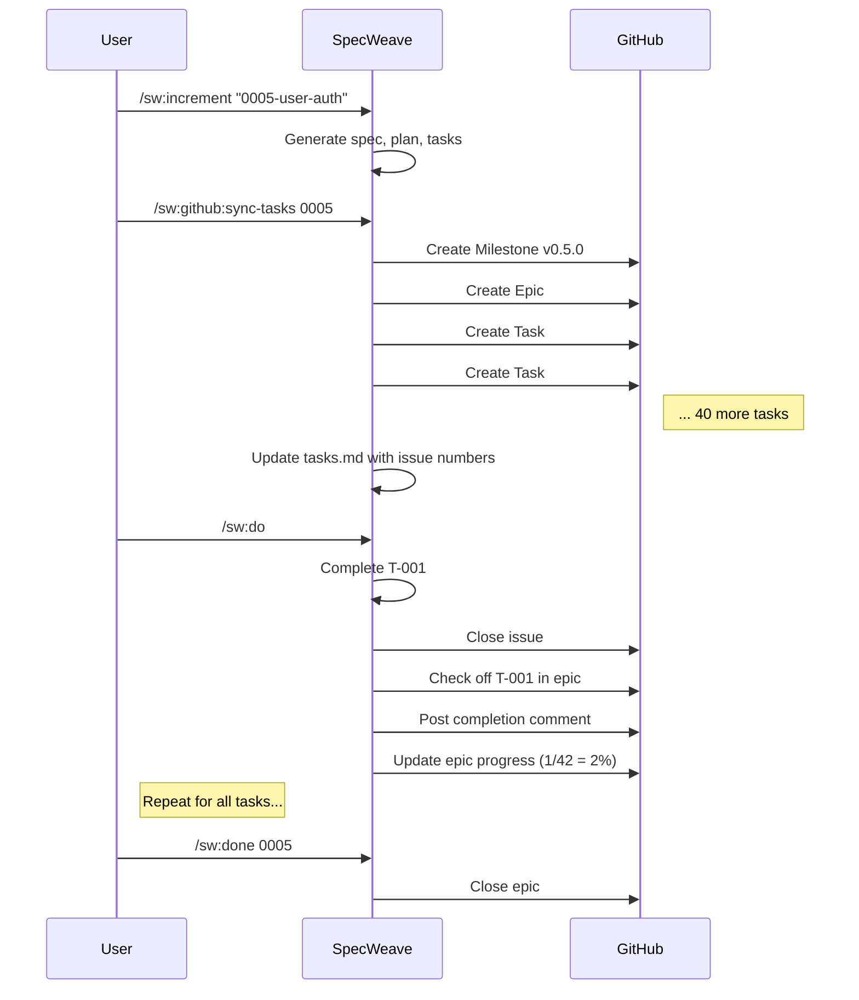

# GitHub Integration Guide

**SpecWeave GitHub Integration** - Seamless task-level synchronization between SpecWeave increments and GitHub issues.

---

## Table of Contents

1. [Introduction](#introduction)
2. [Why GitHub Integration?](#why-github-integration)
3. [Prerequisites](#prerequisites)
4. [Quick Start](#quick-start)
5. [How It Works](#how-it-works)
6. [Task-Level vs Increment-Level Sync](#task-level-vs-increment-level-sync)
7. [Sync Commands](#sync-commands)
8. [Working with Synced Tasks](#working-with-synced-tasks)
9. [Advanced Features](#advanced-features)
10. [Troubleshooting](#troubleshooting)
11. [Best Practices](#best-practices)
12. [FAQ](#faq)

---

## Introduction

SpecWeave's GitHub integration provides **bidirectional synchronization** between your local increment development and GitHub issues. This enables:

- ✅ **Granular task assignment** - Assign individual tasks to team members
- ✅ **Better collaboration** - Focused discussions per task (not mixed in one thread)
- ✅ **GitHub Projects integration** - Drag tasks on Kanban boards
- ✅ **Transparent progress tracking** - Real-time visibility for stakeholders
- ✅ **Native GitHub workflow** - Pull requests linked to tasks, automated actions

**GitHub is PRIMARY** in SpecWeave - JIRA integration remains available for enterprise teams, but GitHub is recommended for most projects.

---

## Why GitHub Integration?

### The Problem (Before Integration)

Without GitHub sync, teams face challenges:

- **No granular assignment**: Can't assign specific tasks to team members (only epic-level)
- **Noisy discussions**: All task conversations mixed in one issue thread (200+ comments)
- **Limited visibility**: Managers can't see task-level progress on Kanban boards
- **Manual coordination**: Developers must coordinate manually ("Who's working on what?")

### The Solution (With Integration)

SpecWeave's task-level GitHub sync solves this:

- **1 Task = 1 GitHub Issue**: Each task gets its own issue with focused discussion
- **Automatic updates**: Task completion automatically closes issues and updates epic
- **Dependency tracking**: Link tasks via GitHub's native dependency system
- **Team collaboration**: Assign tasks, track progress, integrate with GitHub Projects

---

## Prerequisites

### 1. GitHub CLI (Required)

SpecWeave uses the official GitHub CLI (`gh`) for all GitHub operations.

**Installation**:

```bash
# macOS
brew install gh

# Ubuntu/Debian
sudo apt install gh

# Windows
choco install gh

# Arch Linux
sudo pacman -S github-cli
```

**Verify installation**:

```bash
gh --version
# Should output: gh version 2.x.x
```

### 2. GitHub Authentication (Required)

Authenticate the GitHub CLI with your account:

```bash
gh auth login
```

Follow the interactive prompts:
1. Select "GitHub.com"
2. Choose "HTTPS" or "SSH" (your preference)
3. Authenticate via web browser or token
4. Select default git protocol

**Verify authentication**:

```bash
gh auth status
# Should show: ✓ Logged in to github.com as your-username
```

### 3. [Git](/docs/glossary/terms/git) Repository with GitHub Remote (Required)

Your project must be a [git](/docs/glossary/terms/git) repository with a GitHub remote:

```bash
# Check remote
git remote get-url origin
# Should output: git@github.com:owner/repo.git (SSH)
# OR: https://github.com/owner/repo.git (HTTPS)
```

**If no remote exists**:

```bash
# Create GitHub repo (via CLI)
gh repo create

# OR add existing remote
git remote add origin git@github.com:owner/repo.git
```

### 4. Write Permissions (Required)

You need **write access** to the repository to create issues and milestones.

**Check permissions**:

```bash
gh [api](/docs/glossary/terms/api) repos/OWNER/REPO --jq '.permissions.push'
# Should output: true
```

---

## Quick Start

### Step 1: Enable GitHub Plugin

```bash
# Initialize SpecWeave (if not already done)
specweave init

# The plugin auto-detects GitHub and enables automatically
# OR enable manually:
specweave plugin enable sw-github
```

### Step 2: Create an Increment

```bash
# Plan a new increment
/sw:increment "0005-user-authentication"

# SpecWeave PM generates:
# - spec.md (product requirements)
# - plan.md (technical architecture)
# - tasks.md (implementation tasks)
# - tests.md (test strategy)
```

### Step 3: Sync Tasks to GitHub

```bash
# Sync all tasks to GitHub
/sw:github:sync-tasks 0005
```

**What happens**:
1. Creates GitHub Milestone: `v0.5.0` or `Increment 0005`
2. Creates Epic Issue: `#42 - [INC-0005] User Authentication`
3. Creates Task Issues: `#43-#84` (one per task, linked to epic)
4. Updates `tasks.md` with issue numbers
5. Saves sync mapping to `.github-sync.yaml`

**Output**:
```
🔄 Syncing increment to GitHub...
📦 Increment: 0005-user-authentication - User Authentication
📋 Found 42 tasks

📍 Creating milestone: v0.5.0
   ✅ Milestone #1: v0.5.0

🎯 Creating epic issue for increment 0005-user-authentication...
   ✅ Epic issue #42: https://github.com/owner/repo/issues/42

📝 Creating 42 task issues...
Creating issues 1-10 of 42...
   ✅ #43: [T-001] Create User model
   ✅ #44: [T-002] Implement JWT tokens
   ...
Waiting 6s to avoid rate limits...
Creating issues 11-20 of 42...
   ✅ #53: [T-011] Add password hashing
   ...

📄 Updating tasks.md with GitHub issue numbers...
   ✅ Updated tasks.md

💾 Saving sync mapping...
   ✅ Saved to .github-sync.yaml

🎉 GitHub sync complete!
   📍 Milestone: #1 v0.5.0
   🎯 Epic: #42 https://github.com/owner/repo/issues/42
   📝 Tasks: #43-#84 (42 issues)
```

### Step 4: Work on Tasks

```bash
# Execute tasks (SpecWeave auto-syncs to GitHub)
/sw:do

# For each completed task:
# - Task issue automatically closed
# - Epic checklist updated
# - Completion comment posted
# - Epic progress updated (e.g., "7/42 tasks = 17%")
```

### Step 5: Track Progress

**On GitHub**:
- View epic issue `#42` to see overall progress
- View individual task issues for focused discussions
- Use GitHub Projects to visualize tasks on Kanban board
- Filter by assignee, label, milestone

**Locally**:
```bash
# Check increment progress
/sw:progress

# Output:
# 📊 Increment Progress: 0005-user-authentication
# Tasks completed: 15/42 (36%)
# GitHub sync: ✅ Up to date
```

---

## How It Works

### Three-Level Hierarchy

SpecWeave maps increments to GitHub using a three-level hierarchy:

```
GitHub Milestone (Release/Version)
    ↓
GitHub Epic Issue (Increment)
    ↓
GitHub Task Issues (Individual Tasks)
    ↓
GitHub Checkboxes (Subtasks within issue)
```

**Example**:

| SpecWeave Concept | GitHub Concept | Example |
|-------------------|----------------|---------|
| Release/Version | Milestone | `v0.5.0` |
| Increment | Epic Issue | `#42: [INC-0005] User Authentication` |
| Task | Task Issue | `#43: [T-001] Create User model` |
| Subtask | Checkbox in issue | `- [ ] S-001-01: Define User schema` |
| Dependency | Issue link | `Depends on #43, #44` |
| Blocker | Issue link | `Blocks #47, #48` |

### Sync Flow



### What Gets Created in GitHub

#### 1. Milestone

**Title**: `v{version}` or `Increment {id}`
**Example**: `v0.5.0` or `Increment 0005-user-authentication`
**Description**: Auto-generated summary from spec.md

#### 2. Epic Issue (Increment-Level)

**Title**: `[INC-####] Increment Title`
**Example**: `[INC-0005] User Authentication`
**Labels**: `increment`, `specweave`, priority (`p0`/`p1`/`p2`/`p3`)

**Body**:
```markdown
# [INC-0005] User Authentication

**Part of**: Milestone v0.5.0

## Summary

Complete authentication system with JWT, password hashing, and session management.

## Tasks

### Phase 1: Foundation
- [ ] [T-001] Create User model (#43)
- [ ] [T-002] Implement JWT tokens (#44)
- [ ] [T-003] Add password hashing (#45)

### Phase 2: API
- [ ] [T-004] Create login endpoint (#46)
- [ ] [T-005] Create signup endpoint (#47)
...

---
🤖 Synced from SpecWeave increment `0005-user-authentication`
- **Spec**: [spec.md](link)
- **Plan**: [plan.md](link)
- **Tasks**: [tasks.md](link)
```

#### 3. Task Issues (One Per Task)

**Title**: `[T-###] Task Title`
**Example**: `[T-001] Create User model`
**Labels**: `task`, priority, phase slug

**Body**:
```markdown
# [T-001] Create User Model

**Part of**: #42 (Increment 0005 - User Authentication)
**Priority**: P0
**Estimate**: 2 hours
**Phase**: Phase 1: Foundation

## Description

Create Prisma User model with email, passwordHash, and timestamps.

## Subtasks

- [ ] S-001-01: Define User schema in Prisma (30min)
- [ ] S-001-02: Generate migration (15min)
- [ ] S-001-03: Create seed data (15min)
- [ ] S-001-04: Add TypeScript types (30min)
- [ ] S-001-05: Write unit tests (30min)

## Files to Create

- `prisma/schema.prisma` (User model)
- `prisma/migrations/001_create_users.sql`
- `src/models/User.ts` (TypeScript types)

## Acceptance Criteria

- ✅ User model has id, email, passwordHash, createdAt, updatedAt
- ✅ Email is unique and indexed
- ✅ Migration runs successfully
- ✅ TypeScript types generated
- ✅ Unit tests pass

## Dependencies

None (foundation task)

## Blocks

- T-002 (JWT tokens need User model)
- T-003 (Password hashing needs User model)

---
🤖 Synced from SpecWeave increment `0005-user-authentication`
- **Task**: [tasks.md#T-001](link)
```

---

## Task-Level vs Increment-Level Sync

SpecWeave supports two sync strategies:

### Increment-Level Sync (Simple)

**Use when**: Solo developer or small team, simple tracking needs

**What it does**:
- 1 Increment → 1 GitHub Issue
- All tasks listed as checkboxes in issue body
- Single issue for entire increment

**Pros**:
- ✅ Fewer issues created
- ✅ Simple setup
- ✅ Good for solo developers

**Cons**:
- ❌ Cannot assign tasks individually
- ❌ All discussions in one thread
- ❌ No Kanban per-task
- ❌ Limited project management features

**Command**:
```bash
/sw:github:sync 0005
```

### Task-Level Sync (Recommended)

**Use when**: Team collaboration, granular tracking, GitHub Projects integration

**What it does**:
- 1 Task → 1 GitHub Issue
- Each task gets individual issue linked to epic
- Subtasks as checkboxes within task issue

**Pros**:
- ✅ Granular assignment (assign T-001 to Alice, T-002 to Bob)
- ✅ Focused discussions (one thread per task)
- ✅ GitHub Projects integration (Kanban per-task)
- ✅ Dependency linking (blocks/depends-on)
- ✅ Better team collaboration

**Cons**:
- ⚠️ More issues created (42 tasks = 42 issues)
- ⚠️ Rate limit consideration (mitigated with batching)

**Command**:
```bash
/sw:github:sync-tasks 0005
```

### Comparison

| Feature | Increment-Level | Task-Level |
|---------|----------------|------------|
| Issues created | 1 | 1 + N (N = task count) |
| Granular assignment | ❌ | ✅ |
| Focused discussions | ❌ | ✅ |
| GitHub Projects | Limited | ✅ Full support |
| Dependencies | Manual | ✅ Native linking |
| Best for | Solo dev | Teams |

**Recommendation**: Use **task-level sync** for most projects. It provides better collaboration and visibility at the cost of more issues.

---

## Sync Commands

### `/sw:github:sync-tasks`

**Purpose**: Create or update GitHub issues for all tasks in an increment.

**Usage**:
```bash
/sw:github:sync-tasks <increment-id> [options]
```

**Arguments**:
- `<increment-id>` - Increment ID (e.g., `0005` or `0005-user-authentication`)

**Options**:
- `--force` - Overwrite existing issues (⚠️ WARNING: creates duplicates!)
- `--dry-run` - Show what would be created without actually creating
- `--batch-size <N>` - Number of issues per batch (default: 10)
- `--batch-delay <ms>` - Delay between batches in milliseconds (default: 6000)

**Examples**:

```bash
# Basic sync (recommended)
/sw:github:sync-tasks 0005

# Preview without creating (dry run)
/sw:github:sync-tasks 0005 --dry-run

# Force re-sync (creates duplicates, use carefully!)
/sw:github:sync-tasks 0005 --force

# Slower sync for rate limit safety
/sw:github:sync-tasks 0005 --batch-size 5 --batch-delay 12000
```

**When to use**:
- ✅ After creating a new increment (`/sw:inc`)
- ✅ When starting team collaboration on an increment
- ✅ To create GitHub visibility for stakeholders
- ❌ Not needed for solo work (optional)

### `/sw:github:create-issue`

**Purpose**: Create a GitHub issue for a single task.

**Usage**:
```bash
/sw:github:create-issue <increment-id> <task-id>
```

**Example**:
```bash
/sw:github:create-issue 0005 T-001
```

**When to use**:
- ✅ Selective task sync (only sync specific tasks)
- ✅ Adding tasks after initial sync
- ❌ Don't use for bulk sync (use `sync-tasks` instead)

### `/sw:github:close-issue`

**Purpose**: Manually close a task's GitHub issue.

**Usage**:
```bash
/sw:github:close-issue <increment-id> <task-id>
```

**Example**:
```bash
/sw:github:close-issue 0005 T-001
```

**When to use**:
- ✅ Manual issue closure (if auto-close failed)
- ✅ Closing tasks completed outside SpecWeave
- ❌ Not needed normally (`/sw:do` auto-closes)

### `/sw:github:status`

**Purpose**: Check GitHub sync status and detect drift.

**Usage**:
```bash
/sw:github:status <increment-id>
```

**Example**:
```bash
/sw:github:status 0005
```

**Output**:
```
📊 GitHub Sync Status: 0005-user-authentication

Epic Issue: #42 (open)
Milestone: #1 v0.5.0 (open)

Tasks: 42 total
  ✅ Synced: 42
  ⚠️  Drift detected: 2
    - T-001: Closed in GitHub but pending in tasks.md
    - T-005: Completed in tasks.md but open in GitHub

Last sync: 2025-11-01 10:30:00
```

**When to use**:
- ✅ Checking sync health
- ✅ Detecting manual edits in GitHub
- ✅ Before force re-sync

---

## Working with Synced Tasks

### During Development

When you execute tasks via `/sw:do`, GitHub sync happens automatically:

```bash
# Execute next task
/sw:do
```

**What happens after each task completion**:

1. **SpecWeave locally**:
   - Marks task complete in `tasks.md`
   - Plays completion sound (if hook enabled)
   - Shows task summary

2. **GitHub automatically** (if plugin enabled):
   - Closes task GitHub issue (`#43`, `#44`, etc.)
   - Checks off task in epic issue checklist
   - Posts completion comment with stats:
     ```
     ✅ Task Completed

     Files Modified: 3 files (+120/-45 lines)
     Tests: All passing (5 new tests)
     Duration: 1.5h (estimated: 2h)

     What Changed:
     - Created User model in Prisma
     - Added migration for users table
     - Implemented TypeScript types
     - Added unit tests with 95% coverage

     Next Task: T-002 - Implement JWT tokens

     ---
     Progress: 1/42 tasks (2%)
     🤖 Posted by SpecWeave
     ```
   - Updates epic progress: `"1/42 tasks completed (2%)"`
   - Adds `in-progress` label to epic (on first task)

**Example workflow**:

```
📂 Loading increment 0005-user-authentication...
✅ Context loaded (spec.md, plan.md, tasks.md, tests)

━━━━━━━━━━━━━━━━━━━━━━━━━━━━━━━━━━━━━━━━━━━━━━━━━━━━━
TASK T-001: Create User model
━━━━━━━━━━━━━━━━━━━━━━━━━━━━━━━━━━━━━━━━━━━━━━━━━━━━━

📋 Task details:
   • File: prisma/schema.prisma
   • Model: 🧠 sonnet (complex schema design)
   • Description: Create User model with Prisma
   • Acceptance: Model has id, email, passwordHash, createdAt fields

🧠 Executing with Sonnet...
   ✓ Created prisma/schema.prisma
   ✓ Added migration
   ✓ Generated TypeScript types
   ✓ Added inline documentation

✅ Task T-001 completed

🔊 [Glass.aiff plays automatically via hook]

🔗 Syncing to GitHub (if enabled):
   ✓ Closed task issue #43
   ✓ Checked off [T-001] in epic #42
   ✓ Posted completion comment to #43
   ✓ Updated epic #42 progress: 1/42 tasks (2%)

📝 Updating project documentation:
   ✓ Updated CLAUDE.md (added User model to schema reference)
   ✓ Updated README.md (added database section with example)

━━━━━━━━━━━━━━━━━━━━━━━━━━━━━━━━━━━━━━━━━━━━━━━━━━━━━

Progress: 1/42 tasks (2%)
Moving to next task...
```

### Team Collaboration on GitHub

**For Team Members**:

1. **View epic issue** (`#42`) to see all tasks and overall progress
2. **Assign yourself to a task issue** (e.g., `#43`)
3. **Comment on task issue** for focused discussion
4. **Link pull requests** to task issue (e.g., `Closes #43`)
5. **Update task status** (SpecWeave syncs automatically, or edit manually)

**For Project Managers**:

1. **Create GitHub Project** (Kanban board)
2. **Add milestone to project** (`v0.5.0`)
3. **Drag task issues** across columns (To Do → In Progress → Done)
4. **Filter by assignee** to see individual workload
5. **Track epic progress** in real-time

**Example GitHub Projects Setup**:

```
Project: SpecWeave v0.5.0
Milestone: v0.5.0

Columns:
├─ Backlog (0 items)
├─ To Do (30 items)
│   ├─ #43: [T-001] Create User model (@alice)
│   ├─ #44: [T-002] Implement JWT tokens (@bob)
│   └─ ...
├─ In Progress (5 items)
│   ├─ #48: [T-006] Add email verification (@alice)
│   └─ ...
├─ Review (2 items)
└─ Done (5 items)
    ├─ #45: [T-003] Add password hashing ✅
    └─ ...
```

### Subtask Tracking

Subtasks appear as checkboxes in the task issue body. You can:

**On GitHub**:
1. Check off subtasks manually as you complete them
2. SpecWeave detects checkbox changes (future: bidirectional sync)

**Locally** (via SpecWeave):
1. Complete subtasks in code
2. SpecWeave auto-updates GitHub checkboxes
3. Posts comment when all subtasks done: `"✅ All subtasks completed!"`

**Example Task Issue with Subtasks**:

```markdown
# [T-001] Create User Model

**Part of**: #42 (Increment 0005 - User Authentication)

## Subtasks

- [x] S-001-01: Define User schema in Prisma (30min) ✅
- [x] S-001-02: Generate migration (15min) ✅
- [ ] S-001-03: Create seed data (15min)
- [ ] S-001-04: Add TypeScript types (30min)
- [ ] S-001-05: Write unit tests (30min)

Progress: 2/5 subtasks (40%)
```

---

## Advanced Features

### Dependencies and Blockers

SpecWeave supports task dependencies via GitHub's native issue linking:

**In tasks.md**:
```markdown
### T-005: Create login endpoint
**Dependencies**:
- T-001 (User model required)
- T-002 (JWT tokens required)

**Blocks**:
- T-010 (Login tests depend on this)
- T-011 (Session management depends on this)
```

**In GitHub**:
- Dependencies appear as "Depends on #43, #44"
- Blockers appear as "Blocks #50, #51"
- GitHub shows these as issue references with status

**Visualization**:
GitHub automatically shows:
- Dependency graph (which tasks block others)
- Status of dependencies (open/closed)
- Warnings when merging PRs with open dependencies

### Drift Detection

**What is drift?**
Drift occurs when GitHub issues are manually edited (outside SpecWeave), causing inconsistency with `tasks.md`.

**Common drift scenarios**:
- ❌ Task closed in GitHub but still pending in `tasks.md`
- ❌ Task completed in `tasks.md` but open in GitHub
- ❌ Task reassigned in GitHub but assignee unchanged in `tasks.md`

**Detect drift**:
```bash
/sw:github:status 0005
```

**Output**:
```
⚠️  Drift detected: 3 tasks

1. T-001: Closed in GitHub (#43) but pending in tasks.md
2. T-005: Completed in tasks.md but open in GitHub (#47)
3. T-012: Assignee changed in GitHub (@bob) but unassigned in tasks.md
```

**Fix drift**:

**Option 1: Manual fix** (recommended)
- Review each drifted task
- Update `tasks.md` or GitHub manually to align
- Re-sync: `/sw:github:sync-tasks 0005`

**Option 2: Force re-sync** (overwrites GitHub)
```bash
/sw:github:sync-tasks 0005 --force
```
⚠️ WARNING: This creates duplicate issues! Use only if you understand the implications.

### Custom Labels

GitHub issues are created with default labels:
- `increment` - Marks epic issues
- `task` - Marks task issues
- `specweave` - All SpecWeave-created issues
- `p0`, `p1`, `p2`, `p3` - Priority labels

**Add custom labels** (manual, after sync):
1. Go to GitHub issue
2. Add labels: `bug`, `enhancement`, `frontend`, `backend`, etc.
3. SpecWeave preserves custom labels on re-sync

**Pre-configure labels** (future feature):
```yaml
# .specweave/config.yaml
plugins:
  settings:
    sw-github:
      default_labels:
        - "specweave"
        - "increment"
      priority_labels:
        P0: "critical"
        P1: "high"
        P2: "medium"
        P3: "low"
```

### Multi-Repo Projects

For monorepos with multiple GitHub repositories:

**Override auto-detected repo**:
```yaml
# .specweave/config.yaml
plugins:
  settings:
    sw-github:
      repo: "org/frontend"  # Sync to this repo instead
```

**Sync different increments to different repos**:
```yaml
# In increment spec.md frontmatter
---
increment: 0005-user-authentication
github_repo: "org/backend"  # This increment → backend repo
---
```

---

## Troubleshooting

### "Could not detect GitHub repository"

**Problem**: Not in a git repo or no GitHub remote.

**Solution**:
```bash
# Check remote
git remote get-url origin

# Add remote if missing
git remote add origin git@github.com:owner/repo.git

# OR create new repo
gh repo create
```

### "GitHub CLI not installed"

**Problem**: `gh` command not found.

**Solution**: Install GitHub CLI (see [Prerequisites](#prerequisites)).

### "GitHub CLI not authenticated"

**Problem**: Not logged into GitHub.

**Solution**:
```bash
gh auth login
```

Follow prompts to authenticate.

### "Permission denied"

**Problem**: No write access to repository.

**Solution**:
- Request write access from repository owner
- OR use a repository you own/control

### Rate Limiting

**Problem**: GitHub [API](/docs/glossary/terms/api) rate limit exceeded (5000 requests/hour).

**Solution**:

**1. Adjust batch settings** (slower sync):
```bash
/sw:github:sync-tasks 0005 --batch-size 5 --batch-delay 12000
```
Creates 5 issues at a time with 12-second delays.

**2. Check rate limit**:
```bash
gh api rate_limit
```

**3. Wait for reset** (shown in rate limit output)

### Duplicate Issues

**Problem**: Running sync twice creates duplicate issues.

**Cause**: Using `--force` flag or re-syncing without checking status.

**Solution**:
1. **Never use `--force` unless testing**
2. **Check status first**:
   ```bash
   /sw:github:status 0005
   ```
3. **Delete duplicates manually**:
   ```bash
   # Close duplicate issues
   gh issue close 43 44 45 --reason "duplicate"
   ```

### Tasks.md Parse Errors

**Problem**: tasks.md format doesn't match expected structure.

**Cause**: Manual edits broke markdown structure.

**Solution**:
1. **Verify task format**:
   ```markdown
   ### T-XXX: Task Title
   **Priority**: P0
   **Estimate**: 2 hours
   **Status**: pending
   ```
2. **Check required fields**: Priority, Estimate, Status must be present
3. **Validate markdown**: Use a linter or preview in editor
4. **Re-generate tasks** (if too broken):
   ```bash
   /sw:increment 0005 --regenerate-tasks
   ```

### Network Errors

**Problem**: Failed to create issues (network timeout, DNS errors).

**Solution**:
1. **Check internet connection**
2. **Verify GitHub status**: https://www.githubstatus.com/
3. **Retry sync** (safe to retry, idempotent)
4. **Check firewall/proxy** (if corporate network)

---

## Best Practices

### For Solo Developers

**Recommendation**: Task-level sync optional (increment-level may suffice).

**Workflow**:
```bash
# 1. Create increment
/sw:increment "0005-user-auth"

# 2. Skip GitHub sync (work locally)
# OR sync at increment level:
/sw:github:sync 0005

# 3. Execute tasks
/sw:do

# 4. Sync when needed (e.g., for public visibility)
/sw:github:sync-tasks 0005
```

**Benefits**:
- ✅ Less overhead (fewer issues)
- ✅ Work offline without sync
- ✅ Sync only for public repos or team reviews

### For Small Teams (2-5 developers)

**Recommendation**: Task-level sync for collaboration.

**Workflow**:
```bash
# 1. PM creates increment
/sw:increment "0005-user-auth"

# 2. Sync to GitHub immediately
/sw:github:sync-tasks 0005

# 3. Team assigns tasks in GitHub
# - Alice: T-001, T-002, T-003
# - Bob: T-004, T-005, T-006

# 4. Developers work locally
/sw:do

# 5. GitHub updates automatically on task completion
```

**Benefits**:
- ✅ Granular assignment (avoid coordination overhead)
- ✅ Focused discussions (one thread per task)
- ✅ Real-time progress visibility

### For Large Teams (6+ developers)

**Recommendation**: Task-level sync + GitHub Projects.

**Workflow**:
```bash
# 1. PM creates increment
/sw:increment "0006-payment-processing"

# 2. Sync to GitHub
/sw:github:sync-tasks 0006

# 3. PM creates GitHub Project (Kanban)
gh project create --name "SpecWeave v0.6.0" --org my-org

# 4. Add milestone to project
gh project item-add --project "SpecWeave v0.6.0" --milestone v0.6.0

# 5. Team members:
# - Pick tasks from "To Do" column
# - Move to "In Progress"
# - Link PRs to task issues
# - SpecWeave auto-closes on completion

# 6. PM tracks progress visually
```

**Benefits**:
- ✅ Visual Kanban board
- ✅ Workload balancing (see who has how many tasks)
- ✅ Burndown charts (track velocity)
- ✅ Automated workflows ([GitHub Actions](/docs/glossary/terms/github-actions))

### GitHub Projects Setup

**Create Project**:
```bash
gh project create --name "SpecWeave v0.5.0" --org my-org
```

**Add Milestone**:
```bash
gh project item-add --project "SpecWeave v0.5.0" --milestone v0.5.0
```

**Columns**:
- **Backlog**: Future tasks (not started)
- **To Do**: Ready to start
- **In Progress**: Actively worked on
- **Review**: PR open, awaiting review
- **Done**: Completed

**Automation** (GitHub Projects v2):
- Auto-move to "In Progress" when task issue assigned
- Auto-move to "Review" when PR linked
- Auto-move to "Done" when issue closed

### Labeling Strategy

**Core Labels** (auto-created by SpecWeave):
- `increment` - Epic issues
- `task` - Task issues
- `specweave` - All SpecWeave issues
- `p0`, `p1`, `p2`, `p3` - Priority

**Additional Labels** (recommended):
- **Type**: `bug`, `enhancement`, `feature`, `refactor`
- **Scope**: `frontend`, `backend`, `database`, `[api](/docs/glossary/terms/api)`, `ui`
- **Status**: `blocked`, `needs-review`, `ready-to-merge`
- **Effort**: `easy`, `medium`, `hard` (for contributors)

**Example**:
```
Issue #43: [T-001] Create User model
Labels: task, p0, backend, database, easy
```

### Pull Request Linking

**Link PRs to task issues** for automatic closure:

```bash
# In PR description:
Closes #43
```

**When PR merges**:
- GitHub auto-closes issue #43
- SpecWeave detects closure
- Marks task complete in next `/sw:github:status` check

**Best Practice**:
```markdown
# PR Title: [T-001] Create User model

## Description
Implements User model with Prisma schema, migration, and TypeScript types.

## Related Issues
Closes #43

## Checklist
- [x] Tests added
- [x] Documentation updated
- [x] All tests passing
```

---

## FAQ

### Q: Should I use task-level or increment-level sync?

**A**:
- **Solo dev**: Increment-level (simpler, fewer issues)
- **Small team (2-5)**: Task-level (better collaboration)
- **Large team (6+)**: Task-level + GitHub Projects (full visibility)

### Q: Can I sync existing increments?

**A**: Yes! Just run:
```bash
/sw:github:sync-tasks 0001
```

Even if the increment is old, SpecWeave will create issues for all tasks.

### Q: What if I manually close a GitHub issue?

**A**: SpecWeave detects drift:
```bash
/sw:github:status 0005
# Shows: T-001 closed in GitHub but pending in tasks.md
```

Update `tasks.md` manually to align, or re-sync.

### Q: Can I delete GitHub issues created by SpecWeave?

**A**: Yes, but:
- SpecWeave will detect drift
- Re-sync will recreate issues (unless task already completed in `tasks.md`)
- Better to close issues (not delete)

### Q: What happens if GitHub is down?

**A**: SpecWeave continues working locally:
- `/sw:do` executes tasks normally
- GitHub sync queued for next successful connection
- Work never blocked by GitHub availability

### Q: Can I use JIRA instead of GitHub?

**A**: Yes! SpecWeave supports both:
```bash
# Enable JIRA plugin
specweave plugin enable sw-jira

# Sync to JIRA
/sw:jira:sync-tasks 0005
```

But **GitHub is primary** (recommended for most projects).

### Q: How do I sync multiple increments at once?

**A**: Use a bash loop:
```bash
# Sync increments 0001-0005
for i in {1..5}; do
  /sw:github:sync-tasks $(printf "%04d" $i)
done
```

### Q: Can I customize the issue template?

**A**: Not yet (future feature). Current template is optimized for SpecWeave workflow.

### Q: What if I rename a task in tasks.md?

**A**: SpecWeave uses task ID (`T-001`) as stable identifier:
- Title change: Safe (issue title updated on re-sync)
- ID change: Creates drift (manual fix needed)

**Best Practice**: Don't change task IDs after sync.

### Q: How do I handle tasks added mid-increment?

**A**:
```bash
# Add new task to tasks.md
# Then sync just that task:
/sw:github:create-issue 0005 T-043

# OR re-sync entire increment (safe, creates only new issues):
/sw:github:sync-tasks 0005
```

### Q: Can I sync private repos?

**A**: Yes! Just authenticate with `gh auth login` and ensure write access.

### Q: What about GitHub Enterprise?

**A**: Supported! Configure in `gh`:
```bash
gh auth login --hostname github.company.com
```

SpecWeave uses GitHub CLI, so any GitHub instance supported by `gh` works.

---

## Summary

**GitHub integration** is SpecWeave's primary sync mechanism, enabling:
- ✅ Granular task tracking (1 task = 1 issue)
- ✅ Team collaboration (assign, discuss, track)
- ✅ Native GitHub workflow (Projects, Actions, PRs)
- ✅ Automatic sync (no manual updates)

**Key Commands**:
- `/sw:github:sync-tasks 0005` - Sync all tasks
- `/sw:do` - Execute tasks (auto-syncs)
- `/sw:github:status 0005` - Check sync health

**Best Practices**:
- Use task-level sync for teams
- Set up GitHub Projects for visualization
- Link PRs to task issues
- Monitor drift with `/status`

**Need Help?**
- Documentation: https://spec-weave.com
- Issues: https://github.com/anton-abyzov/specweave/issues
- Discussions: https://github.com/anton-abyzov/specweave/discussions

---

🤖 **SpecWeave GitHub Plugin** - Task-level sync for better team collaboration
