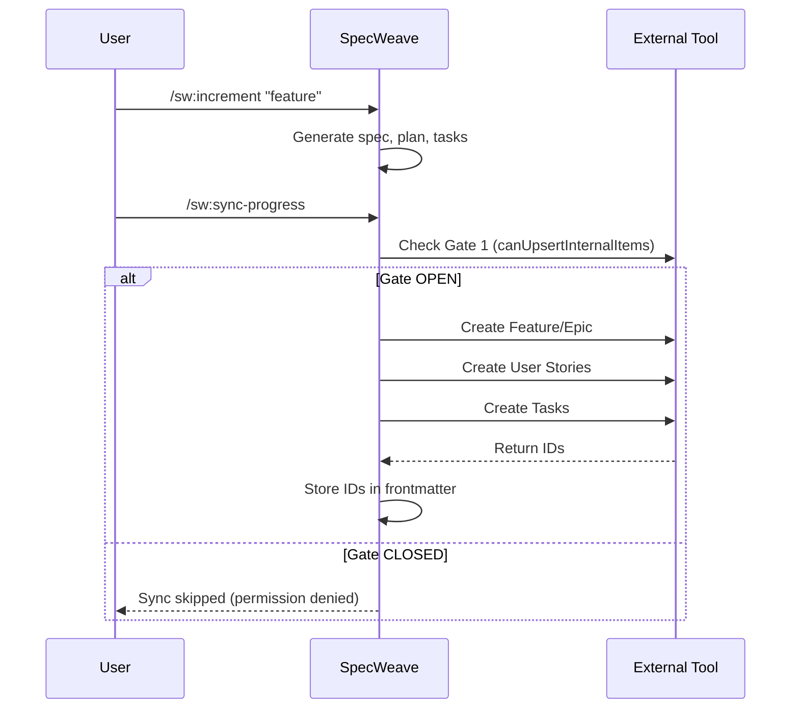
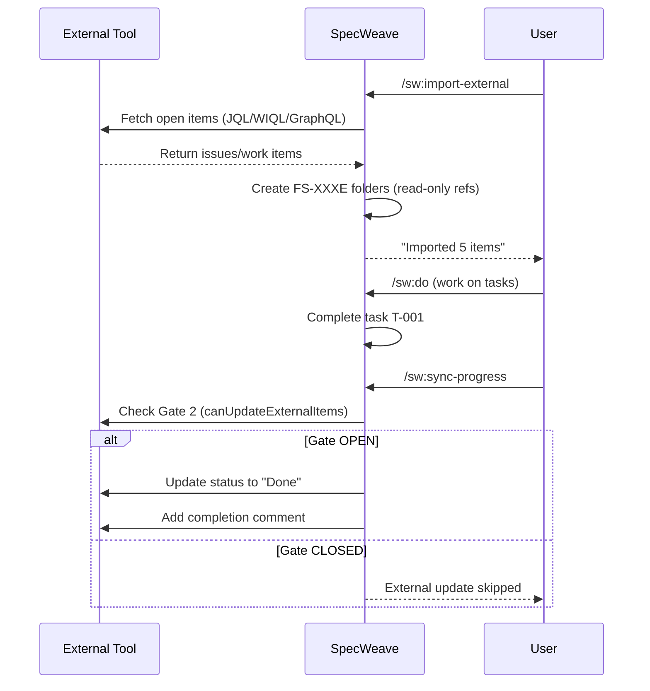

# External Tools Integration Overview

**SpecWeave 1.0** provides enterprise-grade bidirectional synchronization with the three major project management platforms:

- **GitHub Issues** - Native integration for GitHub-centric teams
- **JIRA** - Enterprise Atlassian integration with board support
- **Azure DevOps** - Microsoft ecosystem with area path mapping

---

## Architecture Overview

```mermaid
flowchart TB
    subgraph SPECWEAVE["SpecWeave (Source of Truth)"]
        direction TB
        SPEC[spec.md<br/>User Stories + ACs]
        TASKS[tasks.md<br/>Implementation Tasks]
        LIVING[Living Docs<br/>specs/{project}/FS-XXX/]
    end

    subgraph SYNC["Sync Coordinator"]
        direction TB
        GATE1[Gate 1: Internal Items]
        GATE2[Gate 2: External Items]
        GATE3[Gate 3: Status Updates]
    end

    subgraph EXTERNAL["External Tools"]
        direction TB
        GH[GitHub<br/>Issues + Milestones]
        JIRA[JIRA<br/>Epics + Stories]
        ADO[Azure DevOps<br/>Work Items]
    end

    SPECWEAVE --> SYNC
    SYNC --> EXTERNAL
    EXTERNAL -.-> |Status Only| SYNC

    style SPECWEAVE fill:#e8f5e9,stroke:#4caf50,stroke-width:2px
    style SYNC fill:#fff3e0,stroke:#ff9800,stroke-width:2px
    style EXTERNAL fill:#e3f2fd,stroke:#2196f3,stroke-width:2px
```

---

## Key Concepts

### 1. Split-Source Sync (Not True Bidirectional)

SpecWeave uses **split-source synchronization**:

| Direction | What Syncs | Example |
|-----------|------------|---------|
| **SpecWeave → External** | Content (specs, tasks, ACs) | Create JIRA Story from US-001 |
| **External → SpecWeave** | Status only | JIRA "Done" → task completed |

**Why split-source?**
- SpecWeave remains the source of truth for **what** to build
- External tools track **status** for team visibility
- No merge conflicts between systems
- Clear ownership boundaries

### 2. Three Permission Gates

Every sync operation passes through three permission gates:

```
┌─────────────────────────────────────────────────────────────┐
│                    PERMISSION GATES                          │
├─────────────────────────────────────────────────────────────┤
│                                                              │
│  Gate 1: canUpsertInternalItems                             │
│  └─ Can create/update items that originated in SpecWeave?   │
│     Example: Push US-001 to create JIRA story               │
│                                                              │
│  Gate 2: canUpdateExternalItems                             │
│  └─ Can update items that were imported from external?      │
│     Example: Update GitHub issue that was imported          │
│                                                              │
│  Gate 3: canUpdateStatus                                    │
│  └─ Can change status fields in external tools?             │
│     Example: Close JIRA issue when increment completes      │
│                                                              │
└─────────────────────────────────────────────────────────────┘
```

**Default**: All gates are **OFF** (safe mode). Enable explicitly in config.

### 3. Hierarchy Mapping

SpecWeave maps its 3-level hierarchy to each platform:

| SpecWeave | GitHub | JIRA | Azure DevOps |
|-----------|--------|------|--------------|
| Feature (FS-XXX) | Milestone | Epic | Feature |
| User Story (US-XXX) | Issue | Story | User Story |
| Task (T-XXX) | Checkbox | Sub-task | Task |

### 4. Project Structure Levels

SpecWeave supports two folder structure levels:

#### 1-Level Structure (Simple)
```
.specweave/docs/internal/specs/
├── my-project/
│   ├── FS-001/
│   │   ├── FEATURE.md
│   │   └── us-001-login.md
│   └── FS-002/
│       └── ...
```

**Use when**: Single team, simple organization

#### 2-Level Structure (Team-Based)
```
.specweave/docs/internal/specs/
├── my-project/
│   ├── frontend-team/
│   │   ├── FS-001/
│   │   └── FS-002/
│   ├── backend-team/
│   │   ├── FS-003/
│   │   └── FS-004/
│   └── mobile-team/
│       └── FS-005/
```

**Use when**: Multiple teams, JIRA boards, or ADO area paths

---

## Platform Comparison

| Feature | GitHub | JIRA | Azure DevOps |
|---------|--------|------|--------------|
| **Setup Complexity** | Simple | Medium | Medium |
| **Auth Method** | `gh` CLI | API Token | PAT |
| **Hierarchy** | Milestone → Issue → Checkbox | Epic → Story → Sub-task | Feature → US → Task |
| **Team Support** | Repos | Boards | Area Paths |
| **Sprint Support** | Milestones | Sprints | Iterations |
| **Best For** | Open source, startups | Enterprise Atlassian | Microsoft ecosystem |

---

## Quick Setup Guides

### GitHub (Recommended for Most)

```bash
# 1. Install and authenticate GitHub CLI
brew install gh
gh auth login

# 2. Initialize SpecWeave with GitHub
specweave init .
# Select: "Yes, GitHub Issues"

# 3. Create and sync increment
/sw:increment "my feature"
/sw:sync-progress
```

**[Full GitHub Guide →](/docs/academy/specweave-essentials/14-github-integration)**

### JIRA (Enterprise Atlassian)

```bash
# 1. Create API token at id.atlassian.com

# 2. Configure credentials
cat >> .env << EOF
JIRA_EMAIL=your-email@company.com
JIRA_API_TOKEN=your-token
EOF

# 3. Configure domain in config.json
specweave config set issueTracker.domain "company.atlassian.net"

# 4. Initialize with JIRA
specweave init .
# Select: "Yes, JIRA"
```

**[Full JIRA Guide →](/docs/academy/specweave-essentials/15-jira-integration)**

### Azure DevOps (Microsoft Ecosystem)

```bash
# 1. Create PAT at dev.azure.com

# 2. Configure credentials
cat >> .env << EOF
AZURE_DEVOPS_PAT=your-pat
EOF

# 3. Configure org in config.json
specweave config set issueTracker.organization_ado "your-org"

# 4. Initialize with ADO
specweave init .
# Select: "Yes, Azure DevOps Work Items"
```

**[Full Azure DevOps Guide →](/docs/academy/specweave-essentials/16-ado-integration)**

---

## Sync Workflows

### Workflow 1: Create Internal → Push to External

When you create an increment locally and want it visible in external tools:

```bash
# 1. Create increment
/sw:increment "User authentication feature"

# 2. AI generates spec.md, plan.md, tasks.md

# 3. Sync to external (happens automatically or manually)
/sw:sync-progress

# Result:
# - GitHub: Creates milestone + issues
# - JIRA: Creates Epic + Stories + Sub-tasks
# - ADO: Creates Feature + User Stories + Tasks
```



### Workflow 2: Import External → Work Locally

When work items exist in external tools and you want to implement them:

```bash
# 1. Import from external tool
/sw:import-external

# 2. SpecWeave creates read-only references
# Result:
# - FS-001E (E = external)
# - US-001E-github-issue-42
# - Frontmatter includes: external_ref, external_url

# 3. Work on tasks locally
/sw:do

# 4. Status syncs back (if Gate 2 enabled)
/sw:sync-progress
```



### Workflow 3: Complete Increment → Close External

When an increment completes and you want to close all related external items:

```bash
# 1. All tasks completed
/sw:progress
# → "15/15 tasks complete"

# 2. Close increment with quality gates
/sw:done 0042

# 3. SpecWeave validates:
# - All tasks complete ✓
# - Test coverage >= 60% ✓
# - Living docs updated ✓

# 4. Closes all external items (if Gate 3 enabled)
# - GitHub: Closes issues, updates milestone
# - JIRA: Transitions to "Done"
# - ADO: Sets state to "Closed"
```

---

## Configuration Reference

### config.json Structure

```json
{
  "sync": {
    "enabled": true,
    "autoSync": false,
    "providers": {
      "github": {
        "enabled": true,
        "owner": "your-org",
        "repo": "your-repo"
      },
      "jira": {
        "enabled": true,
        "projectKey": "PROJ"
      },
      "ado": {
        "enabled": true,
        "project": "your-project"
      }
    },
    "permissions": {
      "canUpsertInternalItems": true,
      "canUpdateExternalItems": false,
      "canUpdateStatus": true
    },
    "profiles": {
      "default": {
        "strategy": "intelligent",
        "hierarchyMapping": {
          "featureLevelTypes": ["Epic", "Feature"],
          "userStoryTypes": ["Story", "User Story", "PBI"]
        }
      }
    }
  },
  "issueTracker": {
    "domain": "company.atlassian.net",
    "organization_ado": "your-org"
  }
}
```

### .env Secrets (Never Commit!)

```bash
# GitHub (via gh CLI, usually not needed in .env)
GITHUB_TOKEN=ghp_xxxxxxxxxxxx

# JIRA
JIRA_EMAIL=your-email@company.com
JIRA_API_TOKEN=xxxxxxxxxxxxxxxxxxxxxx

# Azure DevOps
AZURE_DEVOPS_PAT=xxxxxxxxxxxxxxxxxxxx
```

---

## Troubleshooting

### "Permission denied" errors

**Cause**: Gate permissions not enabled

**Fix**:
```bash
# Check current permissions
specweave config get sync.permissions

# Enable needed gates
specweave config set sync.permissions.canUpsertInternalItems true
```

### "Project not found" errors

**Cause**: Config mismatch or authentication issue

**Fix**:
```bash
# Verify config
specweave context projects

# Check authentication
gh auth status          # GitHub
/sw-jira:status         # JIRA
/sw-ado:status          # ADO
```

### "Duplicate issues" created

**Cause**: Running sync multiple times without idempotency

**Fix**: SpecWeave uses 3-layer idempotency (frontmatter → metadata.json → API). If duplicates occur:
1. Check frontmatter for existing IDs
2. Use `--dry-run` first to preview
3. Never use `--force` unless testing

### "Status not syncing back"

**Cause**: Gate 3 (canUpdateStatus) is OFF

**Fix**:
```bash
specweave config set sync.permissions.canUpdateStatus true
```

---

## Best Practices

### 1. Start with Gates OFF

Begin with all gates OFF, enable incrementally:
1. First enable Gate 1 (push specs out)
2. Test thoroughly
3. Then enable Gate 3 (status sync)
4. Only enable Gate 2 if you import external items

### 2. Use Intelligent Strategy

The `intelligent` sync strategy auto-maps user stories to projects:
```json
{
  "sync": {
    "profiles": {
      "default": {
        "strategy": "intelligent"
      }
    }
  }
}
```

### 3. Prefer Per-US Project Field

Always specify project per user story in spec.md:
```markdown
### US-001: Login Form
**Project**: frontend-app
**As a** user, I want...
```

### 4. Keep External as Read-Only References

When importing external items:
- Don't modify the spec content
- Only track status changes
- Use FS-XXXE naming (E = external)

### 5. Monitor Sync Health

Regular health checks:
```bash
# Check sync status
/sw:workflow

# View external items dashboard
/sw:external

# Check for drift
/sw:sync-diagnostics
```

---

## Next Steps

Choose your platform guide:

- **[GitHub Integration Guide](/docs/academy/specweave-essentials/14-github-integration)** - Full GitHub setup with Projects integration
- **[JIRA Integration Guide](/docs/academy/specweave-essentials/15-jira-integration)** - 1-level and 2-level board mapping
- **[Azure DevOps Integration Guide](/docs/academy/specweave-essentials/16-ado-integration)** - Area paths and iteration support

Or learn about specific workflows:

- **[Multi-Project Setup](../multi-project-setup)** - Configure multiple repos/teams
- **[Sync Strategies](../sync-strategies)** - Intelligent vs custom queries
- **[Hierarchy Mapping](../hierarchy-mapping)** - Map any external hierarchy

---

**SpecWeave 1.0** - Enterprise-grade external tool integration
