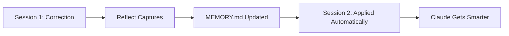

# Self-Improving Skills (Reflect)

**Correct once, never again.** The Reflect system enables Claude to learn from your corrections and patterns, persisting knowledge across sessions.

:::tip Self-Improving AI
Enable `/sw:reflect-on` to start building AI memory that compounds over time.
:::

---

## The Problem

Every LLM session starts from zero:


Common frustrations:
- Wrong naming conventions
- Incorrect logging patterns
- Missing input validation
- Wrong component usage
- Forgotten architectural decisions

**Without memory, you're repeating yourself forever.**

---

## The Solution

Reflect analyzes your sessions and persists learnings in **skill memory files**:



---

## Quick Start

### Enable Auto-Learning

```bash
/sw:reflect-on
```

Now the stop hook will automatically analyze sessions and extract learnings.

### Manual Reflection

After any session, trigger reflection manually:

```bash
/sw:reflect
```

### Check Status

```bash
/sw:reflect-status
```

---

## How It Works

### 1. Signal Detection

Reflect identifies two types of signals:

| Signal Type | Confidence | Example |
|-------------|------------|---------|
| **Corrections** | High | "No, don't use that. Always use X instead." |
| **Approvals** | Medium | "Perfect! That's exactly how it should look." |

### 2. Learning Extraction

Each signal is analyzed and structured:

```json
{
  "id": "LRN-2026-01-05-abc",
  "type": "correction",
  "confidence": "high",
  "category": "component-usage",
  "learning": "Always use <Button variant='primary'> for primary actions",
  "triggers": ["button", "primary", "action"],
  "skill": "frontend"
}
```

### 3. Memory Persistence

Learnings are saved to **centralized memory files** (by category, no skill copies needed!):

```markdown
# .specweave/memory/component-usage.md

# Component Usage Memory

> Auto-generated by SpecWeave Reflect. Edit with caution.
> Last updated: 2026-01-05T10:30:00Z
> Location: Centralized in .specweave/memory/

## Learned Patterns

#### LRN-2026-01-05-abc (High Confidence)
**Context**: User corrected button component usage
**Learning**: Always use `<Button variant='primary'>` for primary actions
**Triggers**: button, primary, action
**Added**: 2026-01-05
**Source**: session:auto-2026-01-05
```

### 4. Automatic Application

Claude reads centralized memory via CLAUDE.md instructions:

```
User: "Create a button for settings"
      ↓
Claude: Session starts
      ↓
CLAUDE.md instruction: "Check .specweave/memory/ for learned patterns"
      ↓
Claude: Reads .specweave/memory/component-usage.md
      ↓
Learned patterns applied
      ↓
Claude: "I'll use <Button variant='primary'>..."
      (Applied learned pattern without skill copying!)
```

---

## Commands Reference

| Command | Description |
|---------|-------------|
| `/sw:reflect` | Analyze current session, extract learnings |
| `/sw:reflect-on` | Enable automatic reflection on session end |
| `/sw:reflect-off` | Disable automatic reflection |
| `/sw:reflect-status` | Show configuration and memory statistics |
| `/sw:reflect-clear` | Remove specific learnings |

---

## Memory File Locations (Centralized Architecture)

:::tip No Skill Copies Needed!
Memory is stored centrally by category. Plugin skills from the marketplace automatically benefit from learned patterns without any copying.
:::

### Project Memory

```
.specweave/memory/
├── component-usage.md    # UI component patterns
├── api-patterns.md       # API design patterns
├── testing.md            # Test patterns (Playwright, Vitest)
├── deployment.md         # Deploy patterns (Wrangler, Vercel)
├── security.md           # Auth, validation patterns
├── database.md           # Query, schema patterns
├── architecture.md       # Design decisions
└── general.md            # Miscellaneous patterns
```

### Global Memory

```
~/.specweave/memory/
├── component-usage.md    # Patterns across ALL projects
├── api-patterns.md
├── testing.md
└── deployment.md
```

---

## Categories

Learnings are automatically categorized:

| Category | Triggers | Example Learning |
|----------|----------|------------------|
| `component-usage` | button, component, ui | Use Button component for actions |
| `api-patterns` | api, endpoint, route | Return 404 for missing resources |
| `testing` | test, mock, coverage | Use vi.mock() for Vitest |
| `deployment` | deploy, wrangler, vercel | Use --local for D1 development |
| `security` | auth, token, password | Never log sensitive data |
| `database` | query, schema, sql | Use parameterized queries |
| `naming` | convention, case, file | PascalCase for React components |
| `architecture` | pattern, design, structure | Follow repository pattern |

---

## Configuration

### Project Config (`.specweave/config.json`)

```json
{
  "reflect": {
    "enabled": true,
    "autoReflect": false,
    "confidenceThreshold": "medium",
    "maxLearningsPerSession": 10,
    "gitCommit": true,
    "gitPush": false
  }
}
```

### Options

| Option | Default | Description |
|--------|---------|-------------|
| `enabled` | true | Enable reflect system |
| `autoReflect` | false | Auto-reflect on session end |
| `confidenceThreshold` | medium | Minimum confidence: high, medium, low |
| `maxLearningsPerSession` | 10 | Max learnings per session |
| `gitCommit` | true | Commit memory changes to git |
| `gitPush` | false | Auto-push after commit |

---

## Git Integration

Track how your AI evolves over time:

```bash
# View learning history
git log --oneline .specweave/skills/frontend/MEMORY.md

# See what was learned
git diff HEAD~1 .specweave/skills/frontend/MEMORY.md

# Rollback a wrong learning
git checkout HEAD~1 -- .specweave/skills/frontend/MEMORY.md
```

---

## Best Practices

### Making Effective Corrections

**High-signal corrections** (captured reliably):
```
"Never use that approach. Always use X because..."
"Don't create custom components. We have a design system."
"Wrong pattern. The correct way is..."
```

**Low-signal corrections** (may not be captured):
```
"Hmm, maybe try something else?"
"That doesn't look quite right."
```

### Giving Clear Approvals

**Strong approvals** (captured):
```
"Perfect! That's exactly how we do it."
"This is the right pattern, well done."
"Yes, always follow this approach."
```

**Neutral responses** (not captured):
```
"OK"
"Sure"
"Proceed"
```

### Organizing Skills

1. **Global skills** (`~/.claude/skills/`) for patterns across all projects
2. **Project skills** (`.specweave/skills/`) for project-specific patterns
3. **Team skills** (shared repo) for team-wide conventions

---

## Integration with Auto Mode

When `/sw:auto` runs with reflection enabled:

```
1. Start auto session
      ↓
2. Claude executes tasks
      ↓
3. User makes corrections (if any)
      ↓
4. Session completes
      ↓
5. Stop hook triggers reflection
      ↓
6. Learnings extracted and saved
      ↓
7. "🧠 Learned from session" notification
```

---

## Troubleshooting

### Learnings Not Persisting

1. Check reflection is enabled: `/sw:reflect-status`
2. Verify skills directory exists: `ls .specweave/skills/`
3. Check file permissions
4. Review logs: `.specweave/logs/reflect/`

### Wrong Learnings Applied

1. View memory file: `cat .specweave/skills/frontend/MEMORY.md`
2. Remove specific learning: `/sw:reflect-clear --learning LRN-XXX`
3. Or use git rollback

### Too Many Learnings

Increase confidence threshold:
```json
{
  "reflect": {
    "confidenceThreshold": "high",
    "maxLearningsPerSession": 5
  }
}
```

---

## Privacy & Security

- Memory files contain only **patterns and learnings**, not raw conversation
- No sensitive data (credentials, keys) is stored
- Memory files can be gitignored if needed
- Clear all learnings: `/sw:reflect-clear --all`

---

## Summary

The Reflect system enables **correct once, never again**:

1. Make correction during session
2. Reflect captures the learning
3. Future sessions apply learned patterns
4. Claude gets smarter over time

**No embeddings. No vector databases. Just markdown files that compound knowledge.**

```bash
# Start now
/sw:reflect-on
```
