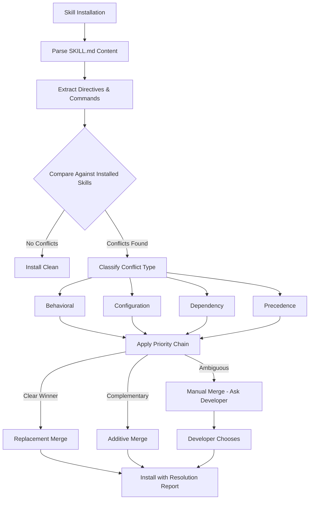

# Skill Contradiction Resolution

When developers install multiple AI agent skills, those skills can issue contradicting instructions on the same topic. No agent runtime currently detects these conflicts — the agent resolves them non-deterministically, producing inconsistent code across sessions. This document explains SpecWeave's approach to detecting, classifying, and resolving skill contradictions.

## The Problem: Silent Instruction Conflicts

The Agent Skills ecosystem has crossed 200,000 published skills with zero cross-skill conflict detection. Real examples from the wild:

- **Memoization**: Vercel's `react-best-practices` says "do not wrap simple expressions with primitive types in useMemo." A competing `react-expert` skill mandates "memoize when passing callbacks/objects to memoized children" with no nuance about expression complexity.
- **Package managers**: A Bun runtime skill instructs agents to "never use npm, yarn, pnpm, or node directly." Google's `stitch-skills` hardcodes `npm run validate` and `npm run dev`.
- **State management**: Three skills recommend three different solutions — Redux Toolkit, Zustand, and Jotai — each positioned as the correct choice for the same use case.
- **React versions**: `react-dev` by Softaworks says "never implement forwardRef in React 19+" while Google's `stitch-skills` validation scripts are built for pre-React-19 patterns.

When an agent loads all of these simultaneously, the result depends on which skill appears last in the context window, which file the agent is currently editing, or seemingly random factors. The developer gets different code patterns in different sessions with no explanation for the inconsistency.

---

## Four Conflict Types

SpecWeave classifies skill contradictions into four categories, each with distinct detection heuristics.

### 1. Behavioral Contradictions

Two or more skills issue opposing instructions on the same programming topic.

**Detection**: Keyword opposition pattern scanning. The system looks for paired directives where one skill uses an affirmative keyword and another uses its negation on the same subject.

Opposition pairs detected:

| Affirmative | Negative |
|-------------|----------|
| `always X` | `never X` |
| `prefer X` | `avoid X` |
| `use X` | `do not use X` / `don't use X` |
| `must X` | `must not X` |
| `require X` | `prohibit X` |
| `recommended` | `deprecated` / `discouraged` |

**Confidence levels**:
- **High**: Direct keyword opposition on the same API name (both mention `useMemo` with opposing verbs)
- **Medium**: Same topic cluster with opposing sentiment but different API names ("use Zustand" vs. "use Redux Toolkit")
- **Low**: Implicit opposition through omission (one skill lists approved libraries; another recommends one not on the list)

### 2. Configuration Contradictions

Two or more skills hardcode incompatible tooling, configuration values, or command invocations.

**Detection**: Parse skill content for shell commands (code blocks and inline backticks), extract package manager binaries (`npm`, `yarn`, `pnpm`, `bun`, `node`, `deno`), and compare across skills. Also detect numeric thresholds ("50 lines", "300 lines") where two skills set different limits for the same metric.

**Examples**:
- `npm run validate` hardcoded in one skill vs. "never use npm" in another
- "50/300 Rule: files exceeding 300 lines should be split" vs. patterns that routinely produce 300+ line component files
- "Pin versions in production; avoid ^ or ~" vs. skills assuming caret ranges

### 3. Dependency Contradictions

Two or more skills assume different runtime versions, framework versions, or dependency configurations that are mutually incompatible.

**Detection**: Maintain a lookup table mapping API names to minimum runtime versions:

| API | Minimum Version |
|-----|----------------|
| `useActionState` | React >= 19.0.0 |
| `use()` hook | React >= 19.0.0 |
| `toSorted()` | Node.js >= 20.0.0 |
| `Array.fromAsync()` | Node.js >= 22.0.0 |
| `forwardRef` | Deprecated in React 19.0.0 |

Compare detected API usage against the project's `package.json` dependencies and `engines` field. Also detect lockfile conflicts — coexisting `package-lock.json` and `bun.lock` from competing package manager skills.

### 4. Precedence Contradictions

Multiple skills claim authority over the same domain without clear priority ordering.

**Detection**: Analyze skill `description` fields and markdown headings for overlapping domain claims. Nine competing React skills on Skills.sh alone, each positioning itself as the authoritative React guide. When three skills all claim to be the "React best practices" authority, the agent has no signal for which to prefer.

---

## The Priority Chain

SpecWeave resolves contradictions using a four-level priority chain. When two skills conflict, the one from the higher-priority source wins.

```
local > project > vendor > community
```

### Priority Levels

| Level | Source | Example | Rationale |
|-------|--------|---------|-----------|
| **Local** (highest) | Developer's own skills in `.agents/skills` | Personal React preferences | Developer knows their project best |
| **Project** | Team skills committed to the repo | `.cursor/skills/team-style` | Team conventions override external opinions |
| **Vendor** | First-party skills from agent/framework vendors | Vercel's `react-best-practices` | Vendor has authoritative knowledge of their framework |
| **Community** (lowest) | Third-party skills from marketplaces | Skills.sh, ClawHub, GitHub | Community skills are opinions, not authority |

### Resolution Example

Conflict: Vercel's `react-best-practices` (vendor) says "use Zustand" while a Skills.sh community skill says "use Redux Toolkit."

Resolution: Vercel skill wins (vendor > community). The detection report notes the conflict and explains the resolution.

If the developer has a local skill that says "use Jotai," that wins over both (local > vendor > community).

---

## Three Merge Strategies

When contradictions are detected, SpecWeave applies one of three merge strategies depending on the conflict severity and type.

### Additive Merge

**When**: Both skills provide complementary guidance that doesn't directly conflict. The contradiction is in completeness, not opposition.

**Action**: Combine both skill instructions with attribution. The developer sees the full picture.

**Example**: Skill A says "use React.memo for expensive components." Skill B says "use useMemo for expensive computations." These are complementary — both are correct for different situations. Merge them into a combined memoization guide.

### Replacement Merge

**When**: Direct opposition where only one instruction can be correct for the project context. Resolution follows the priority chain.

**Action**: The higher-priority skill's instruction replaces the lower-priority one. The suppressed instruction is logged with an explanation.

**Example**: Local skill says "use Bun." Community skill hardcodes `npm install`. The local skill replaces the community instruction for package management commands.

### Manual Merge

**When**: The conflict is ambiguous, both skills have equal priority, or the automated system cannot determine which instruction is correct.

**Action**: Present both instructions to the developer with a conflict report. The developer chooses.

**Example**: Two vendor skills from different frameworks (Vercel React vs. Angular team) give opposing component architecture advice. Neither has priority over the other — the developer must decide based on their project's framework.

---

## Detection Flow



### What the Developer Sees

When installing a skill that conflicts with an existing one:

```
$ vskill add react-expert

⚠ 2 contradictions detected with installed skills:

1. BEHAVIORAL (High confidence)
   react-expert: "Memoize when passing callbacks to memoized children"
   react-best-practices (Vercel): "Do not wrap simple expressions in useMemo"
   → Resolution: Vercel wins (vendor > community)

2. CONFIGURATION (Medium confidence)
   react-expert: Uses `npm run test` in examples
   bun-runtime: "Never use npm directly"
   → Resolution: Manual merge required — choose your package manager

Proceed with installation? (y/n)
```

---

## Integration with SpecWeave

### Security Scanner Integration

Contradiction detection is integrated into SpecWeave's existing `security-scanner.ts` infrastructure. The scanner already runs 26 security patterns against skill content. Contradiction checks run as an additional pass after security scanning, using the same parsed skill content.

### Fabric Registry Integration

The Fabric Registry stores contradiction metadata per skill:

- **Known conflicts**: Pre-computed conflicts with popular skills
- **Resolution history**: How developers in the ecosystem have resolved specific conflicts
- **Conflict score**: A numeric indicator of how "opinionated" a skill is (high conflict scores = frequently contradicts other skills)

### `specweave fabric compare` Integration

The `fabric compare` CLI command includes contradiction analysis when comparing skills from different sources:

```
$ specweave fabric compare react-best-practices --sources skillssh,github

Source Comparison: react-best-practices
┌─────────────────┬──────────────┬──────────────────┬──────────────┐
│ Aspect          │ Skills.sh    │ GitHub (Vercel)   │ Conflict?    │
├─────────────────┼──────────────┼──────────────────┼──────────────┤
│ Memoization     │ Always memo  │ Selective memo    │ BEHAVIORAL   │
│ State mgmt      │ Redux        │ Zustand           │ BEHAVIORAL   │
│ Package mgr     │ npm          │ Not specified     │ None         │
│ React version   │ 18+          │ 19+               │ DEPENDENCY   │
└─────────────────┴──────────────┴──────────────────┴──────────────┘
```

---

## Limitations and Future Work

### Current Limitations

- **Natural language understanding**: The keyword opposition approach catches explicit contradictions but may miss subtle conflicts expressed in nuanced prose.
- **Context-dependent conflicts**: Some instructions only conflict in specific project contexts (e.g., "use Redux" only conflicts with "use Zustand" if both target the same application state).
- **Dynamic resolution**: The current system detects conflicts at installation time. Runtime detection (during agent execution) is a future enhancement.

### Planned Improvements

- **LLM-assisted detection**: Use an LLM judge (SpecWeave's existing `skill-judge.ts`) to evaluate borderline conflicts that keyword matching cannot resolve.
- **Community resolution database**: Allow developers to share how they resolved specific conflicts, building a knowledge base of practical resolutions.
- **Automatic scoping**: If two skills conflict on React patterns but one is scoped to a specific directory (`/app/legacy/`), automatically scope the conflict resolution rather than applying it project-wide.
- **Continuous monitoring**: As skills update, re-run contradiction detection and notify developers if new conflicts emerge with their installed skill set.
