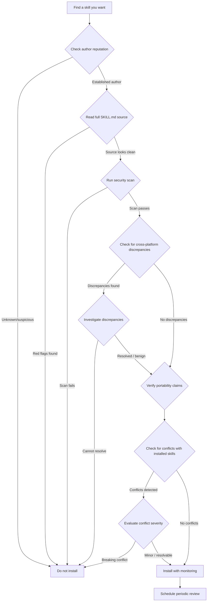

# Skill Discovery and Evaluation

The AI agent skills ecosystem has grown rapidly. Over 200,000 listings now span 8+ platforms, ranging from vendor-curated repositories with rigorous vetting to open marketplaces where anyone can publish anything. The problem is no longer finding skills — it is finding skills you can trust.

According to Snyk's 2025 AI Agent Security Report, 36.82% of publicly listed skills contain at least one security flaw. These range from overly broad permission requests to outright malicious payloads — prompt injection, credential exfiltration, and supply chain hijacking. The stakes are real: a compromised skill runs with the same access as your agent, which typically means your terminal, your files, and your credentials.

This guide provides a systematic framework for discovering skills across every major source, evaluating their quality using a 6-dimension scoring rubric, detecting discrepancies between providers, and recognizing red flags before installation.

:::tip Trusted Registry
[verifiedskill.com](https://verifiedskill.com) provides a trusted source for discovering pre-verified skills with 3-tier certification. See the [Verified Skills Standard](/docs/skills/verified-skills) for how skills earn trust badges.
:::

---

## Discovery Sources

Not all skill sources are equal. Each platform makes different trade-offs between openness and safety. Understanding those trade-offs is the first step toward informed decisions.

### 1. Vendor Repositories

**What it is:** First-party skill collections from Anthropic, OpenAI, Google, and Microsoft, published alongside their agent platforms.

| Attribute | Detail |
|-----------|--------|
| **Approximate count** | ~200 skills total across vendors |
| **Quality signals** | Vendor-authored or vendor-reviewed; version-pinned releases |
| **Security features** | Internal code review; sandbox testing; signed manifests (varies by vendor) |

**Strengths:** Highest baseline trust. These skills are written or vetted by the same teams that build the agent runtimes. Compatibility is guaranteed, and updates follow the platform release cycle.

**Weaknesses:** Extremely limited selection. Covers only generic use cases (file operations, web search, code execution). Domain-specific needs — Terraform, Stripe, Kubernetes — are rarely addressed. Updates can lag behind community demand.

---

### 2. Skills.sh (Vercel)

**What it is:** A curated marketplace hosted by Vercel, focused on Claude Code skills. Includes install counts and community ratings.

**URL:** `https://skills.sh`

| Attribute | Detail |
|-----------|--------|
| **Approximate count** | 200+ skills |
| **Top skill installs** | 234,000+ installs on the most popular listing |
| **Quality signals** | Install counts; user ratings; skill source visible before install |
| **Security features** | None — no automated scanning, no code review |

**Strengths:** Clean interface with genuine community traction. Install counts provide a rough popularity signal. The skill source (SKILL.md) is visible before installation, enabling manual review.

**Weaknesses:** Zero security scanning. Popularity is not a proxy for safety — a skill with 234K installs could still contain a prompt injection payload that no automated system has flagged. Duplicate and near-duplicate skills are common (see the Discrepancy Detection section below).

---

### 3. ClawHub / OpenClaw

**What it is:** The largest open skill registry, originally built for the OpenClaw ecosystem. Accepts community submissions with minimal gatekeeping.

**URL:** `https://clawhub.com`

| Attribute | Detail |
|-----------|--------|
| **Approximate count** | 3,286+ skills |
| **Quality signals** | Star counts; contributor profiles; fork activity |
| **Security features** | VirusTotal scanning added post-incident (after Bitdefender reported 17% malicious skill rate) |

**Strengths:** Largest catalog. Active community contributions. VirusTotal integration catches known malware signatures.

**Weaknesses:** Worst security track record of any major platform. Bitdefender's 2025 report found that 17% of ClawHub skills acted maliciously — injecting crypto miners, infostealers, and prompt manipulation payloads. VirusTotal catches known signatures but misses novel attacks, obfuscated payloads, and pure-prompt exploits that contain no executable code. Treat every ClawHub skill as untrusted until independently verified.

---

### 4. SkillsMP

**What it is:** A meta-aggregator that indexes skills from multiple sources into a single searchable catalog.

| Attribute | Detail |
|-----------|--------|
| **Approximate count** | 200,000+ aggregated listings |
| **Quality signals** | Source attribution; cross-platform deduplication (partial) |
| **Security features** | None — aggregates listings without scanning |

**Strengths:** Single search surface across the fragmented ecosystem. Useful for discovering skills you would not find on any single platform.

**Weaknesses:** No independent quality assessment. Aggregation without scanning means you inherit the worst security posture of every source it indexes. A skill listed on SkillsMP may originate from ClawHub, meaning you are effectively trusting ClawHub's vetting (or lack thereof).

---

### 5. SkillsDirectory.com

**What it is:** An independent directory that applies 50+ automated rules to score every listed skill, assigning letter grades from A through F.

| Attribute | Detail |
|-----------|--------|
| **Approximate count** | 36,000+ skills |
| **Quality signals** | Letter grades (A-F); 50+ rule checks; detailed score breakdowns |
| **Security features** | Automated rule-based scanning (pattern matching, permission analysis, metadata validation) |

**Strengths:** Best automated quality signal in the ecosystem. The letter grade system provides an instant read on skill quality. Rule checks cover permission scope, metadata completeness, code patterns, and documentation quality.

**Weaknesses:** Rule-based scanning catches known patterns but misses novel attack vectors. An A-grade skill is not necessarily safe — it means the skill passed 50+ heuristic checks, not that a human reviewed it. The grading system is transparent about its methodology, which is both a strength (you know what it checks) and a weakness (attackers know what it checks).

---

### 6. GitHub Search

**What it is:** Direct repository search using `agentskill.sh` conventions and SKILL.md file patterns.

| Attribute | Detail |
|-----------|--------|
| **Approximate count** | 44,000+ repositories containing agent skill configurations |
| **Quality signals** | Stars; commit history; contributor count; issue tracker activity; license |
| **Security features** | Full source transparency; GitHub Dependabot alerts; community issue reporting |

**Strengths:** Complete source code visibility. You can read every line before installing. Git history reveals how the skill evolved, who contributed, and whether security issues were addressed. GitHub's own Dependabot catches vulnerable dependencies in skills that include package manifests.

**Weaknesses:** No centralized quality scoring. Discovery requires manual search queries. Many repositories are abandoned, forked-and-forgotten, or experimental. The signal-to-noise ratio is low — 44K repositories does not mean 44K production-ready skills.

---

### 7. Third-Party Scanners

**What they are:** Independent security analysis tools purpose-built for agent skill evaluation.

| Scanner | Focus | Approach |
|---------|-------|----------|
| **Cisco Agent Security** | Enterprise skill vetting | Static analysis + behavioral sandbox |
| **Alice Caterpillar** | Prompt injection detection | NLP-based instruction analysis |
| **SkillShield** | Permission scope analysis | Manifest parsing + permission enumeration |
| **SkillAudit** | Compliance and licensing | License compatibility + data handling audit |

**Strengths:** Purpose-built for the AI skill threat model, which differs from traditional software security. These tools understand prompt injection, instruction override attacks, and excessive permission patterns that generic scanners miss entirely.

**Weaknesses:** Fragmented landscape — no single scanner covers all threat categories. Most require manual invocation per skill. Enterprise scanners (Cisco) are not freely available.

---

### 8. SpecWeave Fabric Registry

**What it is:** SpecWeave's integrated skill registry with a 3-tier trust model and a 26-pattern security scanner.

| Attribute | Detail |
|-----------|--------|
| **Trust tiers** | Tier 1 (vendor-verified), Tier 2 (community-reviewed), Tier 3 (unvetted) |
| **Scanner patterns** | 26 patterns covering prompt injection, credential access, excessive permissions, obfuscation, and instruction override |
| **Quality signals** | Trust tier badge; scan results; compatibility matrix; update frequency |

**Strengths:** Integrated directly into the SpecWeave workflow. Skills are scanned before installation, not after. The 3-tier trust model provides clear expectations — Tier 1 skills have been reviewed by maintainers, Tier 2 skills passed community review, and Tier 3 skills are explicitly marked as unvetted.

**Weaknesses:** Smaller catalog than open marketplaces. The 26-pattern scanner is effective against known attack patterns but, like all static analysis, can miss novel techniques.

---

## Quality Scoring Rubric

Use this 6-dimension rubric to score any skill from any source. Each dimension is scored 0 through 5. The maximum possible score is 30.

### Dimension 1: Transparency (0-5)

How readable and auditable is the skill?

| Score | Criteria |
|-------|----------|
| **0** | Source not available; binary or encrypted payload |
| **1** | Source partially available; key logic obscured or minified |
| **2** | Full source available but poorly documented; no inline comments |
| **3** | Full source with basic documentation; purpose of each section is clear |
| **4** | Well-documented source with clear architecture; README explains design decisions |
| **5** | Fully transparent with annotated source, architecture docs, changelog, and security policy |

### Dimension 2: Security Scan (0-5)

Has the skill been scanned, and by what tier of tooling?

| Score | Criteria |
|-------|----------|
| **0** | No scan performed; no scan results available |
| **1** | Basic pattern matching only (grep-level checks) |
| **2** | Automated rule-based scan (SkillsDirectory-level; 50+ rules) |
| **3** | Purpose-built AI skill scanner (Alice Caterpillar, SkillShield, or equivalent) |
| **4** | Multi-scanner analysis (2+ independent tools) with documented results |
| **5** | Professional security audit or vendor-internal review with published findings |

### Dimension 3: Author Reputation (0-5)

How trustworthy is the skill author?

| Score | Criteria |
|-------|----------|
| **0** | Anonymous; no identity information; throwaway account |
| **1** | Account exists but less than 30 days old; no other published work |
| **2** | Established account (90+ days) with some public activity; identity unverified |
| **3** | Recognized contributor with multiple published skills or packages; consistent history |
| **4** | Well-known maintainer in the ecosystem; affiliated with a reputable organization |
| **5** | Platform vendor or core framework maintainer; identity independently verifiable |

### Dimension 4: Update Frequency (0-5)

How actively is the skill maintained?

| Score | Criteria |
|-------|----------|
| **0** | No updates ever; single commit and abandoned |
| **1** | Last update more than 12 months ago |
| **2** | Last update within 6-12 months |
| **3** | Last update within 3-6 months; responds to issues |
| **4** | Monthly updates; active issue triage; published changelog |
| **5** | Weekly or continuous updates; rapid security response; semantic versioning |

### Dimension 5: Test Coverage (0-5)

Does the skill include tests, and how comprehensive are they?

| Score | Criteria |
|-------|----------|
| **0** | No tests of any kind |
| **1** | Basic smoke test or single example |
| **2** | Unit tests covering core functionality (less than 50% coverage) |
| **3** | Unit tests covering most functionality (50-80% coverage) |
| **4** | Comprehensive tests (80%+ coverage) with integration or end-to-end tests |
| **5** | Full test suite with CI/CD pipeline, coverage reports, and edge case testing |

### Dimension 6: Portability (0-5)

How many agent platforms does the skill support?

| Score | Criteria |
|-------|----------|
| **0** | Hardcoded to a single agent version; breaks on updates |
| **1** | Works on one agent platform only; no portability consideration |
| **2** | Works on one platform with clear documentation for adaptation |
| **3** | Supports 2-3 agent platforms with documented configuration |
| **4** | Supports 4+ platforms with tested configurations |
| **5** | Platform-agnostic design; standard skill format; verified across all major agents |

### Score Interpretation

| Total Score | Assessment | Recommendation |
|-------------|------------|----------------|
| **25-30** | Excellent | Safe for production use with standard monitoring |
| **20-24** | Good | Suitable for production with periodic review |
| **15-19** | Acceptable | Use with caution; monitor closely; prefer alternatives if available |
| **10-14** | Poor | Development/testing only; do not use in production |
| **0-9** | Unacceptable | Do not install; high risk of security or quality issues |

---

## Source Quality Assessment Matrix

This matrix applies the scoring rubric to each discovery source as a whole, providing a baseline expectation for skills found on each platform.

| Source | Transparency | Security Scan | Author Reputation | Update Frequency | Test Coverage | Portability | **Total** |
|--------|:-----------:|:------------:|:-----------------:|:----------------:|:------------:|:-----------:|:---------:|
| **Vendor Repositories** | 4 | 5 | 5 | 3 | 4 | 2 | **23** |
| **Skills.sh** | 4 | 0 | 2 | 3 | 1 | 2 | **12** |
| **ClawHub / OpenClaw** | 3 | 2 | 1 | 2 | 1 | 3 | **12** |
| **SkillsMP** | 2 | 0 | 1 | 2 | 0 | 2 | **7** |
| **SkillsDirectory.com** | 3 | 3 | 2 | 3 | 1 | 2 | **14** |
| **GitHub Search** | 5 | 1 | 3 | 3 | 2 | 2 | **16** |
| **Third-Party Scanners** | 3 | 4 | 3 | 3 | 2 | 2 | **17** |
| **SpecWeave Fabric Registry** | 4 | 4 | 4 | 3 | 3 | 3 | **21** |

Note: These scores represent the typical quality of skills found on each platform, not the quality of the platform itself. Individual skills will vary widely.

---

## Discrepancy Detection

The same skill name published on different platforms does not guarantee the same content. This is one of the most underappreciated risks in the current ecosystem.

### The Problem

A skill called `react-component-generator` on Skills.sh may bear no relation to the skill with the same name on ClawHub. There is no global namespace, no content-addressed deduplication, and no cross-platform identity verification. This creates three categories of risk:

1. **Innocent divergence.** Two authors independently created skills with the same name. The skills serve similar purposes but have different implementations, quality levels, and security postures.

2. **Intentional impersonation.** An attacker publishes a skill with the same name as a popular, trusted skill on a different platform. Users searching by name may install the malicious version without realizing it is not the same skill.

3. **Version drift.** The same author published to multiple platforms but only updates one. The stale copy on the secondary platform may contain known vulnerabilities that have been patched in the primary version.

### Real-World Scale

On Skills.sh alone, searching for "React" returns 9 competing skills with overlapping names and descriptions. Without careful evaluation, there is no way to determine which is authoritative, which is a fork, and which may be a trojan.

### How to Detect Discrepancies

When you find a skill you want to install, search for the same name across at least two other platforms. Compare the following:

- **Author identity.** Is the same author listed on both platforms? Can you verify the author's identity through a linked GitHub profile or organization?
- **Content hash.** Does the SKILL.md content match byte-for-byte? Even minor differences in instruction text can indicate divergence or tampering.
- **Publish date.** Which was published first? The later publication is more likely to be a fork or impersonation.
- **Permission scope.** Does one version request more permissions than the other? Expanded permissions in a "copy" are a strong signal of malicious modification.

### SpecWeave Approach

The `specweave fabric compare` command provides automated cross-source comparison:

```bash
# Compare a skill across known registries
specweave fabric compare react-component-generator --sources skills.sh,clawhub,github

# Output includes:
# - Content diff between versions
# - Author identity correlation
# - Permission scope comparison
# - Publish timeline
```

This surfaces discrepancies before installation, allowing you to make an informed choice about which source to trust.

---

## Red Flags Checklist

Before installing any skill, scan for these warning signs. A single red flag warrants deeper investigation. Two or more should halt installation entirely.

### Identity Red Flags

- [ ] **No author identity** — anonymous or pseudonymous with no linked accounts
- [ ] **Account less than 30 days old** — new accounts publishing "popular" skills are suspicious
- [ ] **No other published work** — a single-skill author with no history is higher risk
- [ ] **Mismatched identity across platforms** — same skill name but different authors on different platforms

### Content Red Flags

- [ ] **Base64 encoded content** — legitimate skills have no reason to encode instructions
- [ ] **`curl | bash` or `eval()` patterns** — remote code execution during installation
- [ ] **Minified or obfuscated logic** — if you cannot read it, you cannot trust it
- [ ] **Instructions to disable security features** — "add this to your allowlist" or "disable prompt injection detection"
- [ ] **No description or vague description** — quality skills explain what they do and why

### Permission Red Flags

- [ ] **Excessive permissions requested** — a formatting skill should not need network access
- [ ] **File system access beyond stated scope** — a React skill reading `.env` files or SSH keys
- [ ] **Network calls to unexpected domains** — telemetry, analytics, or data exfiltration endpoints

### Behavioral Red Flags

- [ ] **Overrides existing agent instructions** — attempts to modify system prompts or CLAUDE.md
- [ ] **References other skills by name** — may be attempting to chain exploits across skills
- [ ] **Includes conditional logic based on environment** — behaves differently in CI vs local

---

## Recommended Evaluation Workflow

Follow this process for every skill before installation. The workflow is ordered from least effort to most effort — each step either clears the skill for the next check or eliminates it.



### Step 1: Check Author Reputation

Look up the author on GitHub, their personal site, or their organization's page. Verify that the account has meaningful history (commits, issues, other projects) beyond just this one skill. If the author is anonymous or the account is very new, stop here unless there is a compelling reason to proceed.

### Step 2: Read the Full SKILL.md Source

Read every line. Skills are typically 50 to 500 lines of Markdown — this takes 5 to 15 minutes. Run through the Red Flags Checklist above while reading. Pay particular attention to any instructions that modify agent behavior, request permissions, or reference external URLs.

### Step 3: Run a Security Scan

Use at least one purpose-built scanner. Recommended options in order of accessibility:

```bash
# SpecWeave's built-in 26-pattern scanner
specweave fabric scan ./path-to-skill/

# Alice Caterpillar (prompt injection focus)
alice scan --skill ./SKILL.md

# Cisco Agent Security (enterprise, if available)
cisco-agent-security analyze ./path-to-skill/
```

If the skill fails any scanner, do not install it regardless of other positive signals.

### Step 4: Check for Cross-Platform Discrepancies

Search for the skill name on at least two other platforms. If the same name appears with different content or authors, investigate before proceeding. Use `specweave fabric compare` for automated comparison if available.

### Step 5: Verify Portability Claims

If the skill claims to work across multiple agent platforms, verify this against your target platform. Check whether the skill uses platform-specific features that may not translate, and whether the author has tested on your specific agent version.

### Step 6: Monitor After Installation

Installation is not the end of the evaluation process. After installing a skill:

- Monitor agent behavior for the first several sessions
- Check for unexpected file access patterns or network requests
- Subscribe to the skill's repository for security advisories
- Re-evaluate at least quarterly, or whenever the skill updates

---

## Scoring a Skill: Worked Example

To illustrate the rubric in practice, consider evaluating a hypothetical `terraform-state-manager` skill found on GitHub:

| Dimension | Evidence | Score |
|-----------|----------|:-----:|
| **Transparency** | Full source on GitHub; README explains architecture; inline comments | 4 |
| **Security Scan** | No published scan results; you run Alice Caterpillar manually, it passes | 3 |
| **Author Reputation** | Maintainer of 3 other Terraform tools; 2-year GitHub history; works at a known consultancy | 4 |
| **Update Frequency** | Last commit 6 weeks ago; responds to issues within a week | 4 |
| **Test Coverage** | Unit tests for core logic; no integration tests; ~60% coverage | 3 |
| **Portability** | Works on Claude Code and Copilot; untested on others | 3 |
| **Total** | | **21** |

A score of 21 places this skill in the "Good" range — suitable for production with periodic review. The primary gap is the lack of pre-published security scan results and limited portability testing.

---

## Summary

The skills ecosystem rewards caution. The combination of rapid growth, fragmented platforms, and minimal cross-platform coordination means that the burden of quality assurance falls on the individual installing the skill. Use the scoring rubric consistently, automate what you can with scanners, and never skip the manual source review. A 15-minute investment reading a SKILL.md before installation can prevent hours of incident response after a compromised skill reaches your codebase.
