<div className="homepage-hero">

<div className="hero-content">

# Program Your AI in English

<span className="hero-subtitle">
Skills are <strong>programs written in English</strong> — reusable, extensible, shareable. Describe what you want. AI asks the right questions. Go to sleep. Review finished work in the morning.
</span>

<div className="hero-cta-row">
<a href="./quick-start" className="hero-btn hero-btn-primary">Get Started Free</a>
<a href="https://youtube.com/@antonabyzov" className="hero-btn hero-btn-secondary">Watch Demo</a>
</div>

<div className="hero-badges">

[](https://www.npmjs.com/package/specweave)
[](https://www.npmjs.com/package/specweave)
[](https://discord.gg/UYg4BGJ65V)

</div>

</div>

<div className="hero-visual">

</div>

</div>

---

<div className="features-section">

## The Problem with AI Coding Today

<div className="problem-cards">
<div className="problem-card">
<span className="problem-icon">💨</span>
<h3>Context Vanishes</h3>
<p>Chat ends, specs disappear. You lose everything.</p>
</div>
<div className="problem-card">
<span className="problem-icon">🔄</span>
<h3>Repeat Yourself</h3>
<p>Re-explain architecture every single session.</p>
</div>
<div className="problem-card">
<span className="problem-icon">📝</span>
<h3>Docs Rot</h3>
<p>JIRA outdated. README lies. Tests missing.</p>
</div>
</div>

<div className="solution-highlight">

### SpecWeave Solves This

AI that **remembers everything** — your decisions, patterns, and preferences compound across sessions. Docs update automatically. Nothing gets lost.

</div>

</div>

---

<div className="how-it-works-section">

## How It Works

```mermaid
flowchart LR
    A["💡 Describe"] --> B["🎤 AI Interviews You"]
    B --> C["📋 spec + plan + tasks"]
    C --> D["🤖 Autonomous Build"]
    D --> E["☀️ Review in Morning"]

    style A fill:#f3f4f6,stroke:#9ca3af,color:#1f2937
    style B fill:#7c3aed,stroke:#5b21b6,color:#fff
    style C fill:#7c3aed,stroke:#5b21b6,color:#fff
    style D fill:#22c55e,stroke:#16a34a,color:#fff
    style E fill:#a78bfa,stroke:#7c3aed,color:#1e1b4b
```

<div className="workflow-visual">



</div>

<div className="workflow-steps">
<div className="workflow-step">
<div className="step-number">1</div>
<h3>Describe What You Want</h3>
<code>/sw:increment "Checkout flow with Stripe"</code>
<p>AI asks 5-10 clarifying questions: payment methods, guest checkout, subscriptions, UI library. Once answered, it creates spec + plan + tasks.</p>
</div>
<div className="workflow-step">
<div className="step-number">2</div>
<h3>Go To Sleep</h3>
<code>/sw:auto</code>
<p>Autonomous execution for hours. Writes code, runs tests, fixes failures, syncs to GitHub/JIRA. Self-healing with quality gates.</p>
</div>
<div className="workflow-step">
<div className="step-number">3</div>
<h3>Review and Ship</h3>
<code>/sw:done</code>
<p>Tests verify technical correctness. You review UI, UX, and business logic. Everything documented and synced.</p>
</div>
</div>

</div>

---

<div className="features-grid-section">

## Three Pillars

<div className="feature-grid">

<div className="feature-card">
<div className="feature-icon">🧠</div>
<h3>Programmable AI</h3>
<p>Skills are programs in English — reusable logic that controls how AI thinks and acts. Customize any skill without forking. Fix once, remembered permanently.</p>
</div>

<div className="feature-card">
<div className="feature-icon">🤖</div>
<h3>Autonomous Teams</h3>
<p>Run agent swarms across iTerm/tmux panes. Each agent owns an increment. File-based coordination prevents conflicts. 100+ specialized skills.</p>
</div>

<div className="feature-card">
<div className="feature-icon">🏢</div>
<h3>Enterprise Ready</h3>
<p>Compliance audit trails in git. Brownfield analysis. JIRA/ADO sync. Multi-repo coordination. Production-grade from day one.</p>
</div>

</div>

</div>

---

<div className="features-grid-section">

## You Don't Need to Learn Claude Code

SpecWeave handles the complexity for you. No hooks to configure. No CLAUDE.md to write. No plugins to install. Skills auto-activate based on your project.

**Install. Describe your feature. Skills do the rest.**

<a href="./overview/no-docs-needed" className="hero-btn hero-btn-secondary">Learn more</a>

</div>

---

<div className="auto-mode-section">

## Autonomous Mode

<div className="auto-mode-container">
<div className="auto-mode-content">

Run `/sw:auto` and watch AI work for **hours** without intervention:

- **Self-healing** — Test fails? AI analyzes, fixes, retries
- **Quality gates** — Won't ship until all checks pass
- **Real-time visibility** — See exactly what's happening
- **100+ specialized skills** — PM, Architect, QA, Security, DevOps — powered by Claude Opus 4.6

</div>
<div className="auto-mode-terminal">

```
╔══════════════════════════════════════════════════════════╗
║  AUTO SESSION ACTIVE                                      ║
╠══════════════════════════════════════════════════════════╣
║  Iteration: 47/2500                                      ║
║  Increment: 0001-user-auth                               ║
║  Progress: ████████████░░░░ 12/15 tasks                  ║
║  Tests: 42 passed · 0 failed                             ║
╠══════════════════════════════════════════════════════════╣
║  Stop when: All tasks complete + tests passing           ║
╚══════════════════════════════════════════════════════════╝
```

</div>
</div>

**[Learn about Auto Mode →](./commands/auto)**

</div>

---

<div className="features-grid-section">

## Everything You Need

<div className="feature-grid">

<div className="feature-card">
<div className="feature-icon">📝</div>
<h3>Skills as Programs</h3>
<p>100+ skills written in English. PM, Architect, QA, Security, DevOps, Frontend, Backend, Mobile, ML — all customizable.</p>
</div>

<div className="feature-card">
<div className="feature-icon">📚</div>
<h3>Living Documentation</h3>
<p>Specs, ADRs, and runbooks update automatically after every task. Zero manual work.</p>
</div>

<div className="feature-card">
<div className="feature-icon">🧠</div>
<h3>Self-Improving AI</h3>
<p>Claude learns from your corrections. Fix something once — it remembers forever across all sessions.</p>
</div>

<div className="feature-card">
<div className="feature-icon">🔗</div>
<h3>External Sync</h3>
<p>GitHub Issues, JIRA, Azure DevOps — all stay in sync automatically. Bidirectional.</p>
</div>

<div className="feature-card">
<div className="feature-icon">✅</div>
<h3>Quality Gates</h3>
<p>Code Grill reviews like a senior engineer. Tests must pass. Docs must be updated. ACs must be met.</p>
</div>

<div className="feature-card">
<div className="feature-icon">⚡</div>
<h3>Zero Config</h3>
<p>One command to install. Skills auto-activate. No Claude Code expertise needed.</p>
</div>

</div>

</div>

---

<div className="social-proof-section">

## Battle Tested

<div className="stats-row">
<div className="stat-item">
<div className="stat-number">200+</div>
<div className="stat-label">Features Shipped</div>
</div>
<div className="stat-item">
<div className="stat-number">10k+</div>
<div className="stat-label">Downloads</div>
</div>
<div className="stat-item">
<div className="stat-number">500+</div>
<div className="stat-label">Discord Members</div>
</div>
</div>

<div className="results-grid">
<div className="result-card">
<div className="result-project">React Native App</div>
<div className="result-time">2.5 hours</div>
<div className="result-detail">3,200 LOC, 42 tests, offline sync</div>
</div>
<div className="result-card">
<div className="result-project">Microservices (3 repos)</div>
<div className="result-time">1.2 hours</div>
<div className="result-detail">Payment webhooks, 67 tests</div>
</div>
<div className="result-card">
<div className="result-project">Brownfield Docs</div>
<div className="result-time">3 hours</div>
<div className="result-detail">450k LOC analyzed, 127 pages</div>
</div>
</div>

</div>

---

<div className="quick-start-section">

## Start in 30 Seconds

<div className="install-box">

```bash
# Install globally
npm install -g specweave

# Initialize in your project
cd your-project
specweave init .

# In Claude Code, describe what you want
/sw:increment "Add user authentication"
/sw:auto  # Go to sleep. Review in the morning.
```

</div>

<div className="requirements-box">

**Requirements:** Node.js 20.12+ · Claude Code (VSCode or CLI) · Git

:::tip Best Experience
**Claude Code + Claude Opus 4.6** — native hooks, multi-hour sessions, quality gates work out of the box.
:::

</div>

</div>

---

<div className="final-cta">

<h2>Ready to Ship While You Sleep?</h2>

<p>Join thousands of developers building production features with AI that actually remembers.</p>

<div className="cta-buttons">
<a href="./quick-start" className="cta-primary">Get Started Free →</a>
<a href="https://github.com/anton-abyzov/specweave" className="cta-secondary">Star on GitHub ⭐</a>
</div>

<div className="cta-links">
<a href="https://discord.gg/UYg4BGJ65V">Discord Community</a> ·
<a href="https://youtube.com/@antonabyzov">YouTube Tutorials</a> ·
<a href="./overview/skills-as-programs">Skills Deep Dive</a> ·
<a href="./enterprise">Enterprise</a>
</div>

</div>
