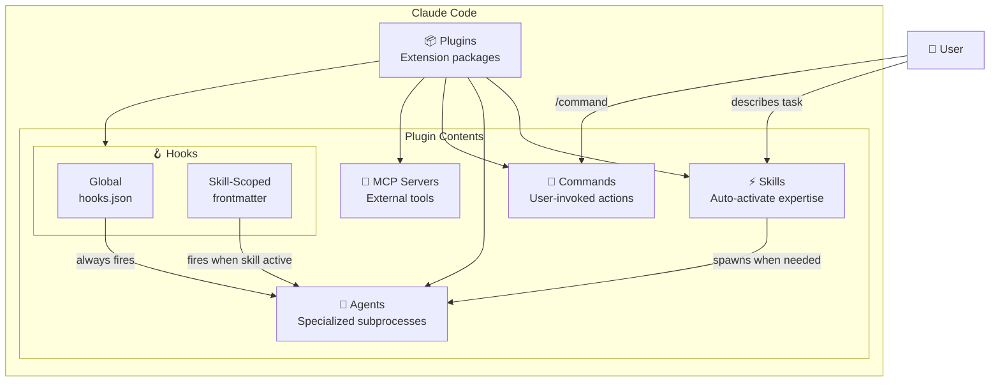

# Claude Code Architecture

Understanding Claude Code's architecture helps you leverage SpecWeave's full power. This guide explains how the core components work and relate to each other.

:::info Official Documentation
This guide is based on the [official Claude Code documentation](https://docs.anthropic.com/en/docs/claude-code) and the [Claude Agent SDK](https://docs.anthropic.com/en/docs/agents-and-tools/claude-code/sdk-overview).
:::

:::tip Cross-Platform Compatibility
**SpecWeave works on all platforms** (macOS, Linux, Windows) and with multiple AI tools:
- **Claude Code** — Native integration (best experience)
- **Cursor, Windsurf, GitHub Copilot** — Via CLAUDE.md instructions
- **Any AI IDE** — Via `specweave generate --template=md`

While Claude Code provides the deepest integration with native hooks and skills, SpecWeave's core workflow (`spec.md`, `plan.md`, `tasks.md`) works with any AI coding assistant.
:::

---

## The Big Picture

Claude Code is an extensible AI coding assistant with a **plugin-based architecture**. Everything flows through plugins, which bundle related functionality together.



---

## Component Relationships

### How They Differ

| Component | Invocation | Purpose | Runs In |
|-----------|------------|---------|---------|
| **Skills** | Auto (keyword triggers) | Provide expertise in conversation | Main context |
| **Agents** | Spawned (Task tool) | Execute complex isolated tasks | Separate context |
| **Commands** | Manual (/slash) | Perform specific actions | Main context |
| **Hooks** | Auto (events) | React to lifecycle events | Background |

### The Flow

```
┌─────────────────────────────────────────────────────────────────────┐
│                         USER INTERACTION                             │
├─────────────────────────────────────────────────────────────────────┤
│                                                                      │
│   User: "Review this code for security issues"                       │
│                      │                                               │
│                      ▼                                               │
│   ┌──────────────────────────────────────┐                          │
│   │  SKILL MATCHING (Auto)               │                          │
│   │  "security" keyword detected         │                          │
│   │  → sw:security skill activates       │                          │
│   └──────────────────────────────────────┘                          │
│                      │                                               │
│                      ▼                                               │
│   ┌──────────────────────────────────────┐                          │
│   │  SKILL PROVIDES EXPERTISE            │                          │
│   │  Security patterns, OWASP, etc.      │                          │
│   │  Claude knows HOW to review          │                          │
│   └──────────────────────────────────────┘                          │
│                      │                                               │
│          Complex task? Spawns agent                                  │
│                      │                                               │
│                      ▼                                               │
│   ┌──────────────────────────────────────┐                          │
│   │  AGENT (Isolated Context)            │                          │
│   │  Runs security scan in subprocess    │                          │
│   │  Returns results when done           │                          │
│   └──────────────────────────────────────┘                          │
│                                                                      │
└─────────────────────────────────────────────────────────────────────┘
```

---

## 📦 Plugins: The Container

Plugins are **packages that bundle related functionality**. Each plugin can contain any combination of skills, agents, commands, hooks, and MCP servers.

### Plugin Structure

```
my-plugin/
├── .claude-plugin/
│   └── plugin.json          # Required: plugin manifest
├── commands/                 # Custom slash commands
│   └── my-command.md
├── agents/                   # Custom agents (subagents)
│   └── specialist.md
├── skills/                   # Agent Skills
│   └── my-skill/
│       └── SKILL.md
├── hooks/                    # Event handlers
│   └── hooks.json
└── .mcp.json                # MCP server definitions
```

### SpecWeave Plugins (24 total)

| Plugin | Skills | Agents | Commands | Purpose |
|--------|--------|--------|----------|---------|
| **sw** (core) | 9 | 22 | 22 | Increment lifecycle |
| **sw-github** | 2 | 1 | 8 | GitHub sync |
| **sw-jira** | 2 | 1 | 8 | JIRA sync |
| **sw-frontend** | 3 | 3 | 0 | React/Vue/Next.js |
| **sw-backend** | 2 | 2 | 1 | Node.js/Python APIs |
| **sw-k8s** | 1 | 1 | 0 | Kubernetes/GitOps |
| **sw-ml** | 2 | 3 | 4 | ML pipelines |
| **sw-infra** | 5 | 5 | 1 | DevOps/SRE |
| ... | | | | |

**Total: 100+ skills, 68+ agents, 100+ commands**

---

## ⚡ Skills: Auto-Activating Expertise

Skills are **SKILL.md files** that Claude automatically loads when relevant keywords appear in your conversation.

### How Skills Work

1. **Discovery**: Skills are discovered at startup from `.claude/skills/` directories
2. **Matching**: Claude matches your request against skill descriptions
3. **Loading**: Only relevant skill content is loaded (saves tokens!)
4. **Guidance**: The skill provides expertise inline in your conversation

### Skill Anatomy

```markdown
---
name: security-review
description: Security expert for code review and vulnerability detection
triggers:
  - security
  - owasp
  - vulnerability
  - authentication
allowed-tools: Read, Grep, Glob
context: fork          # NEW in 2.1.0: Run in isolated sub-agent
model: opus            # NEW in 2.1.0: Specify execution model
---

# Security Review Skill

When reviewing code for security issues:

1. Check for OWASP Top 10 vulnerabilities
2. Review authentication and authorization
3. Look for SQL injection, XSS, CSRF
...
```

### Key Properties

- **Auto-activate**: No manual invocation needed
- **Main context**: Runs in your conversation (not isolated) — unless `context: fork` is set
- **Keyword triggers**: Activates when description matches
- **Token efficient**: Only loaded when needed

### New Frontmatter Fields (Claude Code 2.1.0+)

| Field | Purpose | Example |
|-------|---------|---------|
| **`context: fork`** | Run skill in isolated sub-agent context | Prevents context pollution |
| **`model`** | Specify which model executes | `opus`, `sonnet`, `haiku` |
| **`hooks`** | Embed skill-scoped hooks | See Hooks section below |

### Example Flow

```
User: "Check this login function for security issues"
                    │
                    ▼
       ┌─────────────────────────┐
       │  Keyword: "security"    │
       │  → security skill loads │
       └─────────────────────────┘
                    │
                    ▼
       Claude now has security expertise
       and reviews code accordingly
```

---

## 🤖 Agents: Isolated Task Execution

Agents (subagents) are **separate Claude instances** spawned to handle complex tasks in isolation.

### How Agents Work

1. **Spawning**: Main Claude uses the `Task` tool to spawn an agent
2. **Isolation**: Agent runs with its own context (doesn't pollute main conversation)
3. **Tools**: Agent can have restricted tool access
4. **Return**: Agent completes and returns results to main Claude

### Agent Anatomy

```markdown
---
description: Expert code review specialist for quality, security, and maintainability
model: opus
tools: Read, Grep, Glob
---

# Code Reviewer Agent

You are a code review specialist. When reviewing:

1. Identify security vulnerabilities
2. Check for performance issues
3. Verify coding standards
...
```

### Key Properties

- **Isolated context**: Separate from main conversation
- **Spawned explicitly**: Via Task tool or user request
- **Tool restrictions**: Can limit what the agent can do
- **Model override**: Can use different model (haiku for speed)

### Why Use Agents?

| Benefit | Description |
|---------|-------------|
| **Context isolation** | Complex tasks don't pollute main conversation |
| **Parallelization** | Multiple agents can run concurrently |
| **Specialization** | Tailored instructions for specific domains |
| **Tool restrictions** | Read-only agents can't modify files |

### Example Flow

```
User: "Use the k8s architect to design my deployment"
                    │
                    ▼
       ┌─────────────────────────┐
       │  Task tool spawns       │
       │  kubernetes-architect   │
       └─────────────────────────┘
                    │
                    ▼
       ┌─────────────────────────┐
       │  Agent works in         │
       │  isolated context       │
       │  (generates manifests)  │
       └─────────────────────────┘
                    │
                    ▼
       Results returned to main Claude
```

---

## 📝 Commands: User-Invoked Actions

Commands are **slash commands** (`/command`) that users explicitly invoke.

### How Commands Work

1. **Discovery**: Commands from `.claude/commands/` are listed at startup
2. **Invocation**: User types `/command-name` or `/plugin:command`
3. **Execution**: Command content becomes instructions for Claude
4. **Arguments**: Can accept `$ARGUMENTS` or positional `$1`, `$2`

### Command Anatomy

```markdown
---
description: Create git commit with intelligent message
allowed-tools: Bash, Read, Grep
argument-hint: [optional message]
---

# Commit Command

1. Run `git status` to see changes
2. Run `git diff HEAD` to understand modifications
3. Generate a concise commit message
4. Create the commit: `git commit -m "message"`
```

### Key Properties

- **User-invoked**: Only runs when explicitly called
- **Namespaced**: Plugin commands use `plugin:command` format
- **Arguments**: Can accept parameters
- **Tool restrictions**: Can limit available tools

### Built-in vs Custom Commands

| Type | Location | Example |
|------|----------|---------|
| Built-in | Claude Code core | `/compact`, `/clear`, `/help` |
| Plugin | `.claude/plugins/*/commands/` | `/sw:increment`, `/sw-github:sync` |
| Project | `.claude/commands/` | Custom project commands |
| Personal | `~/.claude/commands/` | Your global commands |

---

## 🪝 Hooks: Event-Driven Automation

Hooks are **scripts that run automatically** when specific events occur.

### Hook Events

| Event | When It Fires | Common Use |
|-------|---------------|------------|
| **PreToolUse** | Before any tool executes | Block dangerous operations |
| **PostToolUse** | After tool completes | Log actions, update docs |
| **Stop** | Session ends | Save state, cleanup |
| **SubagentStop** | Subagent completes | Aggregate results |
| **UserPromptSubmit** | User sends message | Inject context |
| **SessionStart** | Session begins | Initialize logging |

### Hook Anatomy (hooks.json)

```json
{
  "hooks": [
    {
      "event": "PreToolUse",
      "matcher": "Write|Edit",
      "script": "./validate-file.sh"
    },
    {
      "event": "PostToolUse",
      "script": "./update-docs.sh"
    }
  ]
}
```

### Key Properties

- **Auto-execute**: No user action required
- **Event-based**: Fires on specific lifecycle events
- **Matchers**: Can filter by tool name (for tool hooks)
- **Control flow**: Can block, modify, or allow operations

### Skill-Scoped Hooks (Claude Code 2.1.0+)

**New in 2.1.0**: Hooks can be embedded directly in skill/command frontmatter, scoped to the component's lifecycle:

```yaml
---
name: sw:do
description: Execute increment tasks
hooks:
  PostToolUse:
    - matcher: Edit
      hooks:
        - type: command
          command: bash plugins/specweave/hooks/v2/guards/task-ac-sync-guard.sh
---
```

**Benefits of skill-scoped hooks:**
- **~50% fewer invocations**: Only fire when that skill is active
- **Isolation**: Hooks don't interfere across different skills
- **Self-contained**: All behavior (instructions + hooks) in one file
- **Auto-cleanup**: Hooks removed when skill completes

### SpecWeave Hybrid Hook Architecture

SpecWeave uses **both** global and skill-scoped hooks for optimal performance:

```
┌─────────────────────────────────────────────────────────────────────┐
│                    HYBRID HOOK ARCHITECTURE                          │
├─────────────────────────────────────────────────────────────────────┤
│                                                                      │
│  GLOBAL HOOKS (hooks.json)                                          │
│  ─────────────────────────                                          │
│  Cross-cutting concerns that always run:                            │
│  • SessionStart → Initialize logging, load memory                   │
│  • UserPromptSubmit → Inject context, detect patterns               │
│  • PostToolUse (increments) → Update living docs                    │
│  • Stop → Reflect learnings, check auto mode                        │
│                                                                      │
│  SKILL-SCOPED HOOKS (command frontmatter)                           │
│  ─────────────────────────────────────────                          │
│  Command-specific logic that fires only when skill active:          │
│  • /sw:do → Task-AC sync guard (PostToolUse on Edit/Write)         │
│  • /sw:done → Completion guard (Stop)                               │
│  • /sw:validate → Spec validation guard (Stop)                      │
│  • /sw:increment → Duplicate guard (PostToolUse)                    │
│                                                                      │
│  ~50% fewer hook invocations vs all-global approach                 │
│                                                                      │
└─────────────────────────────────────────────────────────────────────┘
```

### SpecWeave Hook Examples

| Hook | Location | Event | Purpose |
|------|----------|-------|---------|
| Session init | Global | SessionStart | Load memory, initialize state |
| Living docs sync | Global | PostToolUse | Auto-update specs on increment changes |
| Task-AC sync | Skill-scoped | PostToolUse | Sync ACs when task completed (only during /sw:do) |
| Quality gates | Skill-scoped | Stop | Validate before increment closes (only during /sw:done) |
| Reflect learning | Global | Stop | Extract learnings from session |
| Auto mode check | Global | Stop | Continue autonomous execution |

---

## 🔌 MCP Servers: External Integrations

MCP (Model Context Protocol) servers **connect Claude to external tools**.

### MCP vs CLI

SpecWeave prefers **CLI over MCP** when available:

| Approach | Pros | Cons |
|----------|------|------|
| **CLI** (preferred) | Direct, full features, latest APIs | Requires auth setup |
| **MCP** | Structured interface | Extra layer, limited APIs |

```bash
# CLI (preferred)
gh issue create --title "Bug fix"
wrangler deploy
supabase db push

# MCP (when no CLI available)
mcp__custom_service__create_item
```

---

## How Components Interact

### Complete Flow Example

```
┌─────────────────────────────────────────────────────────────────────┐
│                    SPECWEAVE WORKFLOW                                │
├─────────────────────────────────────────────────────────────────────┤
│                                                                      │
│  1. User: /sw:increment "Add user auth"                             │
│           │                                                          │
│           ▼                                                          │
│     ┌─────────────────────┐                                         │
│     │  COMMAND executes   │                                         │
│     │  /sw:increment      │                                         │
│     └─────────────────────┘                                         │
│           │                                                          │
│           ▼                                                          │
│     ┌─────────────────────┐                                         │
│     │  SKILL activates    │                                         │
│     │  increment           │                                         │
│     └─────────────────────┘                                         │
│           │                                                          │
│           ▼                                                          │
│     ┌─────────────────────┐                                         │
│     │  AGENTS spawned     │                                         │
│     │  PM → Architect →   │                                         │
│     │  Tech Lead          │                                         │
│     └─────────────────────┘                                         │
│           │                                                          │
│           ▼                                                          │
│     ┌─────────────────────┐                                         │
│     │  HOOK fires         │                                         │
│     │  (increment.created)│                                         │
│     │  → Creates GitHub   │                                         │
│     │    issue            │                                         │
│     └─────────────────────┘                                         │
│                                                                      │
│  Result: spec.md + plan.md + tasks.md + GitHub Issue #42            │
│                                                                      │
└─────────────────────────────────────────────────────────────────────┘
```

---

## Quick Decision Guide

### When to Use What

| I want to... | Use |
|-------------|-----|
| Add domain expertise | **Skill** (auto-activates) |
| Run isolated complex task | **Agent** (spawns subprocess) |
| Create user action | **Command** (/slash) |
| React to events | **Hook** (auto-fires) |
| Connect external tool | **MCP** or CLI |

### Skills vs Agents

```
┌─────────────────────────────────────────────────────────────────────┐
│                                                                      │
│  SKILL                              AGENT                           │
│  ──────                             ─────                           │
│  • Auto-activates                   • Explicitly spawned            │
│  • Main conversation                • Isolated context              │
│  • Provides guidance                • Executes tasks                │
│  • Lightweight                      • Can run in parallel           │
│                                                                      │
│  Example:                           Example:                        │
│  "How do I optimize SQL?"           "Analyze all 50 files           │
│  → SQL skill guides you              and write a report"            │
│                                     → Agent works isolated          │
│                                                                      │
└─────────────────────────────────────────────────────────────────────┘
```

---

## Latest Optimizations (2026)

Recent Claude Code updates improve the architecture:

| Feature | Version | Benefit |
|---------|---------|---------|
| **Skill hot-reload** | v2.1.0 | Skills update instantly without restart |
| **Context fork** | v2.1.0 | Skills can run in isolated sub-agent context |
| **Skill-scoped hooks** | v2.1.0 | Hooks in frontmatter, scoped to skill lifecycle |
| **Agent field in skills** | v2.1.0 | Specify which model executes the skill |
| **Agent type in SessionStart** | v2.1.2 | Agent-specific initialization |
| **Merged skills/commands** | v2.1.3 | Simpler mental model |
| **Large output → file ref** | v2.1.2 | Large outputs saved to disk, not truncated |
| **Nested skill discovery** | v2.1.6 | Auto-finds skills in subdirectories |
| **Wildcard permissions** | v2.1.0 | `Bash(npm *)` pattern matching |

### SpecWeave 2.1.x Optimizations

SpecWeave now leverages these Claude Code 2.1.x features:

| Optimization | Skills Affected | Benefit |
|--------------|-----------------|---------|
| **`context: fork`** | pm, architect, increment | Prevents context pollution in main conversation |
| **`model: opus`** | pm, architect, increment | Ensures highest quality for critical decisions |
| **Skill-scoped hooks** | /sw:do, /sw:done, /sw:validate, /sw:increment | ~50% fewer hook invocations (only fire when skill active) |
| **Agent-type init** | SessionStart hook | Agent-specific startup messages and context |

---

## SpecWeave Architecture

SpecWeave builds on Claude Code's architecture with **hybrid hooks**:

```
┌─────────────────────────────────────────────────────────────────────┐
│                         SPECWEAVE                                    │
├─────────────────────────────────────────────────────────────────────┤
│                                                                      │
│   24 PLUGINS                                                        │
│   ├── sw (core)           - Increment lifecycle                     │
│   ├── sw-github           - GitHub Issues sync                      │
│   ├── sw-jira             - JIRA Epic/Story sync                    │
│   ├── sw-frontend         - React/Vue/Next.js expertise             │
│   ├── sw-backend          - Node.js/Python APIs                     │
│   ├── sw-k8s              - Kubernetes/GitOps                       │
│   ├── sw-ml               - ML pipelines/MLOps                      │
│   └── ... 17 more                                                   │
│                                                                      │
│   136 SKILLS (auto-activate based on keywords)                      │
│   68 AGENTS (spawn for complex isolated tasks)                      │
│   53 COMMANDS (user-invoked slash commands)                         │
│                                                                      │
│   HYBRID HOOKS (65+ total)                                          │
│   ├── Global (hooks.json)      - Cross-cutting: start, stop, prompt│
│   └── Skill-scoped (frontmatter) - Command-specific: ~50% fewer    │
│                                    invocations vs all-global        │
│                                                                      │
└─────────────────────────────────────────────────────────────────────┘
```

---

## Learn More

### SpecWeave Resources
- **[Plugin Ecosystem](/docs/overview/plugins-ecosystem)** — All 24 SpecWeave plugins
- **[SpecWeave Essentials](/docs/academy/specweave-essentials/)** — 16-lesson hands-on curriculum
- **[Getting Started](/docs/getting-started/)** — Quick start guide

### Anthropic Documentation
- **[Claude Code Documentation](https://docs.anthropic.com/en/docs/claude-code)** — Official Claude Code guide
- **[Claude Agent SDK](https://docs.anthropic.com/en/docs/agents-and-tools/claude-code/sdk-overview)** — Programmatic usage
- **[Claude API Reference](https://docs.anthropic.com/en/api)** — API documentation
- **[Claude Models](https://docs.anthropic.com/en/docs/about-claude/models)** — Model capabilities and selection

### AI Tool Alternatives
SpecWeave works with any AI coding assistant. Each has different integration depths:

| Tool | Integration | Hooks | Skills | Notes |
|------|-------------|-------|--------|-------|
| **Claude Code** | Native | Yes | Yes | Full SpecWeave support |
| **Cursor** | Instructions | No | Partial | Via CLAUDE.md |
| **Windsurf** | Instructions | No | Partial | Via CLAUDE.md |
| **GitHub Copilot** | Instructions | No | No | Manual workflow |
| **Cline** | MCP | Partial | No | Via MCP servers |

---

:::tip Key Takeaway
**Think of it like this:**
- **Plugins** = Packages (containers for everything)
- **Skills** = Expertise (auto-loads when relevant)
- **Agents** = Workers (spawn for isolated tasks)
- **Commands** = Actions (user explicitly invokes)
- **Hooks** = Reactions (auto-fire on events)
  - *Global*: Cross-cutting (always fire)
  - *Skill-scoped*: Command-specific (~50% fewer invocations)

SpecWeave bundles 23 plugins with 100+ skills, 68+ agents, 100+ commands, and 65+ hybrid hooks - all working together to make AI-assisted development seamless. Powered by Claude Opus 4.6 and Sonnet 4.5.
:::
