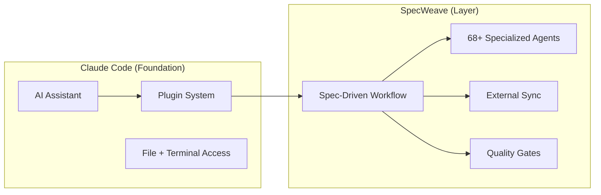

# Claude Code Basics

**Claude Code is the AI coding assistant that SpecWeave is built on.** Understanding its core concepts helps you get the most out of SpecWeave.

:::tip Cross-Platform Note
While Claude Code provides the **deepest integration** (native hooks, skills, agents), SpecWeave's core workflow also works with Cursor, Windsurf, GitHub Copilot, and any AI IDE via `CLAUDE.md` instructions.
:::

---

## What is Claude Code?

Claude Code is Anthropic's **CLI-based AI coding assistant**. Unlike chat-based tools (ChatGPT, Claude.ai), Claude Code:

- Runs **inside your terminal**, with direct access to your codebase
- Can **read, write, and edit files** directly
- Can **run commands** (tests, builds, git operations)
- Supports **plugins** that extend its capabilities
- Works with the latest Claude models (Opus 4.6, Sonnet 4.5, Haiku 4.5)

```bash
# Install Claude Code
npm install -g @anthropic-ai/claude-code

# Start in your project directory
cd your-project
claude
```

---

## Key Concepts

### Models

Claude Code supports multiple AI models with different strengths:

| Model | Best For | Speed | Cost |
|-------|----------|-------|------|
| **Opus 4.6** | Complex architecture, multi-file changes, autonomous work | Slower | Higher |
| **Sonnet 4.5** | Balanced daily coding, reviews, refactoring | Medium | Medium |
| **Haiku 4.5** | Quick lookups, simple edits, documentation | Fast | Low |

**Recommendation**: Use **Opus 4.6** for SpecWeave workflows (especially `/sw:auto`). Its reasoning depth is critical for multi-step planning and implementation.

### Plugins

Plugins are **extension packages** that add capabilities to Claude Code. SpecWeave is delivered as a set of plugins.

```
Claude Code (base)
  └── Plugins
      ├── specweave-core       ← Core workflow (increment, do, auto, done)
      ├── specweave-frontend   ← React, Vue, Angular expertise
      ├── specweave-backend    ← .NET, Node.js, Python patterns
      ├── specweave-testing    ← Test strategy, E2E, coverage
      ├── specweave-github     ← GitHub Issues, PRs, milestones
      ├── specweave-jira       ← JIRA epics, stories, sprints
      └── ... (23 plugins total)
```

Plugins load **on-demand** based on what you're doing. Say "React frontend" and the frontend plugin activates. Say "Kubernetes deploy" and the infrastructure plugin loads. No manual configuration needed.

### Skills

Skills are **auto-activating expertise modules** inside plugins. When you describe a task, relevant skills activate based on keywords.

```
You: "Design the authentication architecture"
                    ↓
Claude Code detects: "architecture" keyword
                    ↓
sw:architect skill activates → System design expertise loads
```

You can also invoke skills explicitly:

```bash
/sw:architect      # Activate architect expertise
/sw:pm             # Activate PM expertise
/sw:security       # Activate security expertise
```

**SpecWeave has 100+ skills** covering PM, architecture, security, testing, frontend, backend, DevOps, and more.

### Agents

Agents are **specialized subprocesses** that handle specific types of work. Think of them as team members with expertise:

| Agent | What It Does |
|-------|-------------|
| PM Agent | Writes user stories, defines acceptance criteria |
| Architect Agent | Designs systems, writes ADRs, picks technology |
| QA Lead Agent | Creates test strategies, defines quality gates |
| Security Agent | Reviews for OWASP vulnerabilities, threat models |
| Frontend Agent | React/Vue/Angular architecture and patterns |
| Backend Agent | API design, database optimization, .NET/Node.js patterns |

**68+ agents** work together. They activate based on context - you don't need to manage them manually.

### Hooks

Hooks are **automated actions** that fire in response to events. SpecWeave uses hooks to enforce quality:

| Hook | When It Fires | What It Does |
|------|--------------|--------------|
| `task-ac-sync` | After completing a task | Updates acceptance criteria in spec.md |
| `tdd-enforcement` | Before marking task complete | Ensures tests were written first |
| `grill-gate` | Before closing increment | Ensures code review was done |
| `living-specs` | After task completion | Updates living documentation |

Hooks run automatically. You don't invoke them - they enforce quality standards behind the scenes.

### Commands vs Skills

| Feature | Commands (`/command`) | Skills (auto-activate) |
|---------|----------------------|----------------------|
| **How invoked** | You type `/sw:increment` | Auto-detects from your description |
| **When to use** | Explicit workflow steps | Expertise needed during work |
| **Example** | `/sw:done 0001` | Mention "security" → security loads |

---

## How SpecWeave Uses Claude Code

SpecWeave layers a **spec-driven workflow** on top of Claude Code's capabilities:



**Without SpecWeave**: Claude Code is a powerful AI assistant that loses context when the chat ends.

**With SpecWeave**: Claude Code becomes an AI development team with permanent memory, quality gates, and external tool sync.

---

## Why Claude Code Over Other Tools?

SpecWeave works with other AI tools, but Claude Code provides the deepest integration:

| Capability | Claude Code | Other AI Tools |
|-----------|-------------|----------------|
| **Native plugins** | Full plugin system | Via CLAUDE.md instructions |
| **Hooks (automation)** | Pre/post tool hooks | Not available |
| **Skill auto-activation** | Keyword-based loading | Manual prompting |
| **Agent spawning** | Native subagent support | Not available |
| **Terminal access** | Direct command execution | Varies by tool |
| **File operations** | Read, write, edit directly | Varies by tool |

**Bottom line**: Claude Code + SpecWeave = native integration. Other tools + SpecWeave = works, but without hooks and auto-activation.

---

## Next Steps

- [Install SpecWeave](/docs/getting-started) - Set up your project
- [Claude Code Architecture](/docs/overview/claude-code-architecture) - Deep dive into the plugin system
- [Academy](/docs/academy/specweave-essentials/) - 16-lesson learning path
- [All 100+ Skills](/docs/reference/skills) - Browse available expertise
