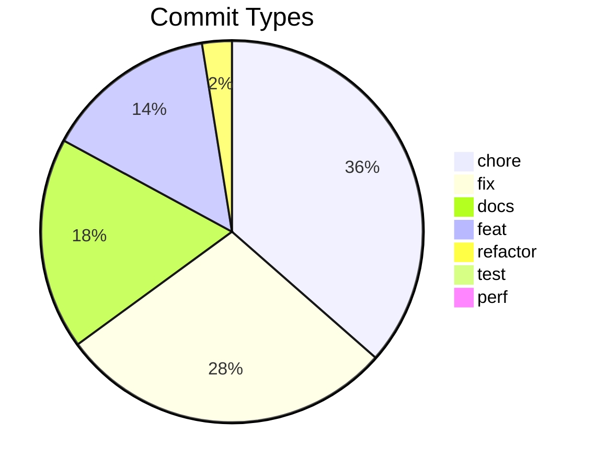
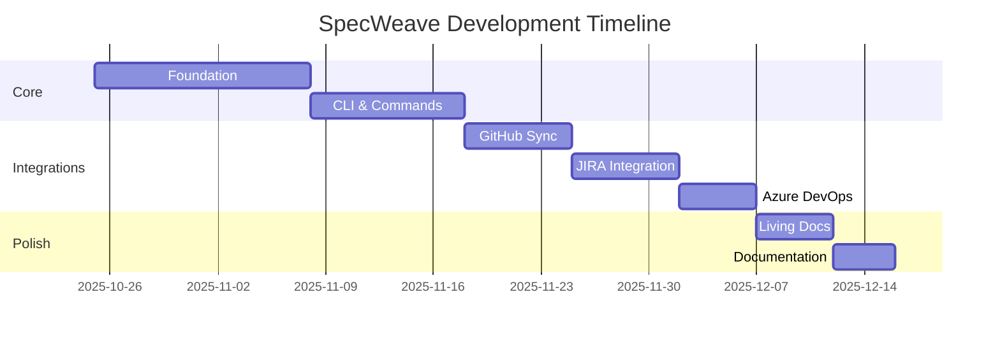
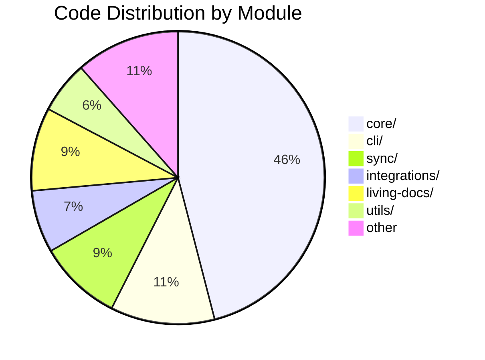

# Dogfooding: SpecWeave Builds SpecWeave

**This isn't a demo. This is production.**

SpecWeave was built using SpecWeave. Every feature, every bug fix, every architectural decision went through the spec-driven workflow you're reading about. The statistics below are real — pulled directly from our git history and codebase.

---

## The Numbers

### Codebase Scale

| Metric | Value |
|--------|-------|
| **Lines of Code** | 186,719 |
| **TypeScript Files** | 567 |
| **Test Files** | 581 |
| **Documentation Files** | 4,405 |
| **CLI Commands** | 47 |
| **Plugins** | 24 |
| **Hook Scripts** | 65 |
| **Public Exports** | 2,893 |

### Development Activity

| Metric | Value |
|--------|-------|
| **Total Commits** | 1,327 |
| **Development Period** | 52 days |
| **Average Commits/Day** | 26 |
| **Peak Day** | 100 commits (Nov 4, 2025) |
| **Unique Contributors** | 3 |

### Commit Distribution



---

## DORA Metrics (Elite Performance)

SpecWeave tracks its own DORA metrics in real-time:

| Metric | Value | Tier |
|--------|-------|------|
| **Deployment Frequency** | 100/month | Elite |
| **Lead Time** | 3.4 hours | High |
| **Change Failure Rate** | 0% | Elite |
| **MTTR** | 0 min | N/A (no failures) |

> **65 releases with 0 failures.** That's what spec-driven development delivers.

[Live DORA Dashboard →](/docs/metrics)

---

## Real Projects Built With SpecWeave

SpecWeave has been used to build 5+ production applications:

### 1. SpecWeave (Built With Itself)
- **186K+ lines** of TypeScript
- **1,327 commits** over 52 days
- **24 plugins**, **47 CLI commands**, **65 hooks**
- Self-documenting: every feature has a spec

### 2. BizZone Mobile App
- React Native mobile application
- Full spec-driven development
- Integrated with JIRA for enterprise workflow

### 3. Event Management SaaS
- Next.js 14 + Prisma + Stripe
- Complete from PRD to deployment
- Hetzner Cloud infrastructure

### 4. E-Commerce Platform
- Multi-tenant architecture
- Azure DevOps integration
- Living documentation synced daily

### 5. Internal Tools Suite
- TypeScript CLI applications
- GitHub Issues sync
- TDD workflow enforcement

---

## Development Intensity

Building SpecWeave required:

- **52 days** of focused development
- **Every weekend** dedicated to the project
- **Many sleepless nights** debugging edge cases
- **26 commits per day** average intensity
- **100 commits in a single day** at peak

### The Timeline



---

## Why Dogfooding Matters

### Eating Our Own Dog Food

Every crash, every bug, every friction point — we experienced it ourselves:

1. **Context crashes** led to the 1500-line file limit
2. **Lost work** led to the three-file foundation
3. **Sync failures** led to circuit breaker patterns
4. **Zombie processes** led to automatic cleanup hooks

**We didn't just build a Skill Fabric. We used it to build itself.**

### Real Lessons Learned

| Problem We Hit | Solution We Built |
|----------------|-------------------|
| Claude context crashes | Emergency mode + file size limits |
| Lost architecture decisions | Automatic ADR capture |
| Manual JIRA updates | Real-time bidirectional sync |
| Forgotten test coverage | Embedded tests in tasks |
| Onboarding new contributors | Living documentation |

---

## Repository Statistics

### Largest Files (Complexity Indicators)

| File | Lines | Purpose |
|------|-------|---------|
| living-docs-sync.ts | 1,953 | Core synchronization engine |
| item-converter.ts | 1,766 | External tool mapping |
| sync-coordinator.ts | 1,701 | Multi-platform sync |
| feature-archiver.ts | 1,501 | Archive management |
| external-import.ts | 1,497 | External tool import |

### Module Distribution



---

## The Proof

**Don't take our word for it. Look at the evidence:**

1. **[GitHub Repository](https://github.com/anton-abyzov/specweave)** — Every commit visible
2. **[DORA Metrics](/docs/metrics)** — Real-time dashboard
3. **[Changelog](https://github.com/anton-abyzov/specweave/blob/develop/CHANGELOG.md)** — 65+ releases documented
4. **[ADR Archive](https://github.com/anton-abyzov/specweave/tree/develop/.specweave/docs/internal/architecture/adr)** — 150+ architectural decisions
5. **[Increments Archive](https://github.com/anton-abyzov/specweave/tree/develop/.specweave/increments)** — 150+ features built with SpecWeave

---

## Start Your Own Journey

Ready to build with the same discipline?

```bash
npm install -g specweave
cd your-project
specweave init .
```

**Your first increment is 30 seconds away.**

[Quick Start Guide →](/docs/guides/getting-started/quickstart)

---

## Summary

| What We Claimed | What We Delivered |
|-----------------|-------------------|
| "AI decisions become permanent" | 4,405 documentation files |
| "Autonomous implementation" | 1,327 commits, 26/day average |
| "Elite DORA metrics" | 100 deploys/month, 0% failure rate |
| "Works at scale" | 186,719 lines of code |
| "Real production use" | 5+ production applications |

**SpecWeave isn't theoretical. It's proven in production — on itself.**
