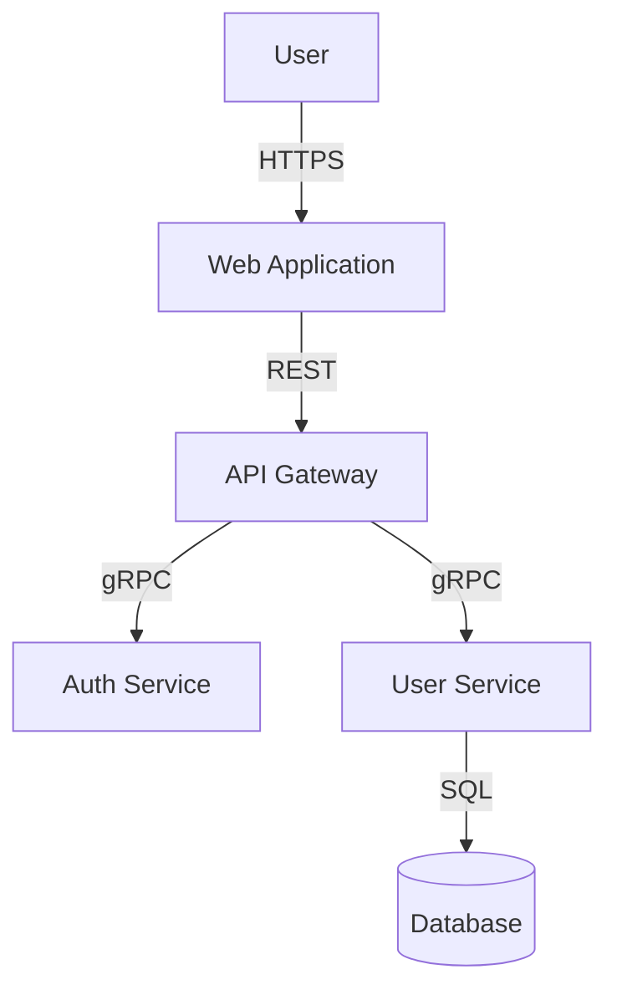

# 🧩 Plugin Ecosystem

SpecWeave's power comes from its **modular plugin architecture**. With **23 specialized plugins**, you get enterprise-grade capabilities that activate automatically based on your project needs.

:::tip Key Insight
**Progressive Disclosure**: Only relevant plugins activate based on context. Working on React? Frontend plugin loads. Mention Kubernetes? Infrastructure plugin activates. This keeps your AI context lean and efficient.
:::

## 🎯 Quick Start

All plugins are **automatically installed** during `specweave init`:

```bash
npx specweave init .
# ✅ Installs all 23 plugins (GitHub, JIRA, K8s, React, ML, etc.)
# ✅ Registers marketplace globally
# ✅ Ready to use immediately!
```

## 📊 Plugin Categories

### 🔧 Core Layer (Always Active)

#### **sw** - Essential Skills
The foundation of SpecWeave, always loaded in every project.

**Key Capabilities:**
- 🎯 **30+ Skills**: increment, spec-generator, tdd-workflow, brownfield-analyzer, context-optimizer, and more
- 🤖 **68+ Agents**: PM, Architect, Tech Lead, QA Lead, Security Engineer, Code Reviewer, and more
- ⚡ **40+ Commands**: Full increment lifecycle management

**Example: Planning a New Feature**
```bash
# The PM agent (from core plugin) helps you create a spec
/sw:increment "User authentication with OAuth"

# Output: Creates spec.md, plan.md, tasks.md with:
# - User stories with acceptance criteria
# - Technical design with architecture
# - Task breakdown with embedded test plans
# - [BDD](/docs/glossary/terms/bdd) format (Given/When/Then)
```

**Skills Highlight:**
- **increment**: Automatically activates when you say "plan feature", "new increment", "build X"
- **tdd-workflow**: Activates on "[TDD](/docs/glossary/terms/tdd)", "test-driven", "red-green-refactor"
- **brownfield-analyzer**: Detects existing projects and maps documentation to SpecWeave structure

---

### 🔗 External Integrations

#### **sw-github** - GitHub Issues Integration
Bidirectional sync between SpecWeave increments and GitHub Issues.

**Key Features:**
- ✅ Auto-creates issues on increment planning
- ✅ Task-level progress tracking (checkboxes)
- ✅ Universal Hierarchy: Epic → Milestone, Increment → Issue
- ✅ Smart conflict resolution

**Example: Auto-Sync Workflow**
```bash
# 1. Create increment (issue auto-created!)
/sw:increment "Add dark mode"
# 🔗 GitHub Issue #42 created automatically

# 2. Start work
/sw:do

# 3. Complete a task
# ✅ GitHub issue checkbox updates automatically!

# 4. Manual sync (if needed)
/sw-github:sync 0023 --time-range 1M
```

**Commands:**
- `/sw-github:sync` - Bidirectional sync with time range filtering
- `/sw-github:create-issue` - Manual issue creation
- `/sw-github:sync-epic` - Sync Epic folder to GitHub Milestone
- `/sw-github:status` - Check sync status

**Configuration:**
```json
{
  "sync": {
    "settings": {
      "autoCreateIssue": true,
      "syncDirection": "bidirectional"
    },
    "profiles": {
      "frontend": {
        "provider": "github",
        "config": {
          "owner": "myorg",
          "repo": "frontend"
        }
      }
    }
  }
}
```

---

#### **sw-jira** - JIRA Integration
Enterprise JIRA integration with Epic/Story sync.

**Key Features:**
- ✅ Bidirectional Epic ↔ JIRA Epic sync
- ✅ User Stories ↔ JIRA Stories
- ✅ Status mapping (Planning → To Do, Active → In Progress)
- ✅ Multi-project support

**Example: JIRA Sync**
```bash
# Sync increment to JIRA
/sw-jira:sync 0042

# Sync Epic folder (20+ user stories)
/sw-jira:sync-epic FS-031-authentication

# Check status
/sw-jira:status 0042
```

**Status Mapping:**
```
SpecWeave          → JIRA
─────────────────────────────
planning           → To Do
active             → In Progress
paused             → On Hold
completed          → Done
abandoned          → Cancelled
```

---

#### **sw-ado** - Azure DevOps Integration
Enterprise Azure DevOps sync with Work Items.

**Key Features:**
- ✅ Epic → Azure DevOps Epic
- ✅ Increment → User Story
- ✅ Tasks → Tasks with Area Paths
- ✅ Multi-project organization strategies

**Example:**
```bash
# Sync to Azure DevOps
/sw-ado:sync 0031

# Create work item manually
/sw-ado:create-workitem 0031

# Check sync status
/sw-ado:status 0031
```

---

#### **sw-figma** - Figma Design Integration
Connect designs to implementation.

**Skills:**
- **figma-integration**: Extract design tokens, components, screens
- Converts Figma → React components
- Auto-generates prop types from Figma properties

---

### 💻 Tech Stack Plugins

#### **sw-frontend** - Frontend Development
[React](/docs/glossary/terms/react), Vue, [Angular](/docs/glossary/terms/angular), [Next.js](/docs/glossary/terms/nextjs) expertise.

**Agents:**
- **frontend-architect**: Component architecture, state management patterns
- **react-expert**: Hooks, performance, modern patterns
- **nextjs-specialist**: SSR, ISR, routing, API routes

**Example: React Component Planning**
```bash
# Frontend architect activates automatically
"I need to build a reusable data table component with sorting and filtering"

# Generates:
# - Component architecture (container/presentational)
# - State management approach (useState, useReducer, Zustand)
# - Performance optimizations (React.memo, useMemo)
# - Accessibility (ARIA labels, keyboard navigation)
# - Test strategy (Jest, React Testing Library)
```

**Tech Stack Coverage:**
- React, Vue 3, Angular, Svelte
- Next.js, Nuxt, SvelteKit
- State Management: Redux, Zustand, Jotai, Pinia
- Styling: Tailwind CSS, Styled Components, Emotion

---

#### **sw-backend** - Backend Development
[Node.js](/docs/glossary/terms/nodejs), Python, .NET expertise.

**Agents:**
- **backend-architect**: API design, microservices, authentication
- **nodejs-expert**: Express, Fastify, NestJS patterns
- **python-expert**: Django, FastAPI, async patterns

**Example: API Design**
```bash
"Design RESTful API for user management with authentication"

# Backend architect generates:
# - OpenAPI/Swagger spec
# - Authentication strategy (JWT, OAuth2)
# - Database schema (PostgreSQL)
# - Rate limiting and caching
# - Error handling patterns
# - API versioning strategy
```

---

#### **sw-mobile** - Mobile Development
React Native and Expo expertise.

**Skills:**
- **react-native-expert**: Architecture, navigation, state, offline-first patterns, native modules, performance optimization

**Example:**
```bash
"Build offline-first mobile app with background sync"

# React Native expert provides:
# - React Native architecture
# - Offline data strategy (SQLite, Realm, WatermelonDB)
# - Background sync with NetInfo
# - Push notifications setup
# - Platform-specific considerations (iOS/Android)
```

---

### ☁️ Infrastructure & DevOps

#### **sw-infra** - Infrastructure Engineering
Cloud infrastructure with Hetzner, DigitalOcean, monitoring.

**Agents:**
- **devops**: CI/CD pipelines, cloud deployments
- **sre**: Incident response, troubleshooting, root cause analysis
- **observability-engineer**: Monitoring, logging, distributed tracing
- **network-engineer**: VPC, firewalls, load balancers

**Example: Production Incident**
```bash
"API response time increased to 5 seconds, CPU at 90%"

# SRE agent activates with:
# - Incident severity classification (SEV2)
# - Immediate mitigation steps
# - Root cause analysis checklist
# - Performance profiling strategy
# - Post-mortem template
```

**Playbooks:**
- High CPU Usage
- Database Deadlock
- Memory Leak Detection
- Slow API Response
- DDoS Attack Mitigation
- Disk Full Recovery
- Service Down Recovery
- Data Corruption
- Cascade Failure Prevention
- Rate Limit Exceeded

---

#### **sw-k8s** - Kubernetes Orchestration
Cloud-native [Kubernetes](/docs/glossary/terms/kubernetes) architecture, GitOps, service mesh.

**Agent:**
- **kubernetes-architect**: EKS/AKS/GKE, Helm, ArgoCD/Flux, Istio

**Example: K8s Setup**
```bash
"Deploy microservices to Kubernetes with GitOps"

# K8s architect provides:
# - Helm chart structure
# - ArgoCD/Flux configuration
# - Service mesh setup (Istio)
# - Multi-tenancy strategy
# - Monitoring with Prometheus/Grafana
# - Security policies (Network Policies, PSP)
```

---

### 🤖 Machine Learning & Data Science

#### **sw-ml** - ML Engineering
Complete ML lifecycle from data to deployment.

**Agents:**
- **ml-engineer**: Model training, deployment, MLOps
- **data-scientist**: Statistical analysis, predictive modeling, EDA
- **mlops-engineer**: MLflow, Kubeflow, experiment tracking

**Commands:**
- `/sw-ml:pipeline` - Design complete ML pipeline
- `/sw-ml:evaluate` - Evaluate model with metrics
- `/sw-ml:deploy` - Generate deployment artifacts
- `/sw-ml:explain` - Model explainability (SHAP, LIME)

**Example: ML Pipeline**
```bash
# Design complete ML workflow
/sw-ml:pipeline "Customer churn prediction"

# Generates:
# 1. Data preprocessing (feature engineering, scaling)
# 2. Model training (XGBoost, Random Forest, Neural Network)
# 3. Hyperparameter tuning (Optuna)
# 4. Model evaluation (precision, recall, F1, ROC-AUC)
# 5. MLflow experiment tracking
# 6. Model registry and versioning
# 7. Deployment (FastAPI, Docker, Kubernetes)
# 8. Monitoring (data drift, model performance)
```

**Tech Stack:**
- Frameworks: TensorFlow, PyTorch, scikit-learn, XGBoost
- MLOps: MLflow, Kubeflow, Weights & Biases
- Deployment: FastAPI, TorchServe, TFServing
- Monitoring: Evidently AI, WhyLabs

---

### 💳 Specialized Domains

#### **sw-payments** - Payment Integration
Stripe, PayPal, payment processor expertise.

**Agent:**
- **payment-integration**: Checkout flows, webhooks, PCI compliance

**Example:**
```bash
"Implement Stripe subscription billing"

# Payment integration agent provides:
# - Stripe Checkout setup
# - Subscription lifecycle management
# - Webhook handling (payment_intent.succeeded)
# - Invoice generation
# - Failed payment retry logic
# - PCI compliance checklist
```

---

### 📚 Documentation & Diagrams

#### **sw-docs** - Documentation & Preview
Documentation generation, organization, and live Docusaurus preview with hot reload.

**Commands:**
- `/sw-docs:view` - Launch interactive docs server (internal or public)
- `/sw-docs:build` - Build static site for deployment
- `/sw-docs:generate` - Generate documentation
- `/sw-docs:organize` - Organize large doc folders
- `/sw-docs:health` - Documentation health report
- `/sw-docs:validate` - Validate documentation (MDX, YAML, links)

**Example:**
```bash
# View internal docs (default) - port 3015
/sw-docs:view

# View public docs - port 3016
/sw-docs:view --public

# Output:
# 🚀 Server running at http://localhost:3015 (or 3016 for public)
# 📁 Auto-generated sidebar from .specweave/docs/
# 🔄 Hot reload enabled
# 📊 Mermaid diagrams rendered
```

---

#### **sw-diagrams** - Diagram Generation
Mermaid diagrams following C4 Model conventions.

**Agent:**
- **diagrams-architect**: C4 Context/Container/Component, sequence, ER diagrams

**Example:**
```bash
"Create C4 Container diagram for microservices architecture"

# Generates:

```

---

### 🚀 Release Management

#### **sw-release** - Release Orchestration
Multi-repo releases, semantic versioning, RC workflows.

**Agents:**
- **release-manager**: Coordinates releases across monorepo/polyrepo

**Commands:**
- `/sw-release:init` - Initialize release strategy
- `/sw-release:align` - Align versions across repos
- `/sw-release:rc` - Manage Release Candidate lifecycle
- `/sw-release:platform` - Multi-repo platform releases

**Example:**
```bash
# Initialize release strategy
/sw-release:init
# Analyzes git history, CI/CD configs, recommends strategy

# Create Release Candidate
/sw-release:rc create v1.5.0-rc.1

# Promote to production
/sw-release:rc promote v1.5.0-rc.3
```

---

### 🎨 UI Testing & Automation

#### **sw-testing** - Testing & Browser Automation
Playwright integration with MCP protocol.

**Features:**
- Browser automation for E2E testing
- Visual regression testing
- Accessibility testing
- Performance monitoring

---

### 🔧 Utilities

#### **sw-cost** - AI Cost Optimization
Tracks AI costs, suggests optimizations.

**Features:**
- Cost tracking per increment
- Model selection recommendations (Opus vs Haiku)
- Context optimization suggestions

---

## 🎯 How Plugins Work Together

### Example: Full-Stack Feature Implementation

```bash
# 1. PM Agent (Core) creates spec
/sw:increment "Real-time chat feature"

# 2. Architect Agent (Core) designs system
# - WebSocket architecture
# - Database schema (PostgreSQL)
# - Caching strategy (Redis)

# 3. Frontend Agent (Frontend Plugin) designs UI
# - React components
# - State management (Zustand)
# - WebSocket client

# 4. Backend Agent (Backend Plugin) designs API
# - WebSocket server (Socket.io)
# - Authentication (JWT)
# - Message persistence

# 5. K8s Agent (Infrastructure Plugin) plans deployment
# - Helm charts
# - Horizontal Pod Autoscaler
# - Ingress configuration

# 6. GitHub Agent (GitHub Plugin) creates issue
# - Auto-creates GitHub Issue #84
# - Links to increment

# 7. Start implementation
/sw:do

# 8. All agents collaborate during implementation!
```

---

## 📈 Token Efficiency

**Context Optimization in Action:**

| Scenario | Active Plugins | Token Usage |
|----------|----------------|-------------|
| **Planning Only** | Core | ~12K tokens |
| **React Feature** | Core + Frontend | ~18K tokens |
| **Full-Stack API** | Core + Frontend + Backend | ~24K tokens |
| **ML Pipeline** | Core + ML + Infrastructure | ~28K tokens |
| **Enterprise (All)** | All 23 plugins | ~30K tokens |

**Result**: 75% smaller than monolithic architecture!

---

## 🔍 Finding the Right Plugin

| I want to... | Use Plugin | Key Command |
|-------------|-----------|-------------|
| Plan increment | **sw** | `/sw:increment` |
| Sync to GitHub | **sw-github** | `/sw-github:sync` |
| Deploy to K8s | **sw-k8s** | Agent auto-activates |
| Build React app | **sw-frontend** | Agent auto-activates |
| Create ML pipeline | **sw-ml** | `/sw-ml:pipeline` |
| View docs | **sw-docs** | `/sw-docs:view` |
| Handle incidents | **sw-infra** | SRE agent + playbooks |
| Generate diagrams | **sw-diagrams** | Agent auto-activates |
| Integrate Stripe | **sw-payments** | Agent auto-activates |
| Manage releases | **sw-release** | `/sw-release:init` |

---

## 🚀 Quick Reference: All 23 Plugins

| Plugin | Purpose | Key Features |
|--------|---------|--------------|
| **sw** | Core Skill Fabric | 68+ agents, 40+ commands, increment lifecycle |
| **sw-github** | GitHub sync | Bidirectional sync, auto-issue creation |
| **sw-jira** | JIRA sync | Epic/Story sync, status mapping |
| **sw-ado** | Azure DevOps | Work items, multi-project strategies |
| **sw-frontend** | Frontend dev | React, Vue, Angular, Next.js |
| **sw-backend** | Backend dev | Node.js, Python, .NET, APIs |
| **sw-mobile** | Mobile dev | React Native, Expo, offline-first |
| **sw-infra** | DevOps | SRE, monitoring, incident response |
| **sw-k8s** | K8s orchestration | Helm, GitOps, service mesh |
| **sw-ml** | Machine Learning | MLOps, pipelines, deployment |
| **sw-release** | Release mgmt | Semantic versioning, RC workflow |
| **sw-payments** | Payments | Stripe, PayPal, PCI compliance |
| **sw-testing** | Testing & automation | Playwright, E2E testing |
| **sw-diagrams** | Diagram generation | Mermaid, C4 Model |
| **sw-figma** | Design integration | Figma → Components |
| **sw-cost** | Cost tracking | AI cost optimization |
| **sw-docs** | Documentation | Guides, API docs, Docusaurus preview |
| **sw-confluent** | Kafka/Confluent | Streaming, Schema Registry |
| **sw-kafka** | Kafka operations | DevOps, monitoring, architecture |

---

## 💡 Tips for Maximum Efficiency

### 1. Trust Progressive Disclosure
Don't manually load plugins. Let skills activate based on context:
- Say "React" → Frontend plugin activates
- Say "Kubernetes" → Infrastructure plugin activates
- Say "ML pipeline" → ML plugin activates

### 2. Use Context Optimizer
For large projects with 100+ files:
```bash
"Optimize context for authentication feature"
# Context optimizer removes 80% irrelevant specs/modules
```

### 3. Leverage Command Shortcuts
```bash
# Planning
/sw:increment → /sw:do → /sw:done

# Quality
/sw:validate → /sw:qa → /sw:check-tests

# Sync
/sw-github:sync → /sw:sync-docs
```

### 4. Multi-Project Setup
```json
{
  "sync": {
    "profiles": {
      "frontend": {"provider": "github", "config": {"repo": "frontend"}},
      "backend": {"provider": "github", "config": {"repo": "backend"}},
      "mobile": {"provider": "github", "config": {"repo": "mobile"}}
    }
  }
}
```

---

## 🎓 Learning Resources

- **[Getting Started Guide](/docs/intro)** - Installation and first increment
- **[Workflows](/docs/workflows/overview)** - Complete development journey
- **[Commands Reference](/docs/commands/overview)** - All essential commands
- **[Multi-Project Setup](/docs/guides/multi-project-setup)** - GitHub/JIRA/ADO setup
- **[FAQ](/docs/faq)** - Common questions answered

---

## 🔧 Extensibility via CLAUDE.md

SpecWeave is an **open Skill Fabric, not a locked product**. Beyond plugins, you can customize behavior through your project's `CLAUDE.md` file:

### Custom Sync Rules
```markdown
## Sync Customization
When syncing to JIRA, always:
- Add custom field "Team: Backend" for backend increments
- Map "paused" status to "Blocked" instead of "On Hold"
- Include sprint field using our sprint naming convention (SPRINT-YYYY-WW)
```

### Custom Quality Gates
```markdown
## Quality Gates
Before closing any increment:
- Run `npm run lint:strict` in addition to tests
- Verify CHANGELOG.md entry exists for the feature
- Check that OpenAPI spec is regenerated if API changed
- Ensure Sentry release is tagged
```

### Custom Workflow Hooks
```markdown
## Workflow Automation
After completing a task:
- Post notification to #dev-updates Slack channel
- Update team capacity spreadsheet via webhook
- Trigger downstream pipeline if it's an API change
```

### Agent Behavior Overrides
```markdown
## Agent Customization
When the PM agent creates specs:
- Always include compliance section for HIPAA requirements
- Add "Data Classification" field to every user story
- Reference our design system component library

When the Architect agent designs:
- Prefer PostgreSQL over MySQL for new services
- Always include rate limiting in API designs
- Use our standard error response format
```

**What you can customize:**
| Area | Examples |
|------|----------|
| **External Sync** | Add fields, transform statuses, integrate with internal tools |
| **Quality Gates** | Custom validation, linting rules, security scans, compliance checks |
| **Lifecycle Hooks** | Trigger actions on events (created, done, paused, archived) |
| **Agent Behavior** | Override default prompts, add domain-specific requirements |
| **Naming Conventions** | Enforce team-specific ID formats, branch names, commit messages |
| **Integration Logic** | Custom webhook payloads, API transformations, field mappings |

---

## 🤝 Contributing

Want to add a new plugin? See [CLAUDE.md](https://github.com/anton-abyzov/specweave/blob/develop/CLAUDE.md) for plugin development guide.

**Plugin Ideas Welcome:**
- Cloud providers (AWS, GCP, Azure)
- Languages (Go, Rust, Java)
- Frameworks (Spring Boot, Django, Rails)
- Databases (MongoDB, Redis, Cassandra)
- Testing tools (Cypress, Playwright)

---

:::tip Next Steps
1. ✅ Install: `npx specweave init .`
2. 🎯 Plan: `/sw:increment "Your feature"`
3. ⚡ Implement: `/sw:do`
4. 🔗 Sync: `/sw-github:sync`
5. ✅ Complete: `/sw:done`

**All 23 plugins are ready to help you build faster!**
:::
