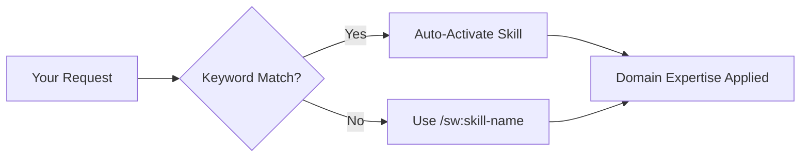

# Skills Reference

SpecWeave provides **100+ specialized skills** that activate automatically based on context or can be invoked directly. Skills are more powerful than commands - they provide domain expertise, best practices, and guided workflows.

:::tip Skills = Commands Now
In Claude Code, skills and slash commands execute identically. Use `/sw:skill-name` to invoke any skill. Skills auto-activate when their keywords are detected in your prompts.
:::

## How Skills Work



**Invocation methods:**
1. **Auto-activation**: Just describe what you need - skills activate based on keywords
2. **Direct invocation**: `/sw:skill-name` or `/sw-plugin:skill-name`
3. **Chaining**: Skills can invoke other skills for complex workflows

---

## Core Skills (Planning & Management)

These skills form the foundation of spec-driven development.

| Skill | Description | When to Use |
|-------|-------------|-------------|
| [`sw:increment`](#increment) | Plan and create increments with PM/Architect collaboration | Starting any new feature |
| [`sw:pm`](#pm) | Product Manager for specs, user stories, acceptance criteria | Writing requirements |
| [`sw:architect`](#architect) | System architect for technical designs and ADRs | Architecture decisions |
| [`sw:role-orchestrator`](#role-orchestrator) | Multi-agent coordination (PM, Architect, DevOps, QA) | Complex full-stack features |
| [`sw:roadmap-planner`](#roadmap-planner) | Product roadmap and feature prioritization | Quarterly planning |
| [`sw:spec-generator`](#spec-generator) | Generate spec.md, plan.md, tasks.md from ideas | Converting ideas to specs |
| [`sw:test-aware-planner`](#test-aware-planner) | Tasks with embedded BDD test plans | Test-first planning |

### increment

**Purpose**: Plan and create SpecWeave increments with PM and Architect collaboration.

```bash
/sw:increment "User authentication with JWT"
```

**What it does:**
- Detects tech stack automatically
- Runs PM-led spec creation
- Creates plan.md with architecture
- Generates tasks.md with proper AC-IDs

### pm

**Purpose**: Product Manager for spec-driven development.

```bash
/sw:pm  # Activate PM guidance
```

**Covers:**
- User story writing with proper format
- Acceptance criteria with testable AC-IDs
- MVP prioritization (MoSCoW, RICE)
- Requirements refinement

### architect

**Purpose**: System architect for scalable, maintainable designs.

```bash
/sw:architect  # Get architecture guidance
```

**Covers:**
- ADR (Architecture Decision Record) writing
- Microservices vs monolith decisions
- Database schema design
- Technology selection trade-offs

### role-orchestrator

**Purpose**: Multi-agent orchestration for complex features.

```bash
/sw:role-orchestrator "Build SaaS dashboard with payments"
```

**Coordinates:**
- PM for requirements
- Architect for design
- DevOps for infrastructure
- QA for testing strategy
- Security for compliance

---

## Execution & Workflow Skills

Control the development workflow from start to finish.

| Skill | Description | When to Use |
|-------|-------------|-------------|
| `sw:do` | Execute tasks manually | Task-by-task control |
| `sw:auto` | Autonomous execution | Hands-free development |
| `sw:auto-parallel` | Multi-agent parallel execution | Large features with isolation |
| `sw:auto-status` | Check autonomous progress | Monitoring from another session |
| `sw:cancel-auto` | Emergency stop | Only when auto mode needs abort |
| `sw:progress` | Show increment status | Checking completion |
| `sw:next` | Smart workflow transition | Completing and moving on |
| `sw:done` | Close increment | Finishing work |
| `sw:validate` | Rule-based validation | Quick quality check |
| `sw:qa` | AI quality gate | Pre-release assessment |
| `sw:grill` | Implementation auditor | Comprehensive code audit |

### auto

**Purpose**: Autonomous execution that runs for hours.

```bash
/sw:auto  # Start autonomous execution
```

**Features:**
- Continuous loop: Read task → Implement → Test → Fix → Next
- Self-healing: Retries failures up to 3 times
- Living docs sync: Updates documentation automatically
- Proven for 2-3 hour sessions

### grill

**Purpose**: Comprehensive implementation audit using parallel subagents.

```bash
/sw:grill                    # Full project audit
/sw:grill 0007               # Specific increment
/sw:grill src/auth           # Specific module
/sw:grill --focus security   # Focus on security
```

**Audits:**
- Structure and organization
- Code quality and patterns
- Consistency across codebase
- Documentation completeness
- Dependency health
- Test coverage
- Security vulnerabilities

---

## Quality & Testing Skills

Ensure code quality and test coverage.

| Skill | Plugin | Description |
|-------|--------|-------------|
| `sw:tdd-red` | core | Write failing tests first |
| `sw:tdd-green` | core | Minimal implementation to pass |
| `sw:tdd-refactor` | core | Improve code quality |
| `sw:tdd-cycle` | core | Full TDD workflow |
| `sw:code-reviewer` | core | Elite code review with AI techniques |
| `sw:increment-quality-judge-v2` | core | LLM-as-Judge quality assessment |
| `unit-testing` | sw-testing | Unit test patterns and Vitest |
| `e2e-testing` | sw-testing | Playwright E2E testing |
| `qa-engineer` | sw-testing | Manual QA processes |

### qa-engineer (sw-testing plugin)

**Purpose**: QA expert for test strategy and automation frameworks.

```bash
/sw-testing:qa-engineer  # Get QA guidance
```

**Covers:**
- Test pyramid (unit > integration > E2E)
- Coverage targets (80%+ for critical paths)
- Playwright, Jest, Vitest patterns
- BDD scenarios (Given/When/Then)

### code-reviewer

**Purpose**: AI-assisted code review.

```bash
/sw:code-reviewer  # Review recent changes
```

**Checks:**
- OWASP security vulnerabilities
- Performance anti-patterns
- Code quality metrics
- Technical debt assessment

---

## Frontend Skills

Build modern web applications with best practices.

| Skill | Plugin | Description |
|-------|--------|-------------|
| `frontend` | sw-frontend | General frontend development |
| `frontend-architect` | sw-frontend | React/Vue/Angular architecture |
| `frontend-design` | sw-frontend | UI/UX implementation |
| `design-system-architect` | sw-frontend | Component library design |
| `nextjs` | sw-frontend | Next.js App Router patterns |
| `code-explorer` | sw-frontend | Codebase navigation |

### frontend-architect

**Purpose**: Frontend architecture for React, Vue, or Angular.

```bash
/sw-frontend:frontend-architect  # Frontend architecture guidance
```

**Covers:**
- Component composition patterns
- State management (Redux, Zustand, Pinia)
- Performance optimization
- Accessibility (a11y) requirements

### nextjs

**Purpose**: Next.js 14+ App Router patterns.

```bash
/sw-frontend:nextjs  # Next.js guidance
```

**Covers:**
- Server Components vs Client Components
- Route handlers and middleware
- Data fetching patterns
- Image and font optimization

---

## Backend Skills

Build scalable APIs and services.

| Skill | Plugin | Description |
|-------|--------|-------------|
| `nodejs-backend` | sw-backend | Node.js/Express/Fastify APIs |
| `python-backend` | sw-backend | Python/FastAPI/Django services |
| `dotnet-backend` | sw-backend | .NET Core APIs |
| `database-optimizer` | sw-backend | SQL and NoSQL optimization |

### nodejs-backend

**Purpose**: Node.js backend development.

```bash
/sw-backend:nodejs-backend  # Node.js guidance
```

**Covers:**
- Express/Fastify patterns
- Middleware architecture
- Error handling
- Authentication (JWT, sessions)

### database-optimizer

**Purpose**: Database performance and design.

```bash
/sw-backend:database-optimizer  # DB optimization
```

**Covers:**
- Query optimization
- Index strategies
- Connection pooling
- PostgreSQL, MySQL, MongoDB patterns

---

## Infrastructure & DevOps Skills

Deploy and operate at scale.

| Skill | Plugin | Description |
|-------|--------|-------------|
| `devops` | sw-infrastructure | CI/CD pipelines and deployment |
| `observability` | sw-infrastructure | Logging, metrics, tracing |
| `infrastructure` | core | Terraform and cloud IaC |
| `k8s-manifest-generator` | sw-kubernetes | Kubernetes manifests |
| `k8s-security-policies` | sw-kubernetes | Pod security and RBAC |
| `helm-chart-scaffolding` | sw-kubernetes | Helm chart creation |
| `gitops-workflow` | sw-kubernetes | ArgoCD/Flux workflows |

### devops

**Purpose**: CI/CD and deployment automation.

```bash
/sw-infrastructure:devops  # DevOps guidance
```

**Covers:**
- GitHub Actions, GitLab CI
- Docker containerization
- Vercel, Cloudflare deployment
- Blue-green, canary deployments

### k8s-manifest-generator

**Purpose**: Generate Kubernetes manifests.

```bash
/sw-kubernetes:k8s-manifest-generator  # K8s manifests
```

**Generates:**
- Deployments, Services, Ingress
- ConfigMaps, Secrets
- HPA, PDB for resilience
- Network policies

---

## External Sync Skills

Integrate with GitHub, JIRA, and Azure DevOps.

| Skill | Plugin | Description |
|-------|--------|-------------|
| `github-sync` | sw-github | Bidirectional GitHub sync |
| `github-multi-project` | sw-github | Multi-repo GitHub coordination |
| `github-issue-tracker` | sw-github | Issue management |
| `github-issue-standard` | sw-github | Issue formatting standards |
| `jira-sync` | sw-jira | Bidirectional JIRA sync |
| `jira-mapper` | sw-jira | Field mapping configuration |
| `jira-resource-validator` | sw-jira | Validate JIRA resources |
| `ado-sync` | sw-ado | Azure DevOps sync |
| `ado-multi-project` | sw-ado | Multi-project ADO coordination |
| `ado-mapper` | sw-ado | ADO field mapping |

### github-sync

**Purpose**: Two-way sync between SpecWeave and GitHub Issues.

```bash
/sw-github:sync 0007  # Sync increment 0007 to GitHub
```

**Maps:**
- Feature → GitHub Milestone
- User Story → GitHub Issue
- Task → Issue checkbox

### jira-sync

**Purpose**: Bidirectional JIRA integration.

```bash
/sw-jira:sync 0007  # Sync to JIRA
```

**Maps:**
- Feature → JIRA Epic
- User Story → JIRA Story
- Task → JIRA Sub-task

---

## Data & Streaming Skills

Build event-driven architectures.

| Skill | Plugin | Description |
|-------|--------|-------------|
| `kafka-architect` | sw-kafka | Kafka architecture design |
| `kafka-ops` | sw-kafka | Kafka operations and monitoring |
| `kafka-streams-topology` | sw-kafka-streams | Stream processing topologies |
| `confluent-kafka-connect` | sw-confluent | Kafka Connect configuration |
| `confluent-schema-registry` | sw-confluent | Avro/Protobuf schemas |
| `confluent-ksqldb` | sw-confluent | ksqlDB streaming queries |

### kafka-architect

**Purpose**: Kafka event-driven architecture.

```bash
/sw-kafka:kafka-architect  # Kafka architecture guidance
```

**Covers:**
- Topic design and partitioning
- Producer/consumer patterns
- Exactly-once semantics
- Schema evolution

---

## ML & AI Skills

Build machine learning systems.

| Skill | Plugin | Description |
|-------|--------|-------------|
| `ml-specialist` | sw-ml | ML model development |
| `ml-engineer` | sw-ml | ML pipeline engineering |
| `mlops-engineer` | sw-ml | MLOps and model deployment |
| `data-scientist` | sw-ml | Data analysis and experimentation |
| `image` | sw-media | AI image generation (Google Imagen 4 / Pollinations.ai) |
| `video` | sw-media | AI video generation (Google Veo 3.1 / Pollinations.ai) |
| `remotion` | sw-media | Programmatic video from React with Remotion |

### ml-specialist

**Purpose**: Machine learning model development.

```bash
/sw-ml:ml-specialist  # ML guidance
```

**Covers:**
- Model selection
- Feature engineering
- Training pipelines
- Model evaluation metrics

### image (sw-media)

**Purpose**: Generate images using AI. Google Imagen 4 (with `GEMINI_API_KEY`) or Pollinations.ai (free fallback).

```bash
/sw-media:image "hero image for SaaS landing page"
```

**Generates:**
- Hero images
- Icons and logos
- Product mockups

### video (sw-media)

**Purpose**: Generate videos using AI. Google Veo 3.1 (with `GEMINI_API_KEY`) or Pollinations.ai (free fallback).

```bash
/sw-media:video "product demo showing the dashboard in action"
```

### remotion (sw-media)

**Purpose**: Create programmatic videos with Remotion (React components rendered to MP4).

```bash
/sw-media:remotion "animated product launch video with logo reveal"
```
- Illustrations

---

## Mobile Skills

Build cross-platform mobile apps.

| Skill | Plugin | Description |
|-------|--------|-------------|
| `react-native-expert` | sw-mobile | Mobile architecture and React Native development |

### react-native-expert

**Purpose**: React Native cross-platform development.

```bash
/sw-mobile:react-native-expert  # React Native guidance
```

**Covers:**
- Expo vs bare workflow
- Navigation patterns
- Native module integration
- Performance optimization

---

## Security & Compliance Skills

Build secure, compliant systems.

| Skill | Plugin | Description |
|-------|--------|-------------|
| `security` | core | Security assessment and hardening |
| `security-patterns` | core | Real-time security pattern detection |
| `compliance-architecture` | core | SOC 2, HIPAA, GDPR compliance |
| `pci-compliance` | sw-payments | PCI-DSS for payments |

### security

**Purpose**: Security vulnerability assessment.

```bash
/sw:security  # Security guidance
```

**Covers:**
- OWASP Top 10
- Authentication/authorization flaws
- Injection vulnerabilities
- Security headers

### compliance-architecture

**Purpose**: Enterprise compliance for regulated industries.

```bash
/sw:compliance-architecture  # Compliance guidance
```

**Covers:**
- SOC 2 Type II controls
- HIPAA for healthcare
- GDPR for EU data
- PCI-DSS for payments

---

## Payments Skills

Build payment systems.

| Skill | Plugin | Description |
|-------|--------|-------------|
| `payments` | sw-payments | Payment integration patterns |
| `billing-automation` | sw-payments | Subscription and billing |
| `pci-compliance` | sw-payments | PCI-DSS compliance |

### payments

**Purpose**: Payment gateway integration.

```bash
/sw-payments:payments  # Payment guidance
```

**Covers:**
- Stripe integration
- Webhook handling
- Idempotency patterns
- Refund workflows

---

## Documentation Skills

Create and maintain documentation.

| Skill | Plugin | Description |
|-------|--------|-------------|
| `docs-writer` | core | Technical documentation |
| `docs-updater` | core | Living docs synchronization |
| `living-docs` | core | Living documentation management |
| `living-docs-navigator` | core | Navigate project docs |
| `technical-writing` | sw-docs | Technical writing best practices |
| `stakeholder-docs` | sw-docs | Non-technical documentation |
| `docusaurus` | sw-docs | Docusaurus site management |
| `preview` | sw-docs | Documentation preview |
| `spec-driven-brainstorming` | sw-docs | Structured ideation |

### docs-writer

**Purpose**: Technical documentation generation.

```bash
/sw:docs-writer  # Generate documentation
```

**Creates:**
- API documentation
- README files
- User guides
- Developer onboarding

### docusaurus

**Purpose**: Docusaurus documentation site.

```bash
/sw-docs:docusaurus  # Docusaurus guidance
```

**Covers:**
- MDX components
- Sidebar configuration
- Versioning
- Search integration

---

## Cost Optimization Skills

Optimize cloud spending.

| Skill | Plugin | Description |
|-------|--------|-------------|
| `cost-optimization` | sw-cost-optimizer | General cost reduction |
| `aws-cost-expert` | sw-cost-optimizer | AWS cost analysis |
| `cloud-pricing` | sw-cost-optimizer | Multi-cloud pricing comparison |

### cost-optimization

**Purpose**: Cloud cost reduction strategies.

```bash
/sw-cost-optimizer:cost-optimization  # Cost analysis
```

**Covers:**
- Right-sizing instances
- Reserved capacity planning
- Spot instance strategies
- Storage tier optimization

---

## Utility Skills

General-purpose development utilities.

| Skill | Plugin | Description |
|-------|--------|-------------|
| `code-simplifier` | core | Code clarity improvement |
| `reflect` | core | Learning from corrections |
| `translator` | core | Content translation |
| `context-loader` | core | Context efficiency |
| `detector` | core | SpecWeave workflow detection |
| `lsp` | core | Code navigation (find refs, go to def) |
| `brownfield-analyzer` | core | Existing project analysis |
| `brownfield-onboarder` | core | Project migration |
| `framework` | core | SpecWeave framework guide |
| `service-connect` | core | External service connection |

### code-simplifier

**Purpose**: Improve code clarity without changing behavior.

```bash
/sw:code-simplifier  # Simplify recent changes
```

**Does:**
- Removes unnecessary complexity
- Improves variable naming
- Extracts functions appropriately
- Never changes functionality

### lsp

**Purpose**: Code navigation (LSP workaround for Claude Code v2.1.0+).

```bash
/sw:lsp refs MyFunction     # Find references
/sw:lsp def MyClass         # Go to definition
/sw:lsp hover file.ts 42 10 # Type info at position
```

---

## Release & Versioning Skills

Manage releases and versions.

| Skill | Plugin | Description |
|-------|--------|-------------|
| `release-coordinator` | sw-release | Release process orchestration |
| `version-aligner` | sw-release | Monorepo version alignment |

### release-coordinator

**Purpose**: Coordinate release processes.

```bash
/sw-release:release-coordinator  # Release guidance
```

**Covers:**
- Semantic versioning
- Changelog generation
- Release notes
- Rollback procedures

---

## Diagrams & Visualization Skills

Create technical diagrams.

| Skill | Plugin | Description |
|-------|--------|-------------|
| `diagrams-architect` | sw-diagrams | Architecture diagram design |
| `diagrams-generator` | sw-diagrams | Diagram code generation |

### diagrams-generator

**Purpose**: Generate Mermaid/PlantUML diagrams.

```bash
/sw-diagrams:diagrams-generator  # Create diagrams
```

**Creates:**
- Architecture diagrams
- Sequence diagrams
- Entity relationship diagrams
- Flow charts

---

## Workflow Automation Skills

Automate with n8n.

| Skill | Plugin | Description |
|-------|--------|-------------|
| `n8n-kafka-workflows` | sw-n8n | Kafka + n8n automation |

### n8n-kafka-workflows

**Purpose**: Event-driven workflow automation.

```bash
/sw-n8n:n8n-kafka-workflows  # n8n + Kafka workflows
```

**Creates:**
- Kafka trigger nodes
- Event processing workflows
- Webhook integrations

---

## Installing Domain Plugins

Skills are loaded from plugins. The core `sw` plugin is always installed. Domain plugins install automatically based on your tech stack, or manually:

```bash
# Install domain plugins
claude plugin install sw-frontend@specweave
claude plugin install sw-backend@specweave
claude plugin install sw-infrastructure@specweave
claude plugin install sw-testing@specweave
claude plugin install sw-github@specweave
claude plugin install sw-jira@specweave
claude plugin install sw-ado@specweave
claude plugin install sw-kafka@specweave
claude plugin install sw-ml@specweave
claude plugin install sw-mobile@specweave
claude plugin install sw-payments@specweave
claude plugin install sw-kubernetes@specweave
claude plugin install sw-cost-optimizer@specweave
claude plugin install sw-docs@specweave
claude plugin install sw-diagrams@specweave
claude plugin install sw-release@specweave
```

---

## Next Steps

- [Commands Reference](./commands) - Execution-focused command guide
- [Quick Start](/docs/getting-started) - Get started in 5 minutes
- [Auto Mode Deep Dive](/docs/commands/auto) - Autonomous execution details
