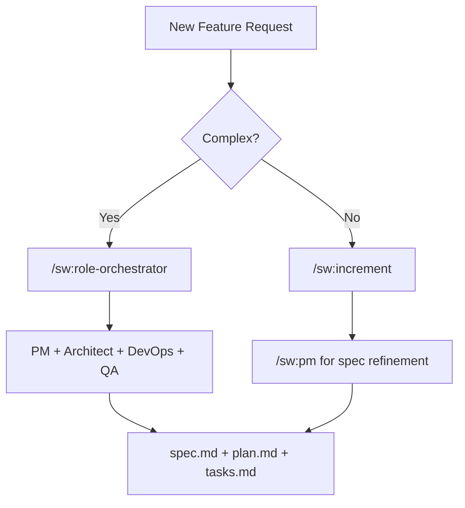
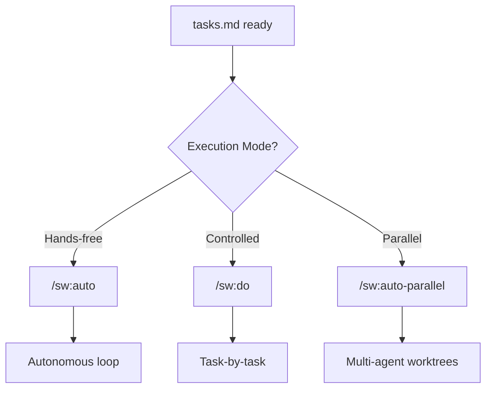
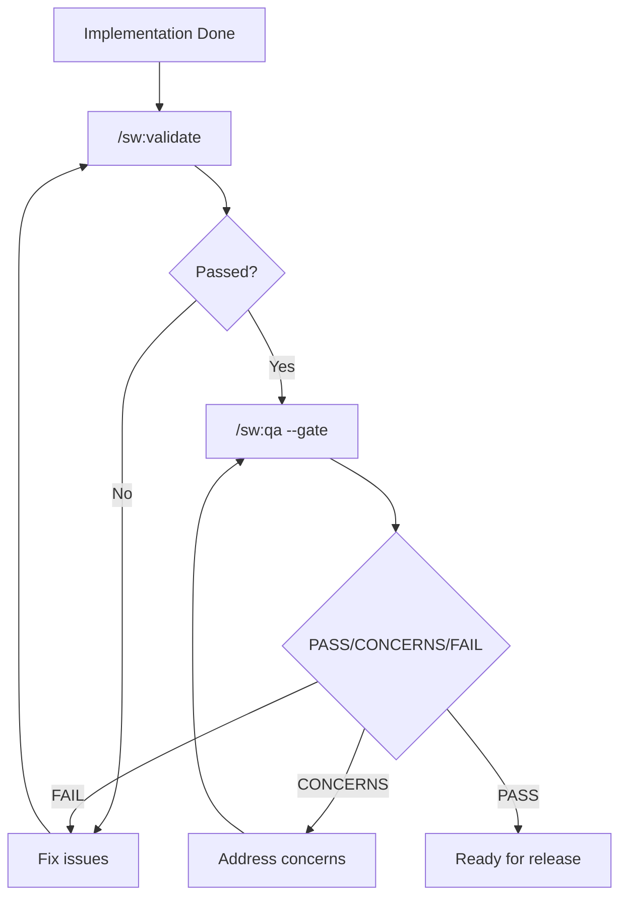
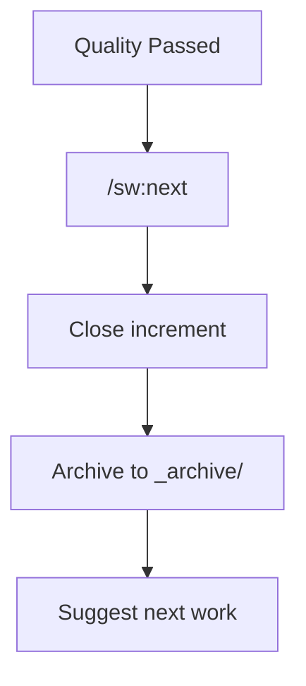

# Use Case Guide

Find the right SpecWeave skill or command for what you're trying to do.

## "I want to..." Quick Lookup

### Planning & Starting Work

| I want to... | Use this | Type |
|--------------|----------|------|
| Start a new feature | `/sw:increment "feature"` | Command |
| Get help writing specs | `/sw:pm` | Skill |
| Design system architecture | `/sw:architect` | Skill |
| Plan a product roadmap | `/sw:roadmap-planner` | Skill |
| Break down a complex feature | `/sw:role-orchestrator` | Skill |
| Create tasks with test plans | `/sw:test-aware-planner` | Skill |

### Implementing Features

| I want to... | Use this | Type |
|--------------|----------|------|
| Work autonomously (hours) | `/sw:auto` | Command |
| Work task-by-task manually | `/sw:do` | Command |
| Work with multiple agents | `/sw:auto-parallel` | Command |
| Check auto mode progress | `/sw:auto-status` | Command |
| Get React/Vue/Angular help | `/sw-frontend:frontend-architect` | Skill |
| Get Node.js API help | `/sw-backend:nodejs-backend` | Skill |
| Get .NET help | `/sw-backend:dotnet-backend` | Skill |
| Get Python help | `/sw-backend:python-backend` | Skill |
| Optimize database queries | `/sw-backend:database-optimizer` | Skill |
| Set up Kubernetes | `/sw-kubernetes:k8s-manifest-generator` | Skill |
| Design Kafka architecture | `/sw-kafka:kafka-architect` | Skill |

### Testing & Quality

| I want to... | Use this | Type |
|--------------|----------|------|
| Validate quickly (rules) | `/sw:validate` | Command |
| AI quality assessment | `/sw:qa --gate` | Command |
| Deep implementation audit | `/sw:grill` | Command |
| Follow TDD strictly | `/sw:tdd-cycle` | Skill |
| Write failing tests first | `/sw:tdd-red` | Skill |
| Get test strategy help | `/sw-testing:qa-engineer` | Skill |
| Write E2E tests | `/sw-testing:e2e-testing` | Skill |
| Code review my changes | `/sw:code-reviewer` | Skill |

### Completing & Managing Work

| I want to... | Use this | Type |
|--------------|----------|------|
| Finish and get next task | `/sw:next` | Command |
| Close specific increment | `/sw:done 0007` | Command |
| Check progress | `/sw:progress` | Command |
| Pause for later | `/sw:pause` | Command |
| Resume paused work | `/sw:resume` | Command |
| Abandon increment | `/sw:abandon` | Command |
| Reopen completed work | `/sw:reopen` | Command |

### Syncing with External Tools

| I want to... | Use this | Type |
|--------------|----------|------|
| Sync to GitHub Issues | `/sw-github:sync` | Command |
| Sync to JIRA | `/sw-jira:sync` | Command |
| Sync to Azure DevOps | `/sw-ado:sync` | Command |
| Configure external sync | `/sw:external-sync-wizard` | Skill |

### Documentation

| I want to... | Use this | Type |
|--------------|----------|------|
| Write technical docs | `/sw:docs-writer` | Skill |
| Update living docs | `/sw:docs-updater` | Skill |
| Navigate project docs | `/sw:living-docs-navigator` | Skill |
| Build Docusaurus site | `/sw-docs:docusaurus` | Skill |
| Preview documentation | `/sw-docs:preview` | Skill |

### Security & Compliance

| I want to... | Use this | Type |
|--------------|----------|------|
| Security assessment | `/sw:security` | Skill |
| Detect security patterns | `/sw:security-patterns` | Skill |
| SOC 2/HIPAA compliance | `/sw:compliance-architecture` | Skill |
| PCI-DSS for payments | `/sw-payments:pci-compliance` | Skill |

### Cost & Performance

| I want to... | Use this | Type |
|--------------|----------|------|
| Optimize cloud costs | `/sw-cost-optimizer:cost-optimization` | Skill |
| Analyze AWS costs | `/sw-cost-optimizer:aws-cost-expert` | Skill |
| Improve performance | `/sw:performance` | Skill |

---

## By Role

### I'm a Product Manager

```bash
/sw:pm                    # Requirements, user stories, ACs
/sw:roadmap-planner       # Quarterly planning, prioritization
/sw:increment "feature"   # Start new work
/sw:progress              # Track team progress
```

### I'm an Architect

```bash
/sw:architect             # System design, ADRs
/sw:role-orchestrator     # Coordinate multiple agents
/sw-infrastructure:devops # CI/CD, deployment
/sw:security              # Security review
```

### I'm a Frontend Developer

```bash
/sw-frontend:frontend-architect    # React/Vue patterns
/sw-frontend:nextjs                # Next.js specifics
/sw-frontend:design-system-architect  # Component library
/sw:auto                           # Autonomous implementation
```

### I'm a Backend Developer

```bash
/sw-backend:nodejs-backend         # Node.js APIs
/sw-backend:database-optimizer     # SQL optimization
/sw-kafka:kafka-architect          # Event-driven design
/sw:auto                           # Autonomous implementation
```

### I'm a DevOps Engineer

```bash
/sw-infrastructure:devops          # CI/CD pipelines
/sw-kubernetes:k8s-manifest-generator  # K8s manifests
/sw-kubernetes:gitops-workflow     # ArgoCD/Flux
/sw-infra:terraform-opentofu       # Terraform IaC
```

### I'm a QA Engineer

```bash
/sw-testing:qa-engineer             # Test strategy
/sw-testing:e2e-testing            # Playwright E2E
/sw-testing:unit-testing           # Unit test patterns
/sw:tdd-cycle               # TDD workflow
/sw:grill                          # Implementation audit
```

### I'm a Security Engineer

```bash
/sw:security                       # Vulnerability assessment
/sw:security-patterns              # Real-time detection
/sw:compliance-architecture        # Compliance frameworks
/sw-payments:pci-compliance        # PCI-DSS
```

---

## By Phase

### Phase 1: Planning



**Commands/Skills:**
- `/sw:increment "feature"` - Create increment
- `/sw:pm` - Product management
- `/sw:architect` - Architecture design
- `/sw:role-orchestrator` - Multi-agent coordination

### Phase 2: Implementation



**Commands/Skills:**
- `/sw:auto` - Autonomous execution
- `/sw:do` - Manual execution
- `/sw-frontend:*` - Frontend skills
- `/sw-backend:*` - Backend skills

### Phase 3: Quality



**Commands/Skills:**
- `/sw:validate` - Rule-based checks
- `/sw:qa --gate` - AI quality gate
- `/sw:grill` - Deep audit
- `/sw:code-reviewer` - Code review

### Phase 4: Completion



**Commands/Skills:**
- `/sw:next` - Complete and suggest next
- `/sw:done` - Close increment
- `/sw-github:sync` - Sync to GitHub

---

## Common Workflows

### Start to Finish (Autonomous)

```bash
# 1. Create increment
/sw:increment "User authentication with JWT"

# 2. Let it run (go grab coffee, lunch, or sleep)
/sw:auto

# 3. Check from another terminal (optional)
/sw:auto-status

# 4. Complete when done
/sw:next

# 5. Sync to GitHub (optional)
/sw-github:sync 0007
```

### TDD Workflow

```bash
# 1. Create increment
/sw:increment "Payment processing"

# 2. TDD cycle
/sw:tdd-cycle

# OR step by step:
/sw:tdd-red        # Write failing tests
/sw:tdd-green      # Minimal implementation
/sw:tdd-refactor   # Clean up

# 3. Quality gate
/sw:qa --gate

# 4. Complete
/sw:next
```

### Quality-First Release

```bash
# 1. Quick validation
/sw:validate 0007

# 2. Deep audit
/sw:grill 0007 --full

# 3. AI quality gate
/sw:qa 0007 --gate

# 4. Code review
/sw:code-reviewer

# 5. Security check
/sw:security

# 6. Complete
/sw:done 0007
```

### Multi-Repo Project

```bash
# 1. Detect repo structure
/sw:umbrella-repo-detector

# 2. Create coordinated increment
/sw:increment "Feature spanning FE + BE"

# 3. Parallel execution
/sw:auto-parallel

# 4. Sync all to GitHub
/sw-github:github-multi-project
```

---

## Decision Trees

### Which Execution Mode?

```
Start Implementation
        │
        ▼
┌───────────────────┐
│ Do I need to make │
│ decisions during  │──Yes──▶ /sw:do (manual)
│ implementation?   │
└───────────────────┘
        │No
        ▼
┌───────────────────┐
│ Are there isolated│
│ parallel work     │──Yes──▶ /sw:auto-parallel
│ streams (FE/BE)?  │
└───────────────────┘
        │No
        ▼
    /sw:auto (autonomous)
```

### Which Quality Check?

```
Want Quality Check
        │
        ▼
┌───────────────────┐
│ Quick validation  │
│ (rules only)?     │──Yes──▶ /sw:validate
└───────────────────┘
        │No
        ▼
┌───────────────────┐
│ Deep code audit   │
│ with parallel     │──Yes──▶ /sw:grill
│ analysis?         │
└───────────────────┘
        │No
        ▼
    /sw:qa --gate (AI quality)
```

### Which Sync Command?

```
Sync to External Tool
        │
        ▼
┌───────────────────┐
│ Which tool?       │
└───────────────────┘
        │
    ┌───┴───┬───────┐
    ▼       ▼       ▼
 GitHub   JIRA    ADO
    │       │       │
    ▼       ▼       ▼
/sw-github /sw-jira /sw-ado
  :sync     :sync    :sync
```

---

## Skill Auto-Activation Keywords

Skills activate automatically when you mention these keywords:

| Keywords | Skill Activated |
|----------|-----------------|
| "user story", "acceptance criteria", "requirements" | `sw:pm` |
| "architecture", "ADR", "design decision" | `sw:architect` |
| "React", "Vue", "Angular", "frontend" | `sw-frontend:frontend-architect` |
| "Node.js", "Express", "API endpoint" | `sw-backend:nodejs-backend` |
| "database", "SQL", "query optimization" | `sw-backend:database-optimizer` |
| "Kubernetes", "K8s", "pods", "deployment" | `sw-kubernetes:*` |
| "Kafka", "events", "streaming" | `sw-kafka:kafka-architect` |
| "test", "TDD", "unit test", "E2E" | `sw:tdd-cycle` |
| "security", "OWASP", "vulnerability" | `sw:security` |
| "compliance", "SOC 2", "HIPAA", "GDPR" | `sw:compliance-architecture` |

---

## Next Steps

- [Skills Reference](./skills) - Complete skills list
- [Commands Reference](./commands) - Complete commands list
- [Quick Start](/docs/getting-started) - Get started in 5 minutes
