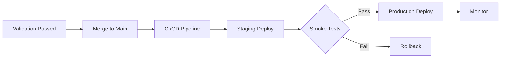

# Deployment Workflow

**Get your validated code into production.**

---

## Overview



---

## Prerequisites

Before deploying:

- [ ] `/sw:validate` passed
- [ ] Code reviewed and approved
- [ ] All tests passing
- [ ] Documentation updated
- [ ] Deployment plan ready

---

## Deployment Stages

### Stage 1: Merge and Build

```bash
# After validation passes
git checkout main
git merge feature/0001-user-auth
git push origin main

# CI/CD automatically:
# - Builds application
# - Runs full test suite
# - Creates deployment artifact
```

### Stage 2: Staging Deployment

```bash
# Deploy to staging
npm run deploy:staging

# Or through CI/CD
# Automatic on merge to develop
```

**Staging Verification:**
- [ ] Application starts
- [ ] Database migrations run
- [ ] Health checks pass
- [ ] Smoke tests pass

### Stage 3: Production Deployment

```bash
# Manual approval required
npm run deploy:production

# With rollback plan
PREVIOUS_VERSION=1.2.3 npm run deploy:production
```

---

## Deployment Strategies

### Strategy 1: Blue-Green

```
Before:
  Blue (Live): v1.0  ← Traffic
  Green (Idle): ---

Deploy:
  Blue (Live): v1.0  ← Traffic
  Green (New): v1.1  (deploying)

Switch:
  Blue (Old): v1.0
  Green (Live): v1.1 ← Traffic

Rollback if needed:
  Blue (Live): v1.0  ← Traffic
  Green (Old): v1.1
```

### Strategy 2: Canary

```
Phase 1: 5% traffic
  v1.0 (95%) ▓▓▓▓▓▓▓▓▓▓▓▓▓▓▓▓▓▓▓░
  v1.1 (5%)  ░

Phase 2: 25% traffic
  v1.0 (75%) ▓▓▓▓▓▓▓▓▓▓▓▓▓▓▓░░░░░
  v1.1 (25%) ░░░░░

Phase 3: 100% traffic
  v1.0 (0%)
  v1.1 (100%) ▓▓▓▓▓▓▓▓▓▓▓▓▓▓▓▓▓▓▓▓
```

### Strategy 3: Rolling

```
Servers: [A] [B] [C] [D]

Step 1: [A-NEW] [B] [C] [D]
Step 2: [A-NEW] [B-NEW] [C] [D]
Step 3: [A-NEW] [B-NEW] [C-NEW] [D]
Step 4: [A-NEW] [B-NEW] [C-NEW] [D-NEW]
```

---

## CI/CD Pipeline

### GitHub Actions Example

```yaml
# .github/workflows/deploy.yml
name: Deploy

on:
  push:
    branches: [main]

jobs:
  build:
    runs-on: ubuntu-latest
    steps:
      - uses: actions/checkout@v4

      - name: Setup Node
        uses: actions/setup-node@v4
        with:
          node-version: '20'

      - name: Install & Build
        run: |
          npm ci
          npm run build

      - name: Test
        run: npm test

      - name: Upload Artifact
        uses: actions/upload-artifact@v4
        with:
          name: build
          path: dist/

  deploy-staging:
    needs: build
    runs-on: ubuntu-latest
    environment: staging
    steps:
      - name: Download Artifact
        uses: actions/download-artifact@v4
        with:
          name: build

      - name: Deploy to Staging
        run: ./scripts/deploy.sh staging

      - name: Smoke Tests
        run: npm run test:smoke -- --env=staging

  deploy-production:
    needs: deploy-staging
    runs-on: ubuntu-latest
    environment: production
    steps:
      - name: Download Artifact
        uses: actions/download-artifact@v4
        with:
          name: build

      - name: Deploy to Production
        run: ./scripts/deploy.sh production

      - name: Health Check
        run: curl -f https://api.example.com/health
```

---

## Database Migrations

```bash
# Run migrations before deployment
npx prisma migrate deploy

# Or as part of deployment
./scripts/deploy.sh production --with-migrations
```

**Migration Best Practices:**
- Always backwards compatible
- Test migrations on staging first
- Have rollback scripts ready
- Avoid long-running migrations

---

## Feature Flags

Enable gradual rollout:

```typescript
// Check feature flag
if (featureFlags.isEnabled('new-checkout-flow', user)) {
  return <NewCheckoutFlow />;
}
return <OldCheckoutFlow />;
```

**Flag lifecycle:**
```
Development → Staging → Canary (5%) → 50% → 100% → Remove flag
```

---

## Monitoring After Deploy

### Health Checks

```bash
# Endpoint health
curl https://api.example.com/health
# {"status":"healthy","version":"1.2.3"}

# Database health
curl https://api.example.com/health/db
# {"status":"connected","latency":"5ms"}
```

### Key Metrics

| Metric | Alert Threshold |
|--------|-----------------|
| Error rate | > 1% |
| Response time (p99) | > 500ms |
| CPU usage | > 80% |
| Memory usage | > 85% |
| Queue depth | > 1000 |

### Dashboard

```
┌────────────────────────────────────────┐
│ Post-Deploy Dashboard                  │
├────────────────────────────────────────┤
│ Error Rate: 0.02% ✅                   │
│ P99 Latency: 120ms ✅                  │
│ Active Users: 1,234                    │
│ Deploy Time: 2024-11-25 14:30:00      │
│ Version: 1.2.3                         │
└────────────────────────────────────────┘
```

---

## Rollback Procedure

### Automatic Rollback

```yaml
# CI/CD triggers rollback on failure
- name: Deploy
  run: ./scripts/deploy.sh production

- name: Health Check
  run: curl -f https://api.example.com/health
  timeout: 60

- name: Rollback on Failure
  if: failure()
  run: ./scripts/rollback.sh production
```

### Manual Rollback

```bash
# Quick rollback to previous version
npm run deploy:rollback

# Rollback to specific version
npm run deploy:rollback -- --version=1.2.2

# Emergency rollback (skip checks)
npm run deploy:rollback -- --force
```

---

## Post-Deployment Checklist

After successful deployment:

- [ ] Health checks passing
- [ ] Error rates normal
- [ ] Response times acceptable
- [ ] Key flows working (login, checkout, etc.)
- [ ] Monitoring dashboards green
- [ ] On-call notified of deploy

---

## SpecWeave Integration

Close increment after successful deploy:

```bash
# Verify deployment
curl https://api.example.com/health

# Close the increment
/sw:done 0001

# Sync to external tools
/sw:sync-progress
```

---

## Common Deployment Issues

### Issue: Migration Failed

```bash
Error: Migration 20241125_add_column failed
```

**Fix:**
1. Check migration logs
2. Fix migration script
3. Test on staging
4. Redeploy

### Issue: Health Check Timeout

```bash
Error: Health check failed after 60s
```

**Fix:**
1. Check application logs
2. Verify database connection
3. Check external dependencies
4. Increase timeout or fix issue

### Issue: Traffic Spike After Deploy

```bash
Alert: CPU usage 95%
```

**Fix:**
1. Scale horizontally
2. Enable caching
3. Rate limit if needed
4. Investigate root cause

---

## Next Step

→ [Validation Workflow](/docs/workflows/validation)
