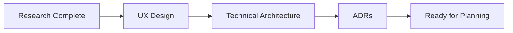

# Design Workflow

**Design the solution before writing code.**

---

## Overview



---

## Design Outputs

| Output | Purpose | Who Creates |
|--------|---------|-------------|
| UX Designs | User interface flow | Designer/PM |
| System Architecture | Technical structure | Architect |
| ADRs | Key decisions | Tech Lead |
| Data Model | Database schema | Backend Dev |
| API Contracts | Interface definitions | Team |

---

## Step 1: UX Design

**Question**: How will users interact with the system?

```markdown
## User Flows

### Flow: User Registration
1. User clicks "Sign Up"
2. User enters email and password
3. System validates input
4. System sends verification email
5. User clicks verification link
6. User is logged in

### Wireframes
- [Figma Link: Registration Flow]
- [Miro Board: User Journey]
```

---

## Step 2: System Architecture

**Question**: How will the system be structured?

### C4 Model

**Context Diagram** (Level 1):
```
                  ┌─────────────┐
                  │   User      │
                  └──────┬──────┘
                         │
                  ┌──────▼──────┐
                  │  SpecWeave  │
                  │    App      │
                  └──────┬──────┘
                         │
          ┌──────────────┼──────────────┐
          │              │              │
   ┌──────▼──────┐┌──────▼──────┐┌──────▼──────┐
   │   GitHub    ││    JIRA     ││  Database   │
   └─────────────┘└─────────────┘└─────────────┘
```

**Container Diagram** (Level 2):
```markdown
## Containers

### Frontend (React)
- Single-page application
- Communicates via REST API

### Backend (Node.js)
- Express server
- Handles business logic
- Manages authentication

### Database (PostgreSQL)
- Stores increments, tasks, docs
- Persistent storage

### External Services
- GitHub API
- JIRA API
- Email service
```

---

## Step 3: Data Model

**Question**: How is data structured?

```sql
-- Core entities

CREATE TABLE increments (
  id SERIAL PRIMARY KEY,
  name VARCHAR(100) NOT NULL,
  status VARCHAR(20) DEFAULT 'planning',
  created_at TIMESTAMP DEFAULT NOW()
);

CREATE TABLE tasks (
  id SERIAL PRIMARY KEY,
  increment_id INTEGER REFERENCES increments(id),
  title VARCHAR(200) NOT NULL,
  status VARCHAR(20) DEFAULT 'pending',
  created_at TIMESTAMP DEFAULT NOW()
);

CREATE TABLE acceptance_criteria (
  id SERIAL PRIMARY KEY,
  increment_id INTEGER REFERENCES increments(id),
  ac_id VARCHAR(20) NOT NULL,  -- e.g., AC-US1-01
  description TEXT NOT NULL,
  satisfied BOOLEAN DEFAULT FALSE
);
```

---

## Step 4: API Contracts

**Question**: How do components communicate?

```yaml
openapi: 3.0.0
info:
  title: Task Tracker API
  version: 1.0.0

paths:
  /api/increments:
    get:
      summary: List all increments
      responses:
        '200':
          description: Array of increments
          content:
            application/json:
              schema:
                type: array
                items:
                  $ref: '#/components/schemas/Increment'

    post:
      summary: Create new increment
      requestBody:
        required: true
        content:
          application/json:
            schema:
              type: object
              properties:
                name:
                  type: string
      responses:
        '201':
          description: Increment created

components:
  schemas:
    Increment:
      type: object
      properties:
        id:
          type: integer
        name:
          type: string
        status:
          type: string
          enum: [planning, active, completed]
```

---

## Step 5: Architecture Decision Records (ADRs)

**Question**: Why did we make key decisions?

```markdown
# ADR-001: Use PostgreSQL for Primary Database

## Status
Accepted

## Context
We need a database for storing increments, tasks, and living docs.
Options considered: PostgreSQL, MongoDB, SQLite.

## Decision
Use PostgreSQL.

## Rationale
- Relational data (increments → tasks → ACs)
- Strong consistency requirements
- Proven scaling patterns
- Team expertise

## Consequences
- Need to manage migrations
- Schema changes require planning
- Good tooling ecosystem (Prisma)
```

---

## Design Document Template

```markdown
# Design: [Feature Name]

## Overview
[1-2 sentence summary]

## User Experience
[User flows, wireframes, mockups]

## System Architecture
[C4 diagrams, component breakdown]

## Data Model
[ERD, schema definitions]

## API Contracts
[OpenAPI spec or interface definitions]

## Key Decisions
[ADRs for significant choices]

## Security Considerations
[Auth, authorization, data protection]

## Performance Considerations
[Caching, scaling, optimization]

## Open Questions
[Items needing further discussion]
```

---

## Using SpecWeave Skills

Leverage skills for design (auto-activate on keywords):

```bash
# Architecture skill (auto-activates on "architecture", "design")
"Design authentication system architecture for
multi-tenant SaaS application"

# Output: C4 diagrams, ADRs, data model
```

```bash
# Security skill (auto-activates on "security", "OWASP")
"Review authentication design for
OWASP compliance and security"

# Output: Security recommendations, threat model
```

**Note**: Architect and Security are SKILLS that auto-activate based on keywords in your prompt. For explicit skill invocation, use the Skill tool:

```typescript
Skill({ skill: "sw-frontend:frontend-architect", args: "..." })
Skill({ skill: "sw-k8s:kubernetes-architect", args: "..." })
```

---

## Design Review Checklist

Before moving to planning:

- [ ] User flows documented
- [ ] System architecture defined
- [ ] Data model designed
- [ ] API contracts specified
- [ ] Key ADRs written
- [ ] Security reviewed
- [ ] Performance considered

---

## Common Design Mistakes

### Mistake 1: No ADRs

```markdown
❌ "We just decided to use X"
✅ "ADR-003 documents why we chose X over Y and Z"
```

### Mistake 2: Missing API Contracts

```markdown
❌ Frontend and backend design separately
✅ Shared API contract before implementation
```

### Mistake 3: Ignoring Scale

```markdown
❌ "We'll scale later"
✅ "Design supports 10x growth, here's how"
```

---

## When Design Is Complete

Move to planning when:

- [ ] All stakeholders reviewed design
- [ ] Technical feasibility validated
- [ ] Security review passed
- [ ] Performance strategy defined
- [ ] ADRs documented

---

## Next Step

→ [Planning Workflow](/docs/workflows/planning)
