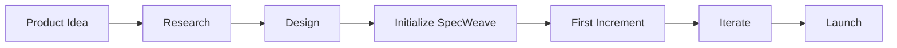

# Greenfield Workflow

**Build something new with SpecWeave from day one.**

---

## Overview



---

## What is Greenfield?

**Greenfield** = New project, no existing code.

```
Greenfield: Empty folder → Working product
Brownfield: Existing code → Enhanced product
```

SpecWeave works great for both, but greenfield is simpler.

---

## Step 1: Project Setup

### Create Project Structure

```bash
# Create project directory
mkdir my-new-app
cd my-new-app

# Initialize Git
git init

# Initialize Node.js
npm init -y

# Install dependencies
npm install typescript @types/node
npx tsc --init
```

### Initialize SpecWeave

```bash
# Open in Claude Code
claude

# Initialize SpecWeave
/sw:init
```

SpecWeave creates:
```
my-new-app/
├── .specweave/
│   ├── docs/
│   │   ├── living/          # Auto-updated docs
│   │   └── internal/        # ADRs, decisions
│   ├── increments/          # Spec-driven work
│   └── config.json          # Configuration
├── package.json
└── tsconfig.json
```

---

## Step 2: Product Foundation

### Document Your Vision

```markdown
# Product: My New App

## Vision
[What problem are we solving?]

## Target Users
[Who are we building for?]

## Core Features (MVP)
1. Feature A
2. Feature B
3. Feature C

## Success Metrics
- Metric 1: [target]
- Metric 2: [target]
```

### Create Architecture

```bash
# Use architect agent
/sw:agent architect
"Design architecture for [product description].
Consider: scalability, security, maintainability."
```

---

## Step 3: First Increment

### Plan Increment 0001

```bash
/sw:increment "Core foundation"
```

**First increment typically includes:**
- Project structure
- Basic tooling (lint, format, test)
- CI/CD pipeline
- First feature (hello world level)

### Example spec.md

```markdown
---
increment: 0001-core-foundation
---

# Increment 0001: Core Foundation

## Objective
Set up project foundation with all tooling.

## User Stories

### US-001: Developer can run the project
**As a** developer
**I want to** clone and run the project
**So that** I can start development quickly

#### Acceptance Criteria
- **AC-US1-01**: `npm install` succeeds
- **AC-US1-02**: `npm run dev` starts development server
- **AC-US1-03**: `npm test` runs test suite
- **AC-US1-04**: `npm run lint` checks code quality
```

---

## Step 4: Implement Foundation

```bash
/sw:do
```

SpecWeave guides implementation:

```
Task T-001: Set up TypeScript configuration
- Creating tsconfig.json with strict mode
- Setting up path aliases
- Configuring build output

Task T-002: Set up testing
- Installing Vitest
- Creating test configuration
- Adding example test

Task T-003: Set up linting
- Installing ESLint
- Creating .eslintrc.js
- Adding lint scripts
```

---

## Step 5: Validate and Complete

```bash
# Verify everything works
/sw:validate 0001

# Complete the increment
/sw:done 0001
```

---

## Step 6: Build Features

### Create Feature Increments

```bash
# Plan next increment
/sw:increment "User authentication"

# Implement
/sw:do

# Complete
/sw:done 0002
```

### Typical Increment Progression

| Increment | Focus | Duration |
|-----------|-------|----------|
| 0001 | Foundation | 1-2 days |
| 0002 | First feature | 3-5 days |
| 0003 | Second feature | 3-5 days |
| 0004 | MVP polish | 2-3 days |
| 0005 | First deploy | 1-2 days |

---

## Greenfield Best Practices

### 1. Start Small

```markdown
❌ Increment 0001: Build entire product
✅ Increment 0001: Set up foundation
   Increment 0002: First feature
   Increment 0003: Second feature
```

### 2. Document Decisions

```bash
# Create ADR for important decisions
/sw:agent architect
"Create ADR for choosing PostgreSQL
over MongoDB for this project."
```

### 3. CI/CD Early

Set up CI/CD in increment 0001:

```yaml
# .github/workflows/ci.yml
name: CI
on: [push, pull_request]
jobs:
  test:
    runs-on: ubuntu-latest
    steps:
      - uses: actions/checkout@v4
      - uses: actions/setup-node@v4
      - run: npm ci
      - run: npm test
      - run: npm run lint
```

### 4. Test from Day One

Every feature has tests:

```typescript
// Even for increment 0001
describe('App', () => {
  it('should start without errors', () => {
    expect(() => new App()).not.toThrow();
  });
});
```

---

## Greenfield vs Brownfield

| Aspect | Greenfield | Brownfield |
|--------|------------|------------|
| Starting point | Empty | Existing code |
| First step | Create structure | Analyze structure |
| Documentation | Build as you go | Capture what exists |
| Testing | TDD from start | Add tests incrementally |
| Architecture | Design fresh | Work with constraints |

---

## Common Greenfield Mistakes

### Mistake 1: Over-Engineering

```markdown
❌ "Let's build microservices from day one"
✅ "Start with a monolith, split when needed"
```

### Mistake 2: No Testing

```markdown
❌ "We'll add tests later when we have time"
✅ "Tests from increment 0001"
```

### Mistake 3: Ignoring Documentation

```markdown
❌ "The code is self-documenting"
✅ "ADRs, living docs, inline comments"
```

### Mistake 4: Big Bang Features

```markdown
❌ Increment 0002: Complete user system (auth, profiles, admin, roles)
✅ Increment 0002: Basic authentication
   Increment 0003: User profiles
   Increment 0004: Admin panel
```

---

## Tech Stack Recommendations

### For Web Apps

```markdown
## Recommended Greenfield Stack

### Backend
- Node.js + TypeScript
- Express or Fastify
- PostgreSQL + Prisma
- Vitest for testing

### Frontend
- React or Vue
- TypeScript
- TailwindCSS
- Playwright for E2E

### DevOps
- GitHub Actions
- Docker
- Vercel or Railway
```

### For APIs

```markdown
## API-Only Stack

- Node.js + TypeScript
- Express + OpenAPI
- PostgreSQL + Prisma
- Supertest for API tests
```

---

## Sample First Month

| Week | Increments | Focus |
|------|-----------|-------|
| 1 | 0001 | Foundation, tooling, CI/CD |
| 2 | 0002, 0003 | Core features |
| 3 | 0004, 0005 | More features, polish |
| 4 | 0006 | MVP deploy, monitoring |

**End of month**: Working MVP in production.

---

## Next Steps

After greenfield setup:

1. **Add features** → [Implementation Workflow](/docs/workflows/implementation)
2. **Deploy** → [Deployment Workflow](/docs/workflows/deployment)
3. **Integrate tools** → [External Tools](/docs/academy/specweave-essentials/07-external-tools)

---

## Related

- [Brownfield Workflow](/docs/workflows/brownfield)
- [Planning Workflow](/docs/workflows/planning)
- [Quick Start Guide](/docs/guides/getting-started/quickstart)
