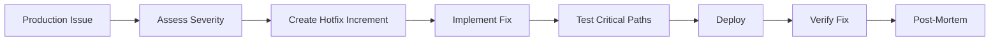

# Hotfix Workflow

**Fix production issues fast—but not recklessly.**

---

## Overview



---

## Severity Levels

| Level | Description | Response Time | Example |
|-------|-------------|---------------|---------|
| SEV1 | System down | Minutes | Site unreachable |
| SEV2 | Major feature broken | Hours | Checkout failing |
| SEV3 | Minor feature broken | Same day | Profile image not loading |
| SEV4 | Cosmetic issue | Normal sprint | Typo in footer |

**SEV1-2 require hotfix workflow. SEV3-4 can wait for normal process.**

---

## Step 1: Assess and Communicate

**Before writing any code:**

```markdown
## Incident Assessment

**Time Detected**: 14:32 UTC
**Severity**: SEV1
**Impact**: All users cannot login
**Symptoms**: 500 error on /api/auth/login
**Hypothesis**: Recent deploy broke auth token validation

**Communication**:
- Posted in #incidents
- Status page updated
- On-call notified
```

---

## Step 2: Create Hotfix Increment

```bash
/sw:increment "hotfix: fix auth token validation"
```

This creates a lightweight increment:

```markdown
# Increment: 0015-hotfix-auth-token

## Problem
Users receiving 500 error on login after v1.2.3 deploy.

## Root Cause (Hypothesis)
Token validation regex changed in commit abc123.

## Fix
Revert token validation to previous behavior.

## Tasks
- [ ] T-001: Identify breaking change
- [ ] T-002: Implement fix
- [ ] T-003: Add regression test
- [ ] T-004: Deploy to production
```

---

## Step 3: Implement Fix

**Key principles:**
- Minimal change
- Fix only the issue
- No refactoring
- No "while we're here" improvements

```javascript
// BAD: "While I'm here, let me also..."
- function validateToken(token) {
-   // Refactored validation with new regex
-   const pattern = /^[A-Za-z0-9_]+$/;  // This broke it
-   // Plus added new logging
-   // Plus renamed variables
- }

// GOOD: Minimal revert
+ function validateToken(token) {
+   const pattern = /^[A-Za-z0-9\-._]+$/;  // Restored working pattern
+ }
```

---

## Step 4: Test Critical Paths

**Hotfix testing is focused:**

```bash
# Run only auth-related tests
npm test -- --grep "auth"

# Verify the specific fix
npm test -- src/auth/token.test.ts

# Quick smoke test
npm run test:smoke
```

**Do NOT run:**
- Full test suite (takes too long)
- Performance tests
- E2E suite (unless auth-related)

---

## Step 5: Fast-Track Deployment

```bash
# Skip staging (for SEV1 only)
npm run deploy:production --hotfix

# Or with approval
npm run deploy:production --skip-staging --approved-by="@lead"
```

**Hotfix deployment differs:**
- May skip staging
- Single approver sufficient
- Immediate rollback ready
- Reduced automated gates

---

## Step 6: Verify Fix

**In production:**

```bash
# Test the fixed endpoint
curl -X POST https://api.example.com/api/auth/login \
  -d '{"email":"test@example.com","password":"test"}' \
  -w "%{http_code}"
# Expected: 200

# Check error rates
curl https://api.example.com/metrics | grep auth_errors
# Should be decreasing
```

---

## Step 7: Post-Mortem

**After the fire is out:**

```markdown
# Post-Mortem: SEV1 Auth Outage 2024-11-25

## Summary
Login broken for all users for 47 minutes.

## Timeline
- 14:32 - First alert triggered
- 14:35 - On-call acknowledged
- 14:42 - Root cause identified
- 14:58 - Fix deployed
- 15:05 - Verified fix in production
- 15:19 - All-clear declared

## Root Cause
Regex pattern in token validation was changed in PR #423.
Change was not tested with tokens containing dashes.

## Impact
- ~2,000 users affected
- ~500 support tickets
- Estimated $5,000 revenue impact

## Lessons Learned
1. Token validation changes need specific test cases
2. Auth changes should have staging soak time
3. Canary deploy would have caught this

## Action Items
- [ ] Add regression test for dash-containing tokens
- [ ] Add auth-specific test coverage requirements
- [ ] Implement canary deployment for auth changes
```

---

## Hotfix vs Normal Flow

| Aspect | Normal Flow | Hotfix Flow |
|--------|-------------|-------------|
| Planning | Full spec, plan, tasks | Minimal spec |
| Code review | Multiple reviewers | Single reviewer |
| Testing | Full suite | Critical paths only |
| Staging | Required | Optional (SEV1) |
| Deploy approval | Multiple | Single |
| Documentation | Full | Post-mortem |

---

## Hotfix Checklist

### Before Fix
- [ ] Severity assessed
- [ ] Impact understood
- [ ] Stakeholders notified
- [ ] Status page updated

### During Fix
- [ ] Increment created
- [ ] Root cause identified
- [ ] Minimal fix implemented
- [ ] Critical tests pass

### After Fix
- [ ] Deployed to production
- [ ] Fix verified
- [ ] All-clear communicated
- [ ] Post-mortem scheduled

---

## Common Hotfix Mistakes

### Mistake 1: Scope Creep

```markdown
❌ "While I'm fixing this, let me also refactor the auth module"
✅ "Fix only the broken regex, create ticket for refactor"
```

### Mistake 2: Skipping Tests

```markdown
❌ "No time for tests, ship it"
✅ "Add one regression test that catches this bug"
```

### Mistake 3: No Post-Mortem

```markdown
❌ "It's fixed, let's move on"
✅ "Schedule post-mortem for tomorrow"
```

### Mistake 4: Hero Culture

```markdown
❌ One person fixes everything alone at 3am
✅ Clear escalation, team support, reasonable hours
```

---

## Rollback vs Hotfix

**When to rollback:**
- Previous version worked
- Rollback is faster than fix
- Multiple issues introduced

**When to hotfix:**
- Can't rollback (data migration)
- Previous version has other issues
- Fix is small and clear

```bash
# Rollback
npm run deploy:rollback

# Hotfix
/sw:increment "hotfix: ..."
```

---

## SpecWeave Integration

After hotfix is stable:

```bash
# Close the hotfix increment
/sw:done 0015

# Sync progress
/sw:sync-progress

# The hotfix is now documented for future reference
```

---

## Related

- [Troubleshooting](/docs/academy/specweave-essentials/09-troubleshooting)
- [Deployment Workflow](/docs/workflows/deployment)
- [Workflows Overview](/docs/workflows/overview)
