# Workflows: The Complete Journey

SpecWeave provides clear, repeatable workflows for every phase of software development—from initial concept to production deployment.

## The Big Picture

```mermaid
graph TB
    A[💡 Concept] --> B[🔍 Research]
    B --> C[🎨 Design]
    C --> D[📋 Plan]
    D --> E[⚙️ Implement]
    E --> F[✅ Validate]
    F --> G[🚀 Deploy]

    style A fill:#e3f2fd
    style B fill:#f3e5f5
    style C fill:#fff3e0
    style D fill:#e8f5e9
    style E fill:#fce4ec
    style F fill:#e0f2f1
    style G fill:#f1f8e9
```



**Each phase has:**
- Clear inputs and outputs
- Step-by-step instructions
- Mini-diagrams for clarity
- Real-world examples
- Common pitfalls to avoid

## Phase-by-Phase Breakdown

### 1. 💡 Concept → Research

**Question**: "What should we build?"


**Activities:**
- Identify user problems
- Research existing solutions
- Define value proposition
- Scope initial features

**Outputs:**
- Product vision document
- User personas
- Feature list (prioritized)

**[→ Full Research Workflow](/docs/workflows/research)**

---

### 2. 🔍 Research → Design

**Question**: "How will it work?"


**Activities:**
- Design user flows
- Create wireframes/mockups
- Define technical architecture
- Choose tech stack

**Outputs:**
- UX designs (Figma, etc.)
- System architecture (C4 diagrams)
- ADRs (architecture decisions)
- Tech stack selection

**[→ Full Design Workflow](/docs/workflows/design)**

---

### 3. 🎨 Design → Planning

**Question**: "What tasks do we need?"


**Activities:**
- Create increment specification
- Design implementation plan
- Generate task checklist
- Define test strategy

**Outputs:**
- spec.md (requirements, AC-IDs)
- plan.md (architecture, approach)
- tasks.md (checklist, embedded tests)

**Command**: `/sw:increment "feature name"`

**[→ Full Planning Workflow](/docs/workflows/planning)**

---

### 4. 📋 Planning → Implementation

**Question**: "Let's build it!"


**Activities:**
- Implement each task
- Write tests ([TDD](/docs/glossary/terms/tdd) optional)
- Update living docs
- Review progress

**Outputs:**
- Production code
- Automated tests
- Updated documentation
- Completed tasks

**Command**: `/sw:do`

**[→ Full Implementation Workflow](/docs/workflows/implementation)**

---

### 5. ⚙️ Implementation → Validation

**Question**: "Does it work correctly?"


**Activities:**
- Run test suite
- Validate acceptance criteria
- Check code quality
- Review documentation

**Outputs:**
- Test results (all passing)
- Quality report
- Completion summary
- Deployment readiness

**Command**: `/sw:validate`

**[→ Full Validation Workflow](/docs/workflows/validation)**

---

### 6. ✅ Validation → Deployment

**Question**: "Ship it?"


**Activities:**
- Deploy to production
- Monitor metrics
- Gather feedback
- Plan next iteration

**Outputs:**
- Production deployment
- Monitoring dashboards
- User feedback
- Next increment ideas

**[→ Full Deployment Workflow](/docs/workflows/deployment)**

---

## Quick Command Reference

| Phase | Command | What It Does |
|-------|---------|--------------|
| **Planning** | `/sw:increment "feature"` | Creates spec, plan, tasks |
| **Implementation** | `/sw:do` | Executes tasks, auto-resumes |
| **Progress Check** | `/sw:progress` | Shows status, next task |
| **Validation** | `/sw:validate` | Quality checks |
| **Completion** | `/sw:done` | Closes increment |

## Workflow Patterns

### Pattern 1: [Greenfield](/docs/glossary/terms/greenfield) (New Project)


**Characteristics:**
- Start from scratch
- Create complete architecture
- Build incrementally
- Comprehensive specs optional

**[→ Greenfield Guide](/docs/workflows/greenfield)**

---

### Pattern 2: [Brownfield](/docs/glossary/terms/brownfield) (Existing Project)


**Two Paths** (choose based on project size):

| Path | Best For | Upfront Work | How It Works |
|------|----------|--------------|--------------|
| **Quick Start** | Large (50k+ LOC) | 1-2 hours | Document core, start immediately, docs grow with changes |
| **Comprehensive** | Small (under 50k LOC) | 1-2 weeks | Full docs upfront, then increments |

**Key Point**: SpecWeave **considers existing code** when planning increments—no mandatory module-by-module documentation loop!

**[→ Brownfield Guide](/docs/workflows/brownfield)**

---

### Pattern 3: Hotfix (Emergency)

```mermaid
graph TB
    A[🚨 Production Issue] --> B[Quick Analysis]
    B --> C[Create Hotfix Increment]
    C --> D[Implement Fix]
    D --> E[Test Thoroughly]
    E --> F[Deploy ASAP]
    F --> G[Post-Mortem]

    style A fill:#ffcdd2
    style F fill:#c8e6c9
```



**Characteristics:**
- Interrupt current work
- Minimal planning (still documented!)
- Fast implementation
- Thorough testing

**[→ Hotfix Guide](/docs/workflows/hotfix)**

---

## Workflow Comparison

| Workflow | Duration | Planning | Testing | Use When |
|----------|----------|----------|---------|----------|
| **[Greenfield](/docs/glossary/terms/greenfield)** | Weeks-Months | Comprehensive | Full [TDD](/docs/glossary/terms/tdd) | New project |
| **[Brownfield](/docs/glossary/terms/brownfield)** | Days-Weeks | Quick Start or Comprehensive | Regression focus | Existing code |
| **Hotfix** | Hours-Days | Minimal | Critical paths | Production bug |
| **Experiment** | Days | Lightweight | Basic | POC/spike |

## Interactive Decision Tree

**Not sure which workflow to use?**


## Key Principles Across All Workflows

### 1. Specification First

Always define WHAT and WHY before HOW:

```
❌ Wrong: "Start coding, figure it out as you go"
✅ Right: "Write spec.md, then plan.md, then implement"
```

### 2. One Increment at a Time

Focus prevents context switching:

```
❌ Wrong: 3 increments in progress
✅ Right: Complete 0001, then start 0002
```

### 3. Test Everything

Every feature needs validation:

```
❌ Wrong: "I tested it manually, looks good"
✅ Right: Automated tests (unit, integration, E2E)
```

### 4. Document as You Go

Living docs update automatically:

```
❌ Wrong: "I'll document it later"
✅ Right: Hooks auto-update docs after each task
```

### 5. Validate Before Shipping

Quality gates prevent issues:

```
❌ Wrong: "Ship it, we'll fix bugs later"
✅ Right: Validate AC-IDs, run tests, check coverage
```

## Common Workflow Mistakes

### ❌ Mistake 1: Skipping Planning

```
Problem: Jump straight to coding without spec
Result: Unclear requirements, scope creep, rework
Solution: Always create spec.md and plan.md first
```

### ❌ Mistake 2: Multiple Increments in Progress

```
Problem: Start 0002 before finishing 0001
Result: Context switching, neither complete, docs stale
Solution: One increment at a time (WIP limit = 1)
```

### ❌ Mistake 3: Manual Documentation

```
Problem: Edit docs manually, forget to update
Result: Docs drift, become outdated, lose trust
Solution: Let hooks auto-update living docs
```

### ❌ Mistake 4: No Test Strategy

```
Problem: Write tests as afterthought
Result: Poor coverage, bugs in production
Solution: Define test strategy in plan.md
```

### ❌ Mistake 5: Ignoring Validation

```
Problem: Mark tasks done without checking
Result: Incomplete features, failing tests
Solution: Run /sw:validate before /sw:done
```

## Real-World Workflow Example

**Scenario**: Add payment processing to e-commerce site

### Week 1: Research & Design
```bash
# Research payment providers
# Design Stripe integration
# Create C4 diagrams
# Document ADRs
```

### Week 2: Planning
```bash
/sw:increment "0015-payment-processing"
# PM agent creates:
# ✅ spec.md (5 user stories, 15 AC-IDs)
# ✅ plan.md (Stripe architecture, test strategy)
# ✅ tasks.md (18 tasks, embedded tests, 90% coverage target)
```

### Week 3-4: Implementation
```bash
/sw:do
# Implement task by task:
# T-001: Stripe client ✅
# T-002: Payment endpoint ✅
# T-003: Webhook handler ✅
# ...
# T-018: E2E payment flow ✅

/sw:progress
# Shows: 18/18 tasks (100%)
```

### Week 5: Validation & Deploy
```bash
/sw:validate 0015
# ✅ All AC-IDs validated
# ✅ Test coverage: 92%
# ✅ Quality checks passed

# Deploy to production
# Monitor metrics
```

**Result**: Production payment system with complete docs, tests, and audit trail.

## Next Steps

Ready to dive deeper? Choose your path:

- **New to SpecWeave?** → [Quickstart Guide](/docs/guides/getting-started/quickstart)
- **Planning your first feature?** → [Planning Workflow](/docs/workflows/planning)
- **Working with existing code?** → [Brownfield Workflow](/docs/workflows/brownfield)
- **Need emergency fix?** → [Hotfix Workflow](/docs/workflows/hotfix)

---

**Learn More:**
- [Core Concepts](/docs/guides/core-concepts/what-is-an-increment)
- [Command Reference](/docs/commands/status-management)
- Best Practices
