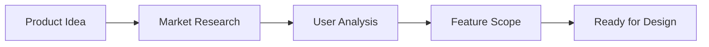

# Research Workflow

**Know what you're building before you start.**

---

## Overview



---

## When to Research

Research before:
- Starting a new product
- Adding major features
- Pivoting direction
- Entering new markets

Research is optional for:
- Bug fixes
- Small enhancements
- Technical improvements

---

## Research Outputs

| Output | Purpose |
|--------|---------|
| Product Vision | What problem we solve |
| User Personas | Who we're building for |
| Feature List | What we'll build |
| Competitor Analysis | What already exists |
| Success Metrics | How we'll measure success |

---

## Step 1: Define the Problem

**Question**: What problem are we solving?

```markdown
## Problem Statement

**Who**: [Target user]
**What**: [The problem they face]
**Why**: [Why it matters]
**Current**: [How they handle it now]

### Example

**Who**: Software development teams
**What**: Requirements drift, specs become outdated
**Why**: Causes bugs, rework, and miscommunication
**Current**: Manually update docs, often forgotten
```

---

## Step 2: Identify Users

**Question**: Who exactly are we building for?

```markdown
## User Personas

### Persona 1: Solo Developer
- **Role**: Independent developer
- **Goals**: Build features faster
- **Pain Points**: Context switching, forgetting details
- **Tech Level**: High

### Persona 2: Team Lead
- **Role**: Manages 3-5 developers
- **Goals**: Keep team aligned, track progress
- **Pain Points**: Status meetings, outdated docs
- **Tech Level**: Medium-High
```

---

## Step 3: Analyze Competition

**Question**: What solutions exist?

```markdown
## Competitive Analysis

| Solution | Strengths | Weaknesses | Gap |
|----------|-----------|------------|-----|
| Jira | Enterprise features | Complex, manual | No AI |
| Linear | Beautiful UI | Limited specs | No living docs |
| Notion | Flexible | No dev workflow | Not integrated |

### Opportunity
No existing solution combines:
- AI-assisted development
- Living documentation
- Automatic progress tracking
```

---

## Step 4: Scope Features

**Question**: What features matter most?

```markdown
## Feature Prioritization

### Must Have (MVP)
- [ ] Increment creation
- [ ] Task tracking
- [ ] Basic validation

### Should Have
- [ ] Living docs sync
- [ ] GitHub integration
- [ ] Quality gates

### Nice to Have
- [ ] AI code review
- [ ] Custom workflows
- [ ] Team analytics

### Won't Have (Now)
- [ ] Mobile app
- [ ] Slack integration
```

---

## Step 5: Define Success

**Question**: How do we know it's working?

```markdown
## Success Metrics

### Adoption
- Target: 1,000 active users in 6 months
- Measure: Weekly active increments

### Engagement
- Target: 80% completion rate
- Measure: Increments started vs completed

### Satisfaction
- Target: NPS > 50
- Measure: Quarterly surveys

### Efficiency
- Target: 30% faster feature delivery
- Measure: Time from spec to production
```

---

## Research Document Template

```markdown
# Product Research: [Product Name]

## Executive Summary
[1-2 sentence overview]

## Problem Statement
[Who, What, Why, Current state]

## Target Users
[User personas with goals and pain points]

## Competitive Landscape
[Analysis of existing solutions]

## Proposed Solution
[High-level approach]

## Feature Scope
[Prioritized feature list]

## Success Metrics
[How we'll measure success]

## Next Steps
[What happens after research]
```

---

## Research with AI

Use AI to accelerate research:

```markdown
# Ask AI to analyze
"Research the task management tool market.
Identify gaps that AI-native development
tools could fill. Focus on developer
workflow automation."

# AI provides
- Market size estimates
- Key competitors
- Underserved segments
- Opportunity areas
```

---

## Common Research Mistakes

### Mistake 1: Skipping Research

```markdown
❌ "I know what users want"
✅ "Let me validate assumptions with research"
```

### Mistake 2: Analysis Paralysis

```markdown
❌ Researching for months before starting
✅ Time-boxed research (1-2 weeks for major features)
```

### Mistake 3: Ignoring Competition

```markdown
❌ "Our idea is unique"
✅ "Here's what exists and why we're different"
```

---

## When Research Is Complete

Move to design when you can answer:

- [ ] Who are we building for?
- [ ] What problem are we solving?
- [ ] What makes us different?
- [ ] What features are essential?
- [ ] How will we measure success?

---

## Next Step

→ [Design Workflow](/docs/workflows/design)
