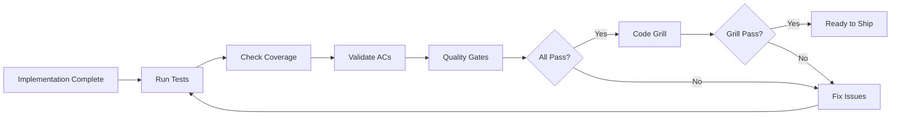

# Validation Workflow

**Prove your code works before shipping.**

---

## Overview



---

## The Validation Command

```bash
/sw:validate 0001
```

This runs comprehensive checks on your increment.

---

## What Gets Validated

### 1. Task Completion

```bash
✓ Tasks: 15/15 complete (100%)
```

All tasks in tasks.md must be marked complete.

**If failing:**
```bash
/sw:progress 0001
# See which tasks are incomplete
```

### 2. Test Suite

```bash
✓ Tests: 47/47 passing
```

All automated tests must pass.

**If failing:**
```bash
npm test
# See which tests fail
```

### 3. Code Coverage

```bash
✓ Coverage: 87% (target: 80%)
```

Coverage must meet threshold defined in plan.md.

**If failing:**
```bash
npm run test:coverage
# See which lines are uncovered
```

### 4. Acceptance Criteria

```bash
✓ AC-IDs: 12/12 satisfied
  ✓ AC-US1-01: User can register
  ✓ AC-US1-02: Email must be unique
  ...
```

Every AC-ID in spec.md must be validated.

**If failing:**
- Review spec.md for uncovered ACs
- Add tests or implementation for missing ACs

### 5. Quality Gates

```bash
✓ Lint: 0 errors
✓ Types: No TypeScript errors
✓ Format: All files formatted
```

Code quality checks must pass.

**If failing:**
```bash
npm run lint
npm run typecheck
npm run format
```

---

## Validation Levels

### Quick Validation

```bash
/sw:validate 0001 --quick
```

- Task completion
- Test pass/fail
- Basic lint check

### Full Validation

```bash
/sw:validate 0001
```

- All quick checks
- Coverage threshold
- AC-ID tracing
- Documentation completeness

### AI Quality Assessment

```bash
/sw:qa 0001
```

- All validation checks
- AI review of code quality
- Risk assessment
- Improvement suggestions

---

## The Validation Report

```markdown
# Increment Validation: 0001-user-authentication

## Summary
Status: READY TO SHIP

## Checks

### Tasks
- Total: 15
- Complete: 15
- Status: PASS

### Tests
- Total: 47
- Passing: 47
- Failing: 0
- Status: PASS

### Coverage
- Target: 80%
- Actual: 87%
- Status: PASS

### Acceptance Criteria
- Total AC-IDs: 12
- Satisfied: 12
- Missing: 0
- Status: PASS

### Quality
- Lint errors: 0
- Type errors: 0
- Format issues: 0
- Status: PASS

## Conclusion
All validation gates passed. Ready for /sw:done.
```

---

## Common Validation Issues

### Issue: Tests Failing

```bash
✗ Tests: 45/47 passing

Failed:
- auth.test.ts: should reject expired token
- user.test.ts: should require email verification
```

**Fix:**
1. Run tests locally: `npm test`
2. Debug failing tests
3. Fix implementation or test
4. Re-validate

### Issue: Coverage Below Threshold

```bash
✗ Coverage: 72% (target: 80%)

Uncovered:
- src/utils/helpers.ts: lines 45-67
- src/services/email.ts: lines 12-30
```

**Fix:**
1. Identify uncovered code
2. Add missing tests
3. Consider if code is dead (remove it)
4. Re-validate

### Issue: AC Not Satisfied

```bash
✗ AC-IDs: 11/12 satisfied

Missing:
- AC-US3-02: User can reset password via email
```

**Fix:**
1. Check if feature is implemented
2. Add tests proving AC is met
3. Link tests to AC-ID in tasks.md
4. Re-validate

### Issue: Lint Errors

```bash
✗ Lint: 3 errors

Errors:
- src/auth.ts:45 - 'unused' is defined but never used
- src/user.ts:23 - Unexpected any
- src/api.ts:67 - Missing return type
```

**Fix:**
```bash
npm run lint:fix
# Or fix manually
```

---

## Pre-Validation Checklist

Before running validation:

- [ ] All tasks marked complete in tasks.md
- [ ] All tests passing locally
- [ ] No console.log statements in production code
- [ ] Error handling is complete
- [ ] Edge cases are covered
- [ ] Documentation is updated

---

## Validation in CI/CD

Integrate validation into your pipeline:

```yaml
# .github/workflows/validate.yml
name: Increment Validation

on:
  pull_request:
    branches: [main, develop]

jobs:
  validate:
    runs-on: ubuntu-latest
    steps:
      - uses: actions/checkout@v4

      - name: Setup Node
        uses: actions/setup-node@v4
        with:
          node-version: '20'

      - name: Install
        run: npm ci

      - name: Lint
        run: npm run lint

      - name: Type Check
        run: npm run typecheck

      - name: Test
        run: npm test

      - name: Coverage
        run: npm run test:coverage
        env:
          COVERAGE_THRESHOLD: 80
```

---

## After Validation Passes

### Code Grill (Mandatory)

After all validation checks pass, run the **code grill** - a demanding senior engineer review:

```bash
/sw:grill 0001
```

The grill performs:
- **Correctness checks** - edge cases, null handling, error paths
- **Security review** - OWASP Top 10, injection vulnerabilities
- **Performance audit** - time complexity, N+1 queries, memory leaks
- **Maintainability review** - code clarity, magic numbers, consistency

**Grill Verdicts:**

| Severity | Action Required |
|----------|-----------------|
| **BLOCKER** | Must fix before close |
| **CRITICAL** | Must fix before close |
| **MAJOR** | Should fix before close |
| **MINOR** | Can fix in follow-up |

```bash
# If grill fails
/sw:grill 0001          # Fix issues, re-run

# If grill passes
/sw:done 0001           # Now you can close
```

:::warning Grill is Mandatory
`/sw:done` will **block** if grill hasn't passed. The grill creates a marker file that `/sw:done` checks before allowing closure.
:::

### Close the Increment

```bash
# All checks passed AND grill passed? Close the increment
/sw:done 0001
```

This:
1. Verifies grill marker exists
2. Marks increment as complete
3. Updates living docs
4. Syncs to external tools (GitHub/JIRA)
5. Archives increment data

---

## Related

- [Code Grill Command](/docs/commands/grill) - Deep code review before closure
- [Quality Gates](/docs/glossary/terms/quality-gate)
- [TDD Workflow](/docs/academy/specweave-essentials/06-tdd-workflow)
- [Implementation Workflow](/docs/workflows/implementation)
